# FlowStorm - System Architecture

## High-Level Architecture

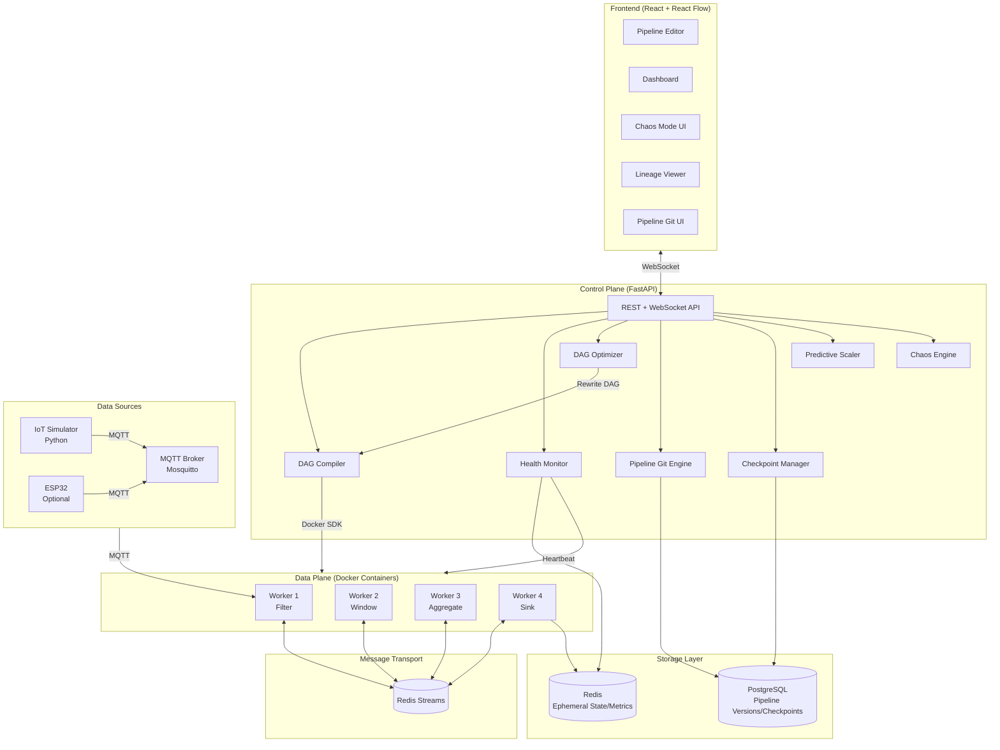

---

## Component Deep Dive

### 1. DAG Compiler

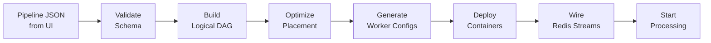

**Responsibilities:**
- Receives pipeline definition from frontend (JSON graph of nodes + edges)
- Validates operator compatibility (source can't connect to source, etc.)
- Builds a logical DAG (directed acyclic graph) of operators
- Determines optimal placement of operators on available workers
- Generates per-worker configuration (what operator to run, input/output streams)
- Deploys Docker containers via Docker SDK
- Creates Redis Stream topics for inter-operator communication
- Signals workers to begin processing

### 2. Health Monitor

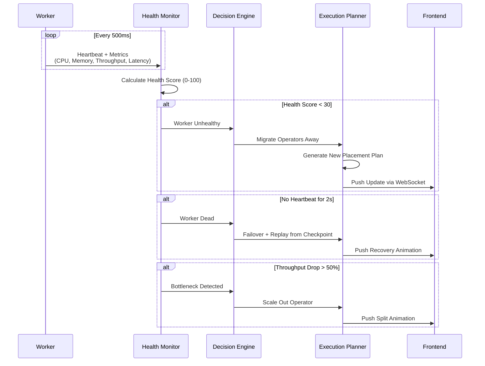

**Health Score Calculation:**
```
health_score = (
    cpu_score * 0.3 +       # 100 if CPU < 50%, linear decrease
    memory_score * 0.3 +     # 100 if mem < 60%, linear decrease
    throughput_score * 0.2 + # 100 if at expected rate, decrease if dropping
    latency_score * 0.2      # 100 if < target, decrease if increasing
)
```

### 3. DAG Optimizer

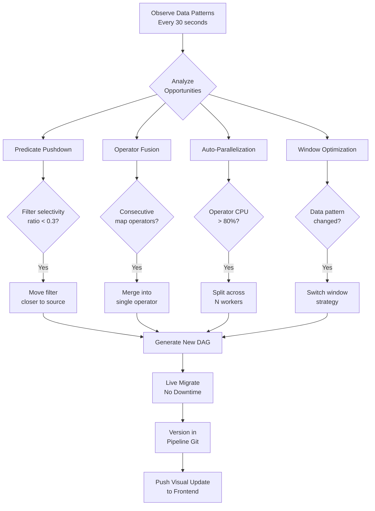

**Optimization Rules:**
| Rule | Trigger | Action | Expected Gain |
|------|---------|--------|---------------|
| Predicate Pushdown | Filter selectivity < 30% (drops 70%+ data) | Move filter before join/aggregate | Up to 10-20x |
| Operator Fusion | Two consecutive stateless transforms | Merge into one operator | 2x (eliminate serialization) |
| Auto-Parallel | Operator CPU > 80% sustained | Split into N parallel instances | Nx throughput |
| Window Switch | Bursty data pattern detected | Switch time-window to count-window | Better accuracy |

### 4. Self-Healing Decision Engine

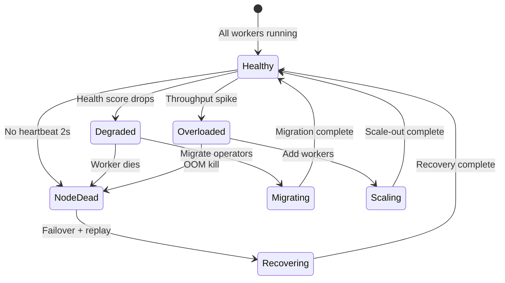

### 5. Pipeline Git (Version Control)

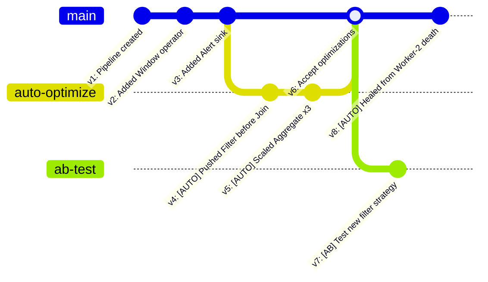

**Stored per version:**
- Full DAG definition (nodes, edges, operator configs)
- Trigger: USER | AUTO_OPTIMIZE | AUTO_HEAL | AB_TEST
- Timestamp
- Description of change
- Performance metrics at time of change
- Diff from previous version

### 6. Chaos Engine

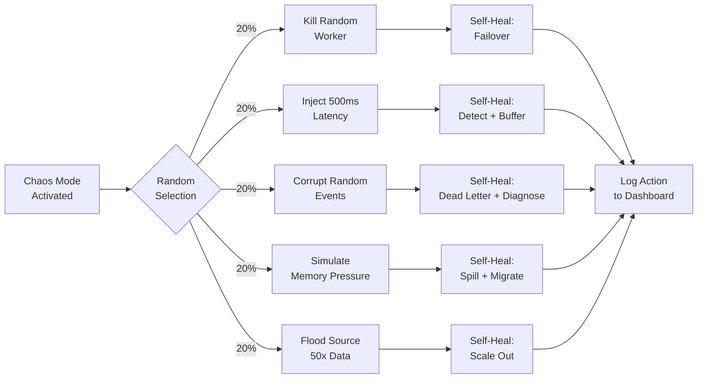

### 7. Predictive Scaler

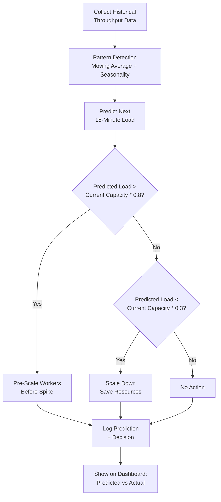

---

## Data Flow

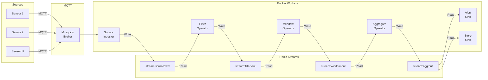

---

## Worker Container Internals

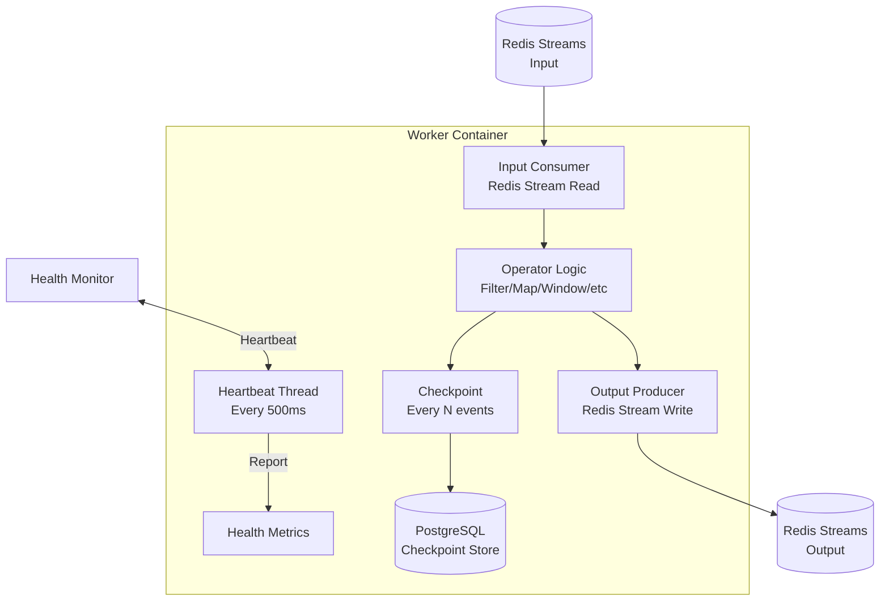

---

## WebSocket Communication Protocol

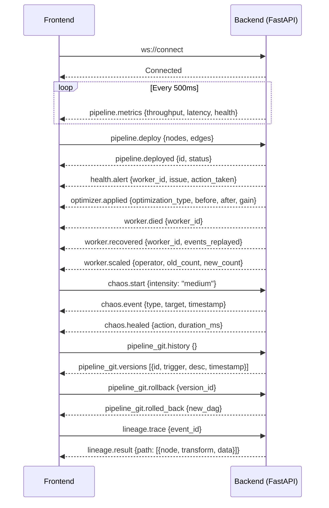

---

## Directory Structure

### Backend
```
backend/
├── src/
│   ├── engine/          # Core DAG execution engine
│   │   ├── dag.py       # DAG data structure and operations
│   │   ├── compiler.py  # Pipeline JSON -> Executable DAG
│   │   ├── scheduler.py # Operator placement on workers
│   │   └── runtime.py   # DAG execution coordinator
│   ├── api/             # FastAPI routes + WebSocket
│   │   ├── routes.py    # REST endpoints
│   │   ├── websocket.py # WebSocket handler
│   │   └── schemas.py   # Pydantic models
│   ├── workers/         # Worker container logic
│   │   ├── base.py      # Base worker class
│   │   ├── operators.py # Filter, Map, Window, Join, Aggregate
│   │   ├── sources.py   # MQTT source, HTTP source
│   │   ├── sinks.py     # DB sink, Alert sink, Webhook sink
│   │   └── runner.py    # Worker entry point (runs in container)
│   ├── health/          # Health monitoring + self-healing
│   │   ├── monitor.py   # Heartbeat collector + health scoring
│   │   ├── detector.py  # Anomaly/failure detection
│   │   ├── healer.py    # Self-healing actions
│   │   └── predictor.py # Predictive scaling
│   ├── optimizer/       # DAG optimization engine
│   │   ├── analyzer.py  # Data pattern analysis
│   │   ├── rules.py     # Optimization rules
│   │   ├── rewriter.py  # DAG transformation
│   │   └── migrator.py  # Live migration without downtime
│   ├── pipeline_git/    # Version control for pipelines
│   │   ├── versioner.py # Version management
│   │   ├── differ.py    # Visual diff generation
│   │   └── store.py     # PostgreSQL version storage (asyncpg)
│   ├── checkpoint/      # State checkpointing
│   │   ├── manager.py   # Checkpoint coordination
│   │   └── store.py     # PostgreSQL checkpoint store (asyncpg)
│   ├── chaos/           # Chaos engineering module
│   │   ├── engine.py    # Chaos scenario orchestrator
│   │   └── scenarios.py # Individual chaos scenarios
│   ├── models/          # Shared data models
│   │   ├── pipeline.py  # Pipeline, Node, Edge models
│   │   ├── worker.py    # Worker state models
│   │   └── events.py    # Event/message models
│   └── main.py          # FastAPI app entry point
├── tests/
├── config/
│   └── settings.py      # Configuration management
├── scripts/
│   ├── simulator.py     # IoT data simulator
│   └── seed_data.py     # Demo data seeder
├── Dockerfile           # Worker container image
├── docker-compose.yml   # Full stack compose
├── requirements.txt
└── README.md
```

### Frontend
```
frontend/
├── src/
│   ├── components/
│   │   ├── pipeline/    # React Flow pipeline editor
│   │   │   ├── PipelineEditor.tsx
│   │   │   ├── CustomNodes.tsx
│   │   │   ├── CustomEdges.tsx
│   │   │   └── NodePalette.tsx
│   │   ├── dashboard/   # Observability dashboard
│   │   │   ├── Dashboard.tsx
│   │   │   ├── MetricsPanel.tsx
│   │   │   ├── HealthPanel.tsx
│   │   │   ├── HealingLog.tsx
│   │   │   └── OptimizationLog.tsx
│   │   ├── chaos/       # Chaos mode UI
│   │   │   ├── ChaosPanel.tsx
│   │   │   └── ChaosControls.tsx
│   │   ├── lineage/     # Data lineage viewer
│   │   │   ├── LineagePanel.tsx
│   │   │   └── EventTrace.tsx
│   │   ├── git/         # Pipeline version control UI
│   │   │   ├── VersionHistory.tsx
│   │   │   ├── VisualDiff.tsx
│   │   │   └── RollbackModal.tsx
│   │   └── common/      # Shared UI components
│   │       ├── Header.tsx
│   │       ├── Sidebar.tsx
│   │       └── StatusBadge.tsx
│   ├── hooks/           # Custom React hooks
│   │   ├── useWebSocket.ts
│   │   ├── usePipeline.ts
│   │   └── useMetrics.ts
│   ├── services/        # API + WebSocket clients
│   │   ├── api.ts
│   │   └── websocket.ts
│   ├── store/           # Zustand state management
│   │   ├── pipelineStore.ts
│   │   ├── metricsStore.ts
│   │   └── chaosStore.ts
│   ├── utils/           # Utility functions
│   ├── types/           # TypeScript type definitions
│   │   ├── pipeline.ts
│   │   ├── metrics.ts
│   │   └── websocket.ts
│   ├── App.tsx
│   └── main.tsx
├── public/
├── tests/
├── tailwind.config.js
├── tsconfig.json
├── vite.config.ts
├── package.json
└── README.md
```
