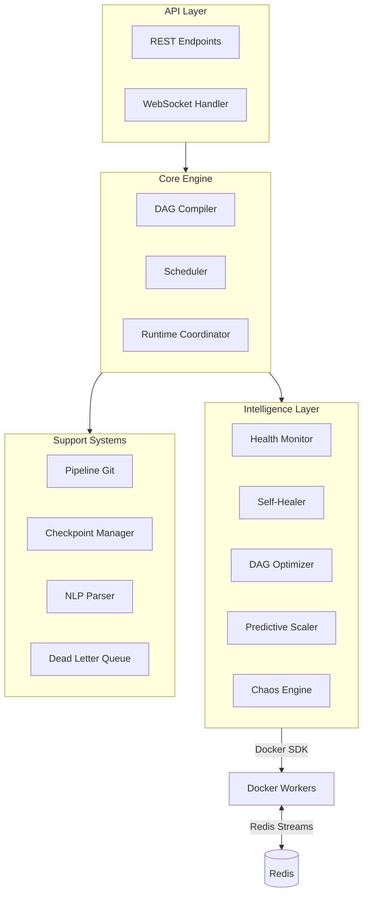

# FlowStorm Backend

> Control Plane + Stream Processing Engine

## Architecture



## Directory Structure

```
src/
├── main.py              # FastAPI app entry point
├── engine/              # Core DAG execution
│   ├── dag.py           # DAG data structure
│   ├── compiler.py      # Pipeline JSON -> DAG
│   ├── scheduler.py     # Worker placement
│   └── runtime.py       # Execution coordination
├── api/                 # HTTP + WebSocket
│   ├── routes.py        # REST endpoints
│   ├── websocket.py     # Real-time communication
│   └── schemas.py       # Request/response models
├── workers/             # Operator implementations
│   ├── base.py          # Base worker class
│   ├── operators.py     # Filter, Map, Window, etc.
│   ├── sources.py       # Data source connectors
│   ├── sinks.py         # Data sink connectors
│   └── runner.py        # Container entry point
├── health/              # Monitoring + healing
│   ├── monitor.py       # Health score calculation
│   ├── detector.py      # Failure detection
│   ├── healer.py        # Recovery actions
│   └── predictor.py     # Predictive scaling
├── optimizer/           # DAG optimization
│   ├── analyzer.py      # Pattern analysis
│   ├── rules.py         # Optimization rules
│   ├── rewriter.py      # DAG transformation
│   └── migrator.py      # Live migration
├── nlp/                 # Natural language features
│   ├── parser.py        # LLM integration
│   └── mapper.py        # Intent -> operations
├── pipeline_git/        # Version control
│   ├── versioner.py     # Version management
│   ├── differ.py        # Diff generation
│   └── store.py         # SQLite storage
├── checkpoint/          # State management
│   ├── manager.py       # Checkpoint coordination
│   └── store.py         # Redis checkpoint store
├── chaos/               # Chaos engineering
│   ├── engine.py        # Chaos orchestrator
│   └── scenarios.py     # Chaos scenarios
├── models/              # Shared models
│   ├── pipeline.py      # Pipeline models
│   ├── worker.py        # Worker models
│   └── events.py        # Event models
config/
├── settings.py          # App configuration
scripts/
├── simulator.py         # IoT data simulator
└── seed_data.py         # Demo data
tests/                   # Test suite
```

## Setup

```bash
# Create virtual environment
python -m venv venv
source venv/bin/activate  # Linux/Mac
# venv\Scripts\activate   # Windows

# Install dependencies
pip install -r requirements.txt

# Start infrastructure
docker-compose up -d redis mosquitto

# Run the server
uvicorn src.main:app --reload --host 0.0.0.0 --port 8000
```

## API Endpoints

| Method | Endpoint | Description |
|--------|----------|-------------|
| GET | `/health` | Server health check |
| POST | `/api/pipelines` | Create/deploy a pipeline |
| GET | `/api/pipelines/{id}` | Get pipeline status |
| DELETE | `/api/pipelines/{id}` | Stop and remove pipeline |
| POST | `/api/pipelines/{id}/chaos` | Start chaos mode |
| POST | `/api/pipelines/{id}/nlp` | NLP command |
| GET | `/api/pipelines/{id}/versions` | Pipeline version history |
| POST | `/api/pipelines/{id}/rollback` | Rollback to version |
| GET | `/api/pipelines/{id}/lineage/{event_id}` | Event lineage trace |
| WS | `/ws/pipeline/{id}` | Real-time pipeline updates |

## Key Dependencies

- **fastapi** + **uvicorn**: Web framework and ASGI server
- **websockets**: Real-time communication
- **redis**: Message transport + state store
- **docker**: Worker container orchestration
- **paho-mqtt**: MQTT client for IoT sources
- **httpx**: Async HTTP client for LLM API
- **pydantic**: Data validation and schemas
