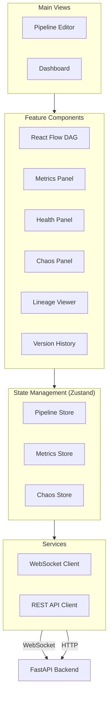
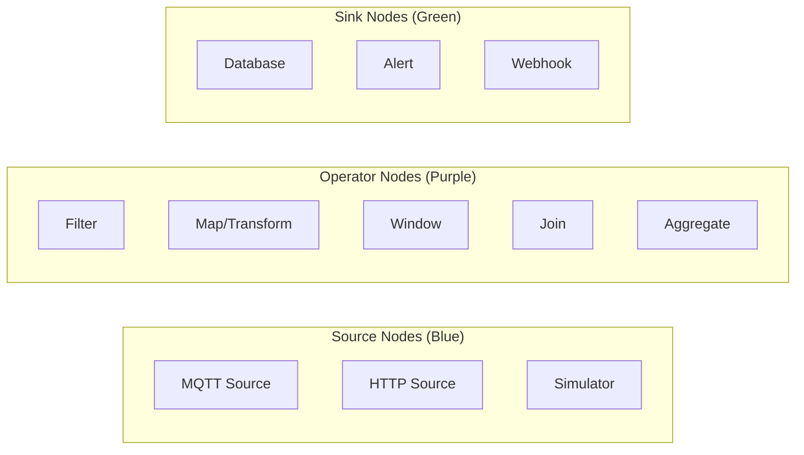

# FlowStorm Frontend

> Visual Pipeline Editor + Real-Time Dashboard

## Architecture



## Directory Structure

```
src/
├── App.tsx                      # Root component + routing
├── main.tsx                     # Entry point
├── components/
│   ├── pipeline/                # DAG editor
│   │   ├── PipelineEditor.tsx   # Main editor wrapper
│   │   ├── CustomNodes.tsx      # Source, Operator, Sink nodes
│   │   ├── CustomEdges.tsx      # Animated edges with metrics
│   │   └── NodePalette.tsx      # Drag-from sidebar
│   ├── dashboard/               # Observability
│   │   ├── Dashboard.tsx        # Dashboard layout
│   │   ├── MetricsPanel.tsx     # Throughput, latency charts
│   │   ├── HealthPanel.tsx      # Cluster health view
│   │   ├── HealingLog.tsx       # Self-healing action log
│   │   └── OptimizationLog.tsx  # DAG optimization history
│   ├── chaos/                   # Chaos engineering UI
│   │   ├── ChaosPanel.tsx       # Chaos mode controls
│   │   └── ChaosControls.tsx    # Intensity slider, toggles
│   ├── lineage/                 # Data lineage
│   │   ├── LineagePanel.tsx     # Lineage viewer
│   │   └── EventTrace.tsx       # Single event trace
│   ├── git/                     # Pipeline versioning
│   │   ├── VersionHistory.tsx   # Version list
│   │   ├── VisualDiff.tsx       # Side-by-side diff
│   │   └── RollbackModal.tsx    # Rollback confirmation
│   └── common/                  # Shared components
│       ├── Header.tsx           # App header
│       ├── Sidebar.tsx          # Navigation sidebar
│       └── StatusBadge.tsx      # Health status indicators
├── hooks/                       # Custom hooks
│   ├── useWebSocket.ts          # WebSocket connection
│   ├── usePipeline.ts           # Pipeline operations
│   └── useMetrics.ts            # Metrics subscription
├── services/                    # API layer
│   ├── api.ts                   # REST client
│   └── websocket.ts             # WebSocket manager
├── store/                       # Zustand stores
│   ├── pipelineStore.ts         # Pipeline state
│   ├── metricsStore.ts          # Metrics state
│   └── chaosStore.ts            # Chaos mode state
├── utils/                       # Utilities
├── types/                       # TypeScript types
│   ├── pipeline.ts              # Pipeline types
│   ├── metrics.ts               # Metrics types
│   └── websocket.ts             # WS message types
```

## Setup

```bash
# Install dependencies
npm install

# Start dev server
npm run dev

# Build for production
npm run build

# Run tests
npm test
```

## Key Libraries

- **React 18** - UI framework
- **React Flow** - DAG editor (drag-drop nodes, edges, minimap, controls)
- **Framer Motion** - Animations (node splitting, healing, migration)
- **Tailwind CSS** - Utility-first styling
- **Recharts** - Dashboard charts and graphs
- **Zustand** - Lightweight state management
- **Vite** - Build tool and dev server

## Custom Node Types



Each node displays:
- Operator name and type icon
- Health status indicator (green/yellow/red glow)
- Current throughput (events/sec)
- Processing latency (ms)
- Worker assignment

## WebSocket Events

The frontend subscribes to real-time events from the backend:

| Event | Description | UI Effect |
|-------|-------------|-----------|
| `pipeline.metrics` | Throughput, latency per node | Update edge labels, charts |
| `health.alert` | Worker health issue | Node turns yellow/red |
| `worker.died` | Worker container dead | Node turns red, flash |
| `worker.recovered` | Worker recovered | Migration animation, green |
| `worker.scaled` | Operator scaled out | Node split animation |
| `optimizer.applied` | DAG optimization | Before/after animation |
| `chaos.event` | Chaos action triggered | Flash affected node |
| `chaos.healed` | Self-healed from chaos | Recovery animation |
| `pipeline_git.version` | New version created | Version list update |
