# FlowStorm Backend — Architecture Documentation

**Version:** 1.0 | **Last Updated:** February 16, 2026
**Project:** Self-Healing, Self-Optimizing Real-Time Stream Processing Engine

---

## Table of Contents

1. [System Overview](#1-system-overview)
2. [Data Flow Architecture](#2-data-flow-architecture)
3. [Self-Healing Architecture](#3-self-healing-architecture)
4. [Auto-Optimization Pipeline](#4-auto-optimization-pipeline)
5. [Chaos Engineering Flow](#5-chaos-engineering-flow)
6. [WebSocket Event System](#6-websocket-event-system)
7. [Pipeline Versioning](#7-pipeline-versioning)
8. [Worker Lifecycle](#8-worker-lifecycle)
9. [Component Interaction Matrix](#9-component-interaction-matrix)
10. [Technology Decisions](#10-technology-decisions)

---

## 1. System Overview

FlowStorm uses a 5-layer architecture. This document focuses on the backend (Layers 2-5).

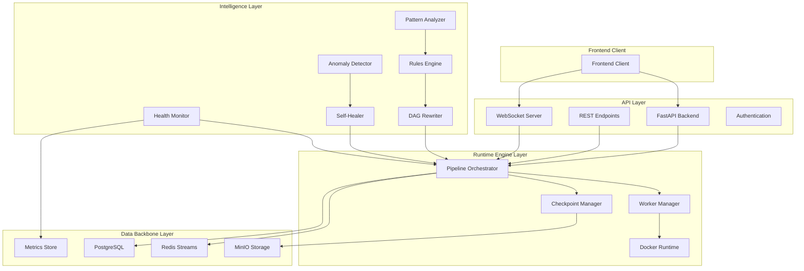

### Layer Responsibilities

| Layer | Role | Key Capabilities |
|-------|------|-----------------|
| 1 - Frontend Client | External consumer | Communicates via REST and WebSocket APIs |
| 2 - API Layer | Entry point | REST CRUD, WebSocket streaming, JWT auth, rate limiting |
| 3 - Runtime Engine | Execution | Pipeline orchestration, worker lifecycle, checkpointing, container scheduling |
| 4 - Intelligence | Autonomics | Health monitoring, anomaly detection, self-healing, DAG optimization |
| 5 - Data Backbone | Persistence | Redis Streams, PostgreSQL, MinIO, metrics storage |

---

## 2. Data Flow Architecture

Events flow from sources through operators to sinks, with Redis Streams as the backbone between worker containers.

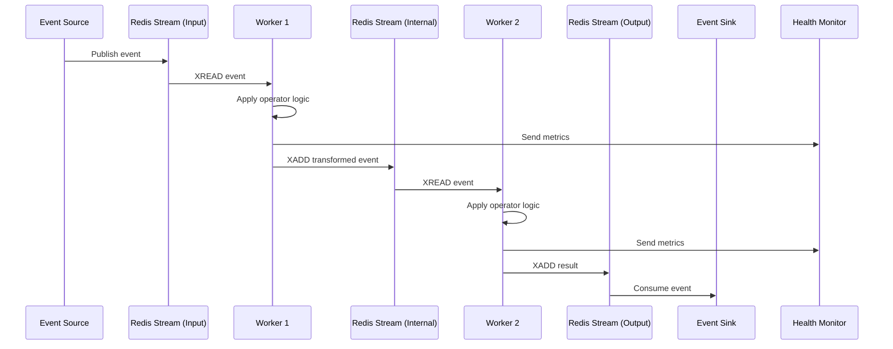

### Data Model

```json
{
  "event_id": "uuid",
  "timestamp": "iso8601",
  "pipeline_id": "pipeline_uuid",
  "operator_id": "operator_uuid",
  "data": { "payload": "operator-specific data" },
  "metadata": { "source": "upstream_operator", "processing_time_ms": 12, "checkpoint_id": "checkpoint_uuid" }
}
```

**Stream Naming:** `pipeline:{pipeline_id}:operator:{operator_id}:in|out` / Consumer groups: `worker:{operator_id}`

---

## 3. Self-Healing Architecture

Implements the MAPE-K (Monitor, Analyze, Plan, Execute over Knowledge) loop for autonomous failure recovery.

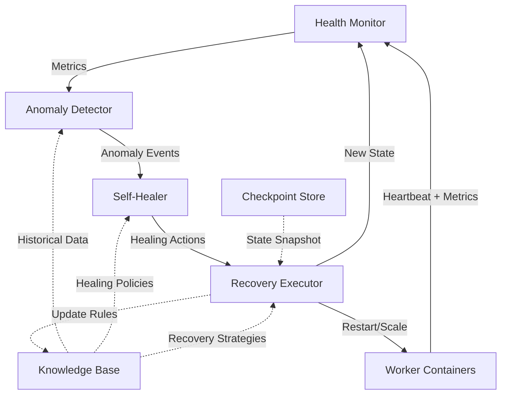

### Health Scoring

```
Health Score = (CPU_Score x 0.30) + (Memory_Score x 0.30) + (Throughput_Score x 0.20) + (Latency_Score x 0.20)
```

Thresholds: Healthy >= 80 | Degraded 60-79 | Critical 40-59 | Failing < 40

### Anomaly Types and Healing Actions

| Anomaly | Trigger | Default Healing Action | Cooldown |
|---------|---------|----------------------|----------|
| High CPU | CPU > 85% for 3 checks | Scale horizontally | 5 min |
| Memory Leak | Memory growth > 10%/min | Restart with checkpoint | 3 min |
| Throughput Drop | Rate < 50% of baseline | Add buffer or scale | 5 min |
| Latency Spike | P99 > 2x SLA for 5 min | Restart or optimize | 10 min |
| Worker Death | No heartbeat for 30s | Immediate restart + replay | 1 min |

### Healing Action Flow

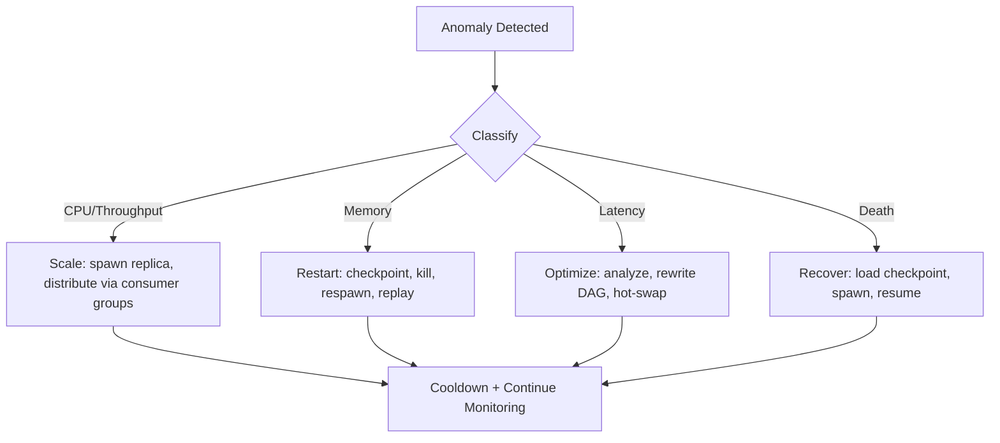

### Checkpoint Replay

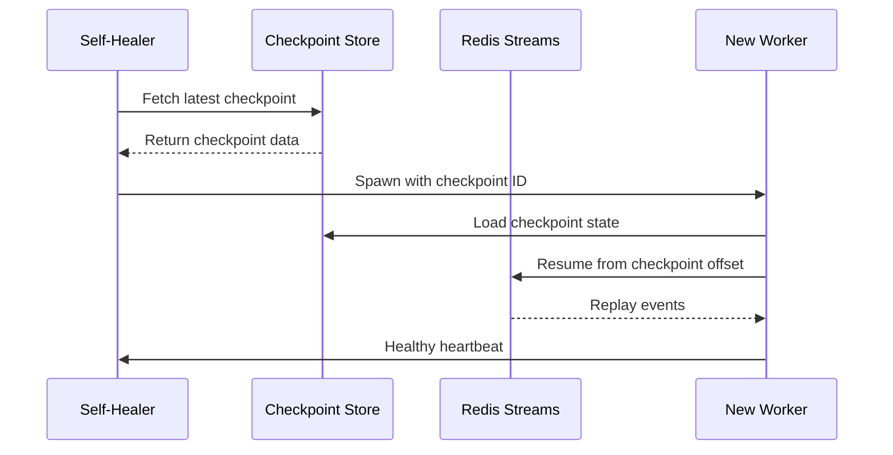

**Checkpoint Strategy:** Every 60s or 10,000 events | MinIO with gzip compression | Retain last 10 per operator

---

## 4. Auto-Optimization Pipeline

Continuously analyzes performance patterns and rewrites the DAG without stopping the pipeline.

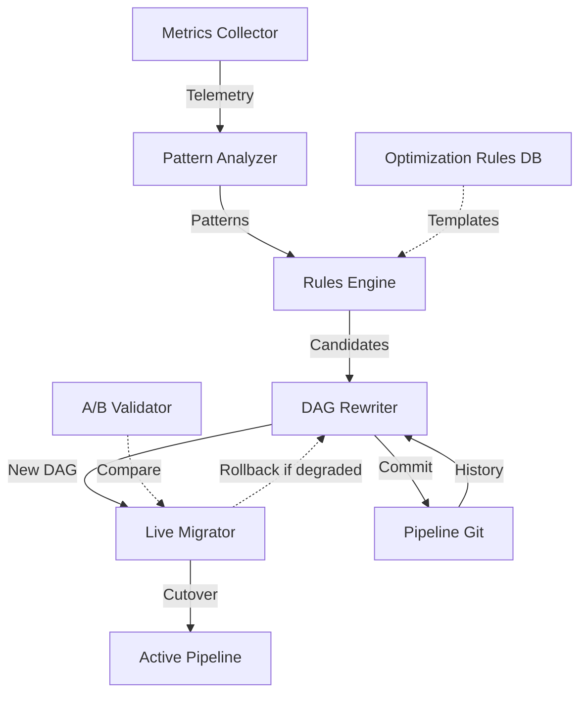

### 5 Optimization Types

1. **Predicate Pushdown** -- Move filters closer to source. Conditions: selectivity < 50%, no upstream deps, savings > 30%.
2. **Operator Fusion** -- Merge sequential stateless operators. Conditions: no branching, latency reduction > 20%.
3. **Auto-Parallelization** -- Partition and parallelize stateless operators. Conditions: CPU > 70%, throughput below target.
4. **Buffer Insertion** -- Smooth throughput mismatches > 2x between adjacent operators.
5. **Window Optimization** -- Adjust window types/sizes based on data distribution. Improvement > 15%.

### DAG Rewriting Process

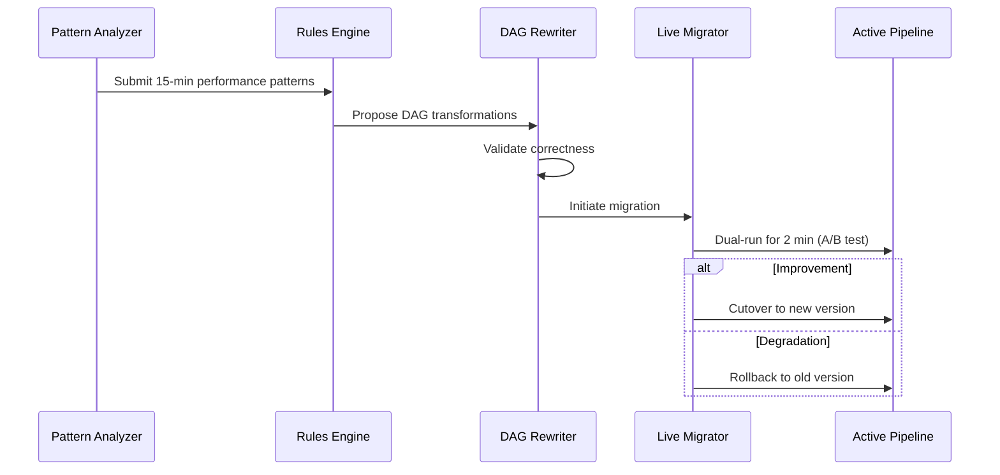

### Rules Engine Priorities

| Priority | Type | Examples |
|----------|------|---------|
| 1 (Critical) | Correctness-preserving | Predicate pushdown, stateless fusion |
| 2 (High) | Low-risk performance | Auto-parallelization, buffer insertion |
| 3 (Medium) | Heuristic-based | Window adjustments, operator reordering |
| 4 (Low) | Experimental | Code generation, hardware-specific |

---

## 5. Chaos Engineering Flow

Built-in chaos module that injects failures to validate self-healing.

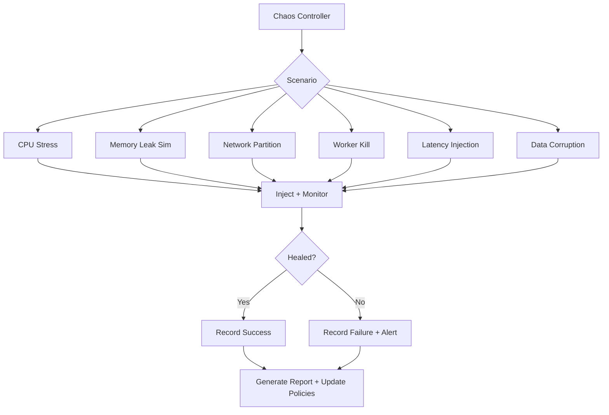

### Chaos Metrics

| Metric | Target SLA |
|--------|-----------|
| Time to Detection (TTD) | < 30 seconds |
| Time to Healing (TTH) | < 10 seconds after detection |
| Time to Recovery (TTR) | < 2 minutes |
| Data Loss | 0 events (exactly-once) |

---

## 6. WebSocket Event System

Real-time event streaming from backend to connected clients.

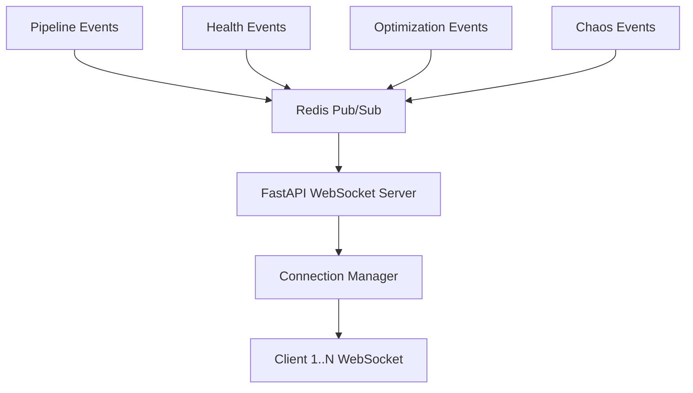

### Event Types

`pipeline.started` | `pipeline.stopped` | `operator.metrics` (every 5s) | `health.anomaly` | `healing.action` | `optimization.applied` | `chaos.injected` | `checkpoint.saved`

### Event Schema

```json
{
  "event_type": "operator.metrics",
  "timestamp": "2026-02-16T10:30:45.123Z",
  "pipeline_id": "pipeline-uuid",
  "data": {
    "operator_id": "operator-uuid",
    "metrics": { "throughput": 1250.5, "latency_p99": 45.2, "cpu_percent": 67.3, "memory_mb": 512.8, "health_score": 85.5 }
  }
}
```

### Connection Management

- JWT authentication on connect
- Selective subscription per pipeline
- Auto-reconnect with exponential backoff (5s, 10s, 20s, 40s)
- Heartbeat ping every 30s
- Event batching every 100ms

---

## 7. Pipeline Versioning

Git-like version control for pipelines with auditable change history and rollback.

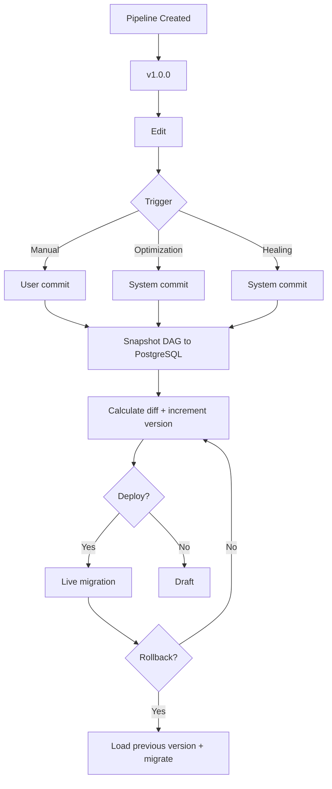

### Version Snapshot Schema

```json
{
  "version_id": "uuid", "pipeline_id": "uuid", "version_number": "v1.5.2",
  "parent_version_id": "uuid", "commit_message": "...", "commit_type": "auto_optimization",
  "timestamp": "iso8601", "author": "system | user@example.com",
  "dag_snapshot": { "operators": [], "edges": [], "config": {} },
  "diff": { "added_operators": [], "removed_operators": [], "modified_operators": [], "edge_changes": [] },
  "metrics_at_commit": { "throughput": 1250.5, "latency_p99": 45.2, "health_score": 85.5 }
}
```

**Auto-Commit Triggers:** Manual save, optimization applied, healing action, scheduled (24h), pre-deployment.

**Versioning:** Major (breaking) | Minor (new operators, optimizations) | Patch (config, fixes, healing)

---

## 8. Worker Lifecycle

Each operator runs in an isolated Docker container managed by the Worker Manager.

### Worker State Machine

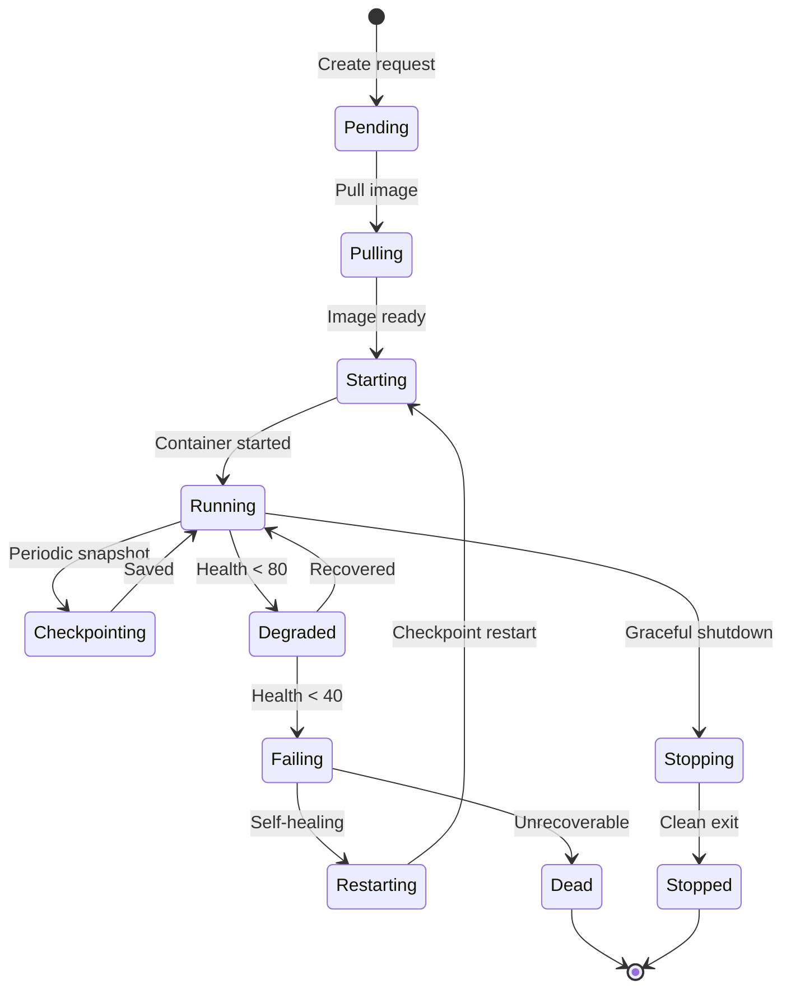

### Worker Spawn Flow

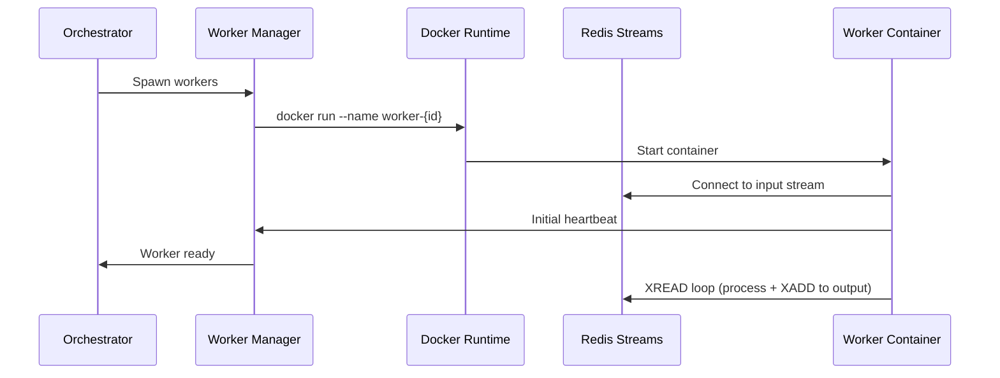

### Heartbeat

Workers send heartbeats every 10 seconds via Redis. Missing heartbeat for 30s triggers self-healing.

```json
{
  "worker_id": "uuid", "operator_id": "uuid", "status": "running",
  "metrics": { "events_processed": 12450, "cpu_percent": 45.2, "memory_mb": 256.8, "last_checkpoint": "uuid" }
}
```

### Resource Limits

```yaml
resources:
  limits:   { cpu: "1.0", memory: "1Gi" }
  requests: { cpu: "0.5", memory: "512Mi" }
```

### Checkpoint Lifecycle

Every 60 seconds: serialize operator state, gzip compress, upload to MinIO, report to Worker Manager.

---

## 9. Component Interaction Matrix

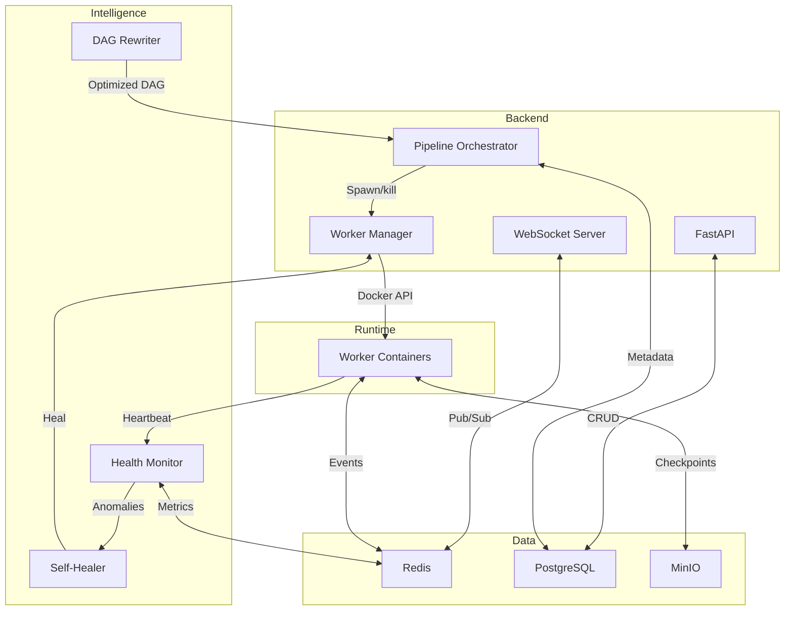

### Communication Details

| Source | Target | Protocol | Purpose |
|--------|--------|----------|---------|
| FastAPI | PostgreSQL | PG wire protocol | Pipeline metadata |
| WebSocket Server | Redis Pub/Sub | Redis protocol | Event subscription |
| Pipeline Orchestrator | Worker Manager | Internal API | Spawn/stop workers |
| Worker Manager | Docker Runtime | Docker API | Container lifecycle |
| Worker Containers | Redis Streams | Redis protocol | Event read/write |
| Worker Containers | Health Monitor | Redis protocol | Heartbeats + metrics |
| Health Monitor | Self-Healer | Internal queue | Anomaly reports |
| Self-Healer | Worker Manager | Internal API | Healing actions |
| DAG Rewriter | Orchestrator | Internal API | Deploy optimized DAG |
| Workers | MinIO | S3 API | Checkpoint save/load |
| Chaos Controller | Workers | Docker API | Failure injection |

---

## 10. Technology Decisions

### Redis Streams over Apache Kafka

Sub-millisecond latency, consumer groups for load balancing, unified stack (also handles pub/sub, metrics, caching), no ZooKeeper/broker management. Trade-off: ~1M vs Kafka's 10M+ events/sec ceiling.

### FastAPI over Flask/Django

Native async/await (ASGI), Pydantic validation, auto-generated OpenAPI docs, first-class WebSocket support, performance comparable to Node.js/Go.

### Docker for Worker Isolation

Fault isolation per operator, CPU/memory limits, portable images, independent dependency versioning, easy horizontal scaling. Trade-off: higher overhead than process isolation.

### PostgreSQL for Metadata

ACID guarantees for versioning, native JSONB for DAG storage, complex queries for version history/diffs, mature ecosystem.

### MinIO for Checkpoints

S3-compatible object storage, handles large checkpoint files, built-in versioning, self-hosted with cloud migration path.

### Python for Worker Runtime

Rich data science ecosystem (NumPy, Pandas, scikit-learn), rapid development, extensible to other languages. Trade-off: GIL limits CPU-bound tasks.

### MAPE-K for Self-Healing

Proven autonomic computing framework with clear separation (Monitor, Analyze, Plan, Execute), centralized knowledge base, easy to extend with new detectors and strategies.

---

## Conclusion

FlowStorm's backend is designed for **resilience**, **performance**, and **autonomous operation**. The layered separation enables independent evolution. Self-healing ensures availability without manual intervention. Auto-optimization continuously improves throughput and latency. WebSocket streaming provides real-time visibility. Git-like versioning enables safe experimentation and rollback.

---

**Document Version:** 1.0 | **Sections:** 10 | **Mermaid Diagrams:** 16 | **Status:** Backend Reference
