# FlowStorm Backend Architecture Documentation

**Version:** 1.0
**Last Updated:** February 16, 2026
**Project:** Self-Healing, Self-Optimizing Real-Time Stream Processing Engine (Backend)

---

## Table of Contents

1. [System Overview](#1-system-overview)
2. [Data Flow Architecture](#2-data-flow-architecture)
3. [Self-Healing Architecture](#3-self-healing-architecture)
4. [Auto-Optimization Pipeline](#4-auto-optimization-pipeline)
5. [Chaos Engineering Flow](#5-chaos-engineering-flow)
6. [WebSocket Event System](#6-websocket-event-system)
7. [Pipeline Versioning](#7-pipeline-versioning)
8. [Worker Lifecycle](#8-worker-lifecycle)
9. [Component Interaction Matrix](#9-component-interaction-matrix)
10. [Technology Decisions](#10-technology-decisions)

---

## 1. System Overview

The FlowStorm backend is built on a 4-layer architecture. Frontend clients communicate exclusively through REST and WebSocket APIs exposed by Layer 1.

### 4-Layer Backend Architecture

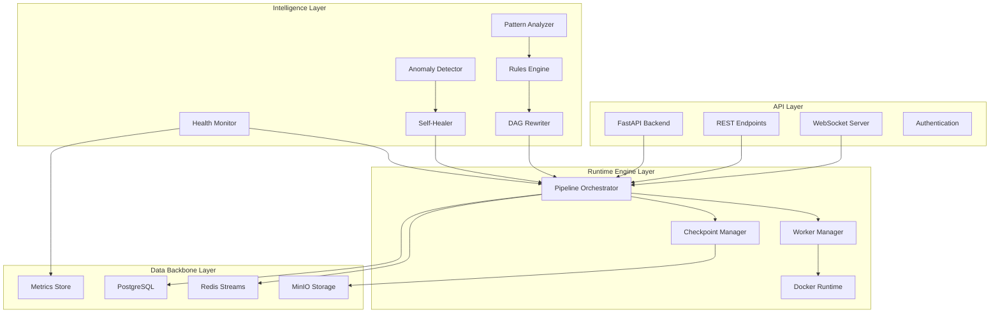
```mermaid
graph TD
    subgraph Layer1[API Layer]
        E[FastAPI Backend]
        F[REST Endpoints]
        G[WebSocket Server]
        H[Authentication]
    end
    subgraph Layer2[Runtime Engine Layer]
        I[Pipeline Orchestrator]
        J[Worker Manager]
        K[Docker Runtime]
        L[Checkpoint Manager]
    end
    subgraph Layer3[Intelligence Layer]
        M[Health Monitor]
        N[Anomaly Detector]
        O[Self-Healer]
        P[Pattern Analyzer]
        Q[Rules Engine]
        R[DAG Rewriter]
    end
    subgraph Layer4[Data Backbone Layer]
        S[Redis Streams]
        T[PostgreSQL]
        U[MinIO Storage]
        V[Metrics Store]
    end
    E --> I
    F --> I
    G --> I
    I --> J
    J --> K
    I --> L
    M --> I
    N --> O
    O --> I
    P --> Q
    Q --> R
    R --> I
    I --> S
    I --> T
    L --> U
    M --> V
```

**Layer 1 - API:** REST CRUD, WebSocket streaming, JWT auth, rate limiting.
**Layer 2 - Runtime Engine:** Pipeline orchestration, worker lifecycle, checkpointing, container scheduling.
**Layer 3 - Intelligence:** Health monitoring, anomaly detection, self-healing, DAG optimization.
**Layer 4 - Data Backbone:** Redis Streams, PostgreSQL, MinIO, metrics storage.

---

## 2. Data Flow Architecture

Events flow from sources through operators to sinks, with Redis Streams as the backbone between worker containers.

### Event Flow Sequence

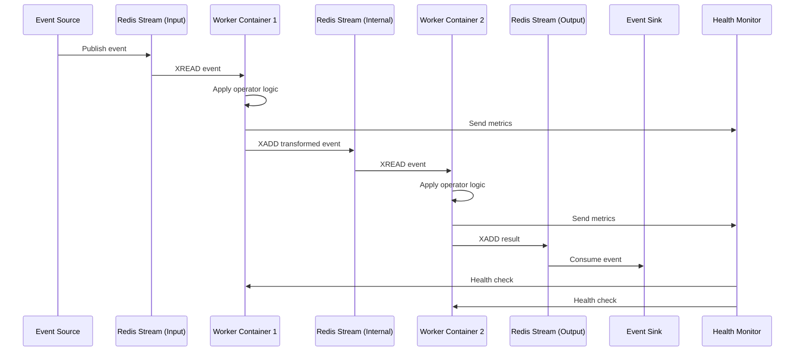
```mermaid
sequenceDiagram
    participant Source as Event Source
    participant RedisIn as Redis Stream (Input)
    participant Worker1 as Worker Container 1
    participant RedisInt as Redis Stream (Internal)
    participant Worker2 as Worker Container 2
    participant RedisOut as Redis Stream (Output)
    participant Sink as Event Sink
    participant Monitor as Health Monitor
    Source->>RedisIn: Publish event
    RedisIn->>Worker1: XREAD event
    Worker1->>Worker1: Apply operator logic
    Worker1->>Monitor: Send metrics
    Worker1->>RedisInt: XADD transformed event
    RedisInt->>Worker2: XREAD event
    Worker2->>Worker2: Apply operator logic
    Worker2->>Monitor: Send metrics
    Worker2->>RedisOut: XADD result
    RedisOut->>Sink: Consume event
    Monitor->>Worker1: Health check
    Monitor->>Worker2: Health check
```

### Data Model

```json
{
  "event_id": "uuid",
  "timestamp": "iso8601",
  "pipeline_id": "pipeline_uuid",
  "operator_id": "operator_uuid",
  "data": { "payload": "operator-specific data" },
  "metadata": { "source": "upstream_operator", "processing_time_ms": 12, "checkpoint_id": "checkpoint_uuid" }
}
```

**Stream Naming:** `pipeline:{pid}:operator:{oid}:in|out` | Consumer groups: `worker:{oid}`

---

## 3. Self-Healing Architecture

Implements the MAPE-K (Monitor, Analyze, Plan, Execute over Knowledge) loop for autonomous failure recovery.

### MAPE-K Loop

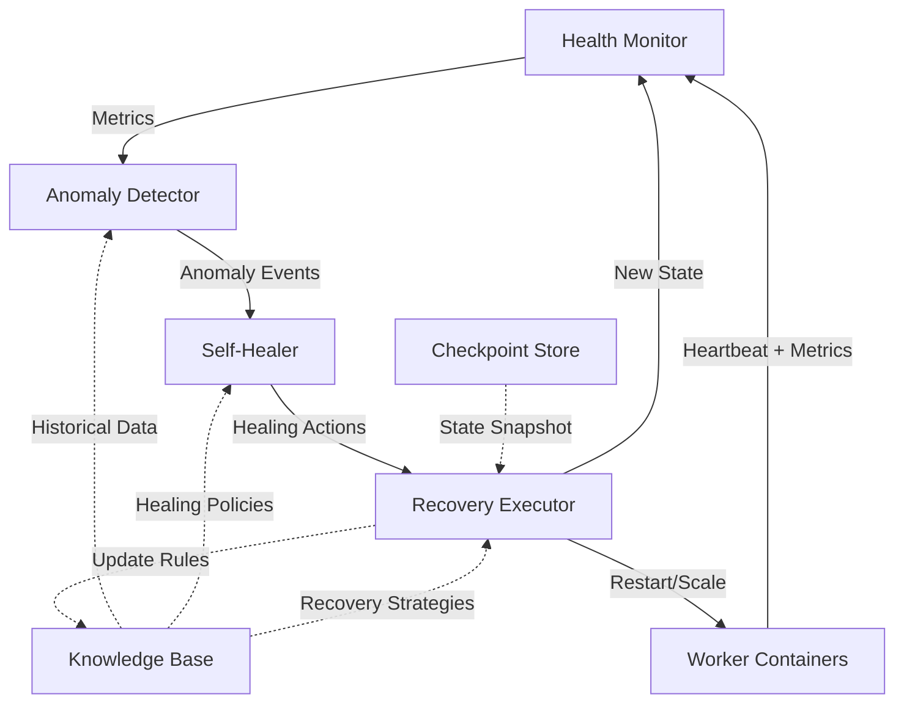
```mermaid
graph TD
    A[Health Monitor] -->|Metrics| B[Anomaly Detector]
    B -->|Anomaly Events| C[Self-Healer]
    C -->|Healing Actions| D[Recovery Executor]
    D -->|New State| A
    E[Knowledge Base] -.->|Historical Data| B
    E -.->|Healing Policies| C
    E -.->|Recovery Strategies| D
    D -.->|Update Rules| E
    F[Worker Containers] -->|Heartbeat + Metrics| A
    D -->|Restart/Scale| F
    G[Checkpoint Store] -.->|State Snapshot| D
```

### Health Scoring

```
Health Score = (CPU_Score x 0.30) + (Memory_Score x 0.30) + (Throughput_Score x 0.20) + (Latency_Score x 0.20)
```

Thresholds: Healthy >= 80 | Degraded 60-79 | Critical 40-59 | Failing < 40

### 5 Anomaly Types

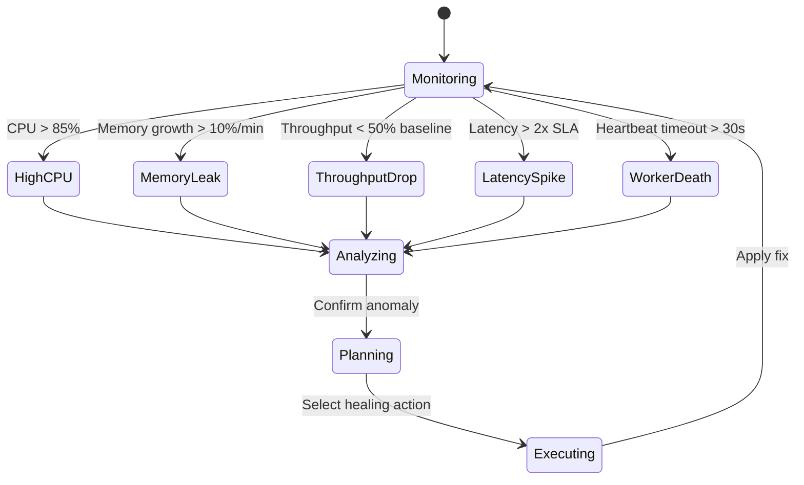
```mermaid
stateDiagram-v2
    [*] --> Monitoring
    Monitoring --> HighCPU: CPU > 85%
    Monitoring --> MemoryLeak: Memory growth > 10%/min
    Monitoring --> ThroughputDrop: Throughput < 50% baseline
    Monitoring --> LatencySpike: Latency > 2x SLA
    Monitoring --> WorkerDeath: Heartbeat timeout > 30s
    HighCPU --> Analyzing
    MemoryLeak --> Analyzing
    ThroughputDrop --> Analyzing
    LatencySpike --> Analyzing
    WorkerDeath --> Analyzing
    Analyzing --> Planning: Confirm anomaly
    Planning --> Executing: Select healing action
    Executing --> Monitoring: Apply fix
```

### 4 Healing Actions

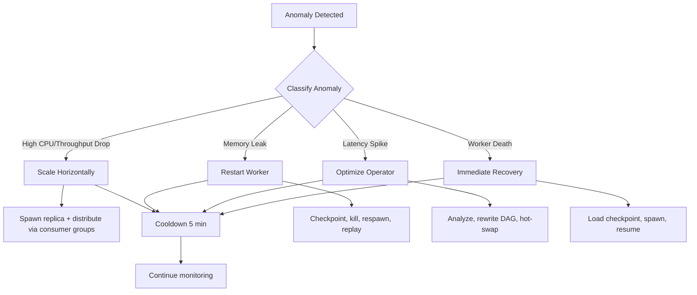
```mermaid
flowchart TD
    A[Anomaly Detected] --> B{Classify Anomaly}
    B -->|High CPU/Throughput Drop| C[Scale Horizontally]
    B -->|Memory Leak| D[Restart Worker]
    B -->|Latency Spike| E[Optimize Operator]
    B -->|Worker Death| F[Immediate Recovery]
    C --> C1[Spawn replica + distribute via consumer groups]
    C --> G[Cooldown 5 min]
    D --> D1[Checkpoint, kill, respawn, replay]
    D --> G
    E --> E1[Analyze, rewrite DAG, hot-swap]
    E --> G
    F --> F1[Load checkpoint, spawn, resume]
    F --> G
    G --> H[Continue monitoring]
```

### Checkpoint Replay Flow

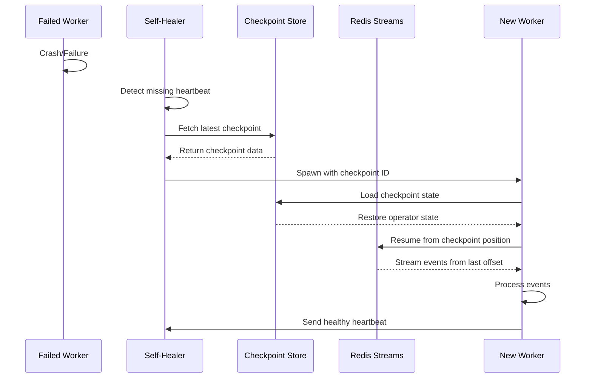
```mermaid
sequenceDiagram
    participant Worker as Failed Worker
    participant Healer as Self-Healer
    participant Store as Checkpoint Store
    participant Redis as Redis Streams
    participant NewWorker as New Worker
    Worker->>Worker: Crash/Failure
    Healer->>Healer: Detect missing heartbeat
    Healer->>Store: Fetch latest checkpoint
    Store-->>Healer: Return checkpoint data
    Healer->>NewWorker: Spawn with checkpoint ID
    NewWorker->>Store: Load checkpoint state
    Store-->>NewWorker: Restore operator state
    NewWorker->>Redis: Resume from checkpoint position
    Redis-->>NewWorker: Stream events from last offset
    NewWorker->>NewWorker: Process events
    NewWorker->>Healer: Send healthy heartbeat
```

**Checkpoint Strategy:** Every 60s or 10,000 events | MinIO with gzip | Retain last 10 per operator

---

## 4. Auto-Optimization Pipeline

Continuously analyzes performance patterns and rewrites the DAG without stopping the pipeline.

### Optimization Architecture

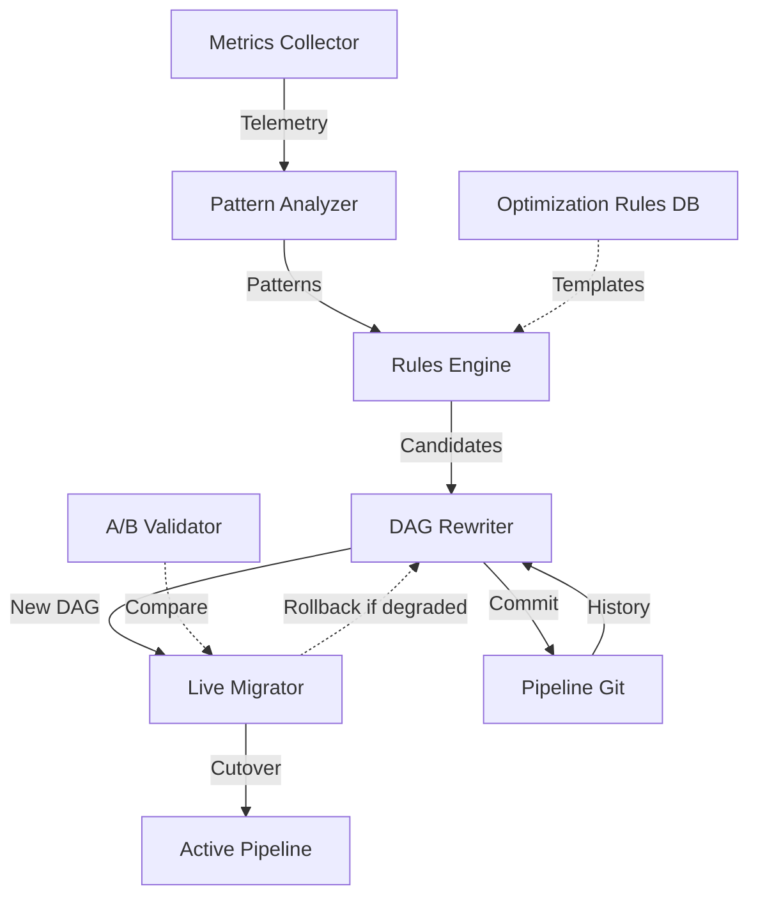
```mermaid
graph TD
    A[Pattern Analyzer] -->|Patterns| B[Rules Engine]
    B -->|Candidates| C[DAG Rewriter]
    C -->|New DAG| D[Live Migrator]
    D -->|Cutover| E[Active Pipeline]
    F[Metrics Collector] -->|Telemetry| A
    G[Optimization Rules DB] -.->|Templates| B
    H[Pipeline Git] -->|History| C
    C -->|Commit| H
    I[A/B Validator] -.->|Compare| D
    D -.->|Rollback if degraded| C
```

### 5 Optimization Types

**1. Predicate Pushdown** -- Move filters closer to source (selectivity < 50%, savings > 30%).

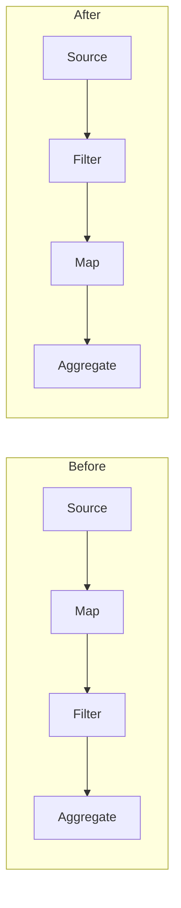
```mermaid
flowchart LR
    subgraph Before
        A1[Source] --> B1[Map] --> C1[Filter] --> D1[Aggregate]
    end
    subgraph After
        A2[Source] --> B2[Filter] --> C2[Map] --> D2[Aggregate]
    end
```

**2. Operator Fusion** -- Merge sequential stateless operators (latency reduction > 20%).

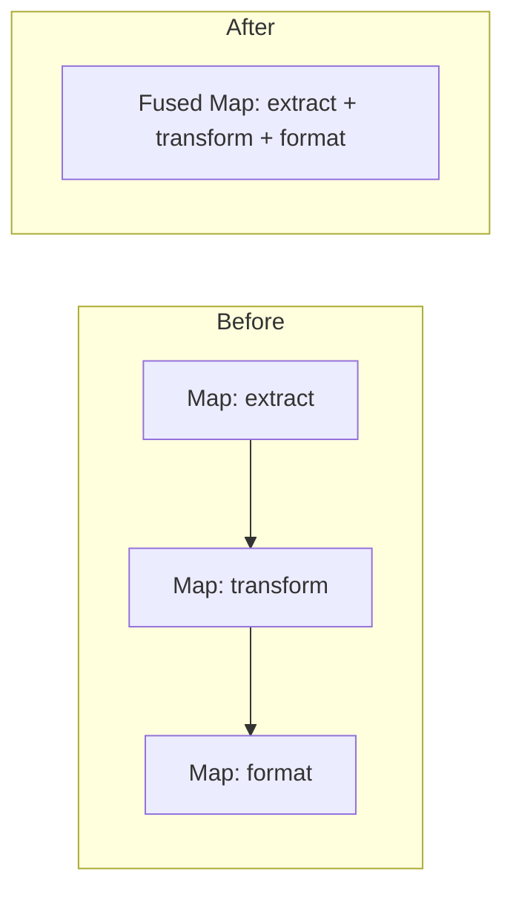
```mermaid
flowchart LR
    subgraph Before
        A1[Map: extract] --> B1[Map: transform] --> C1[Map: format]
    end
    subgraph After
        A2[Fused Map: extract + transform + format]
    end
```

**3. Auto-Parallelization** -- Partition stateless operators (CPU > 70%).

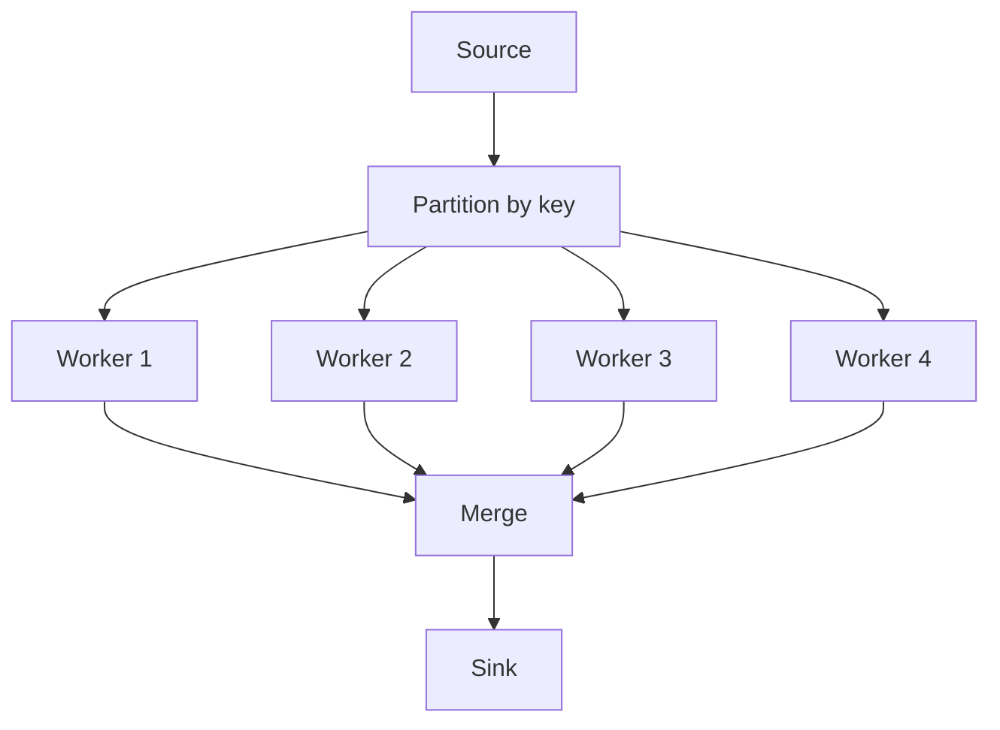
```mermaid
flowchart TD
    A[Source] --> B[Partition by key]
    B --> C1[Worker 1]
    B --> C2[Worker 2]
    B --> C3[Worker 3]
    B --> C4[Worker 4]
    C1 --> D[Merge]
    C2 --> D
    C3 --> D
    C4 --> D
    D --> E[Sink]
```

**4. Buffer Insertion** -- Smooth throughput mismatches > 2x.

**5. Window Optimization** -- Adjust window types/sizes based on data distribution (improvement > 15%).

### DAG Rewriting Process

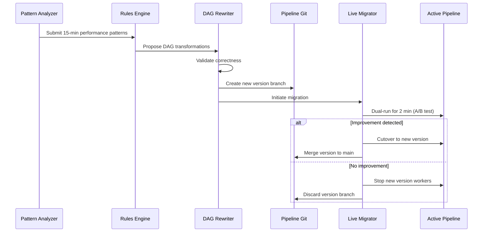
```mermaid
sequenceDiagram
    participant PA as Pattern Analyzer
    participant RE as Rules Engine
    participant DR as DAG Rewriter
    participant PG as Pipeline Git
    participant LM as Live Migrator
    participant Pipeline as Active Pipeline
    PA->>RE: Submit 15-min performance patterns
    RE->>DR: Propose DAG transformations
    DR->>DR: Validate correctness
    DR->>PG: Create new version branch
    DR->>LM: Initiate migration
    LM->>Pipeline: Dual-run for 2 min (A/B test)
    alt Improvement detected
        LM->>Pipeline: Cutover to new version
        LM->>PG: Merge version to main
    else No improvement
        LM->>Pipeline: Stop new version workers
        LM->>PG: Discard version branch
    end
```

**Rules Priority:** Critical (predicate pushdown, fusion) > High (parallelization, buffering) > Medium (window tuning) > Low (experimental).

---

## 5. Chaos Engineering Flow

Built-in chaos module that injects failures to validate self-healing.

### Chaos Injection Architecture

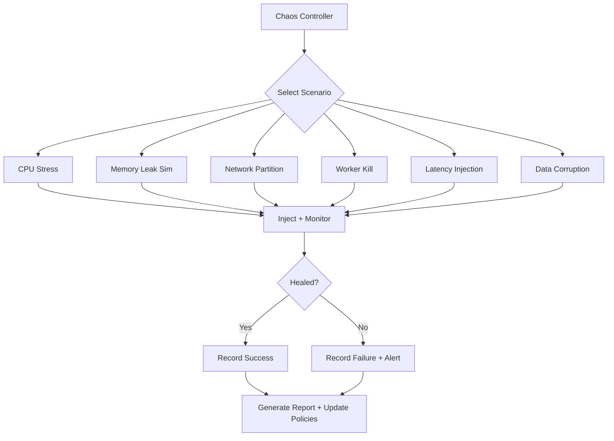
```mermaid
flowchart TD
    A[Chaos Controller] --> B{Select Scenario}
    B --> C1[CPU Stress]
    B --> C2[Memory Leak Sim]
    B --> C3[Network Partition]
    B --> C4[Worker Kill]
    B --> C5[Latency Injection]
    B --> C6[Data Corruption]
    C1 & C2 & C3 & C4 & C5 & C6 --> D[Inject + Monitor]
    D --> E{Healed?}
    E -->|Yes| F[Record Success]
    E -->|No| G[Record Failure + Alert]
    F & G --> H[Generate Report + Update Policies]
```

### Chaos Validation Flow

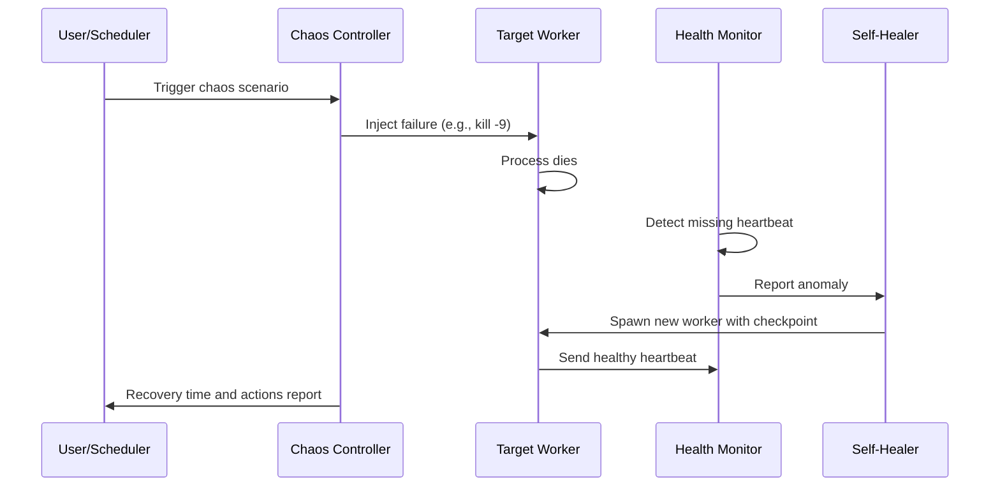
```mermaid
sequenceDiagram
    participant User as User/Scheduler
    participant CC as Chaos Controller
    participant Target as Target Worker
    participant Monitor as Health Monitor
    participant Healer as Self-Healer
    User->>CC: Trigger chaos scenario
    CC->>Target: Inject failure (e.g., kill -9)
    Target->>Target: Process dies
    Monitor->>Monitor: Detect missing heartbeat
    Monitor->>Healer: Report anomaly
    Healer->>Target: Spawn new worker with checkpoint
    Target->>Monitor: Send healthy heartbeat
    CC->>User: Recovery time and actions report
```

**Target SLAs:** TTD < 30s | TTH < 10s after detection | TTR < 2 min | Data Loss: 0 events

---

## 6. WebSocket Event System

Real-time event streaming from backend to connected clients via Redis Pub/Sub bridging.

### WebSocket Architecture

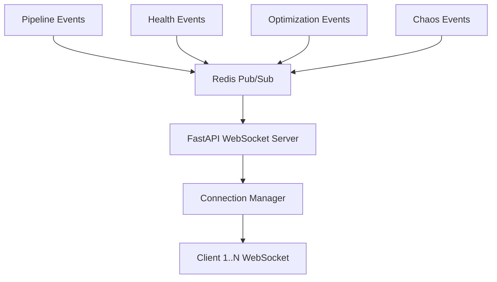
```mermaid
graph TD
    A[Pipeline Events] --> B[Redis Pub/Sub]
    C[Health Events] --> B
    D[Optimization Events] --> B
    E[Chaos Events] --> B
    B --> F[FastAPI WebSocket Server]
    F --> G[Connection Manager]
    G --> H[Client 1..N WebSocket]
```

**8 Event Types:** `pipeline.started` | `pipeline.stopped` | `operator.metrics` | `health.anomaly` | `healing.action` | `optimization.applied` | `chaos.injected` | `checkpoint.saved`

### Connection Management

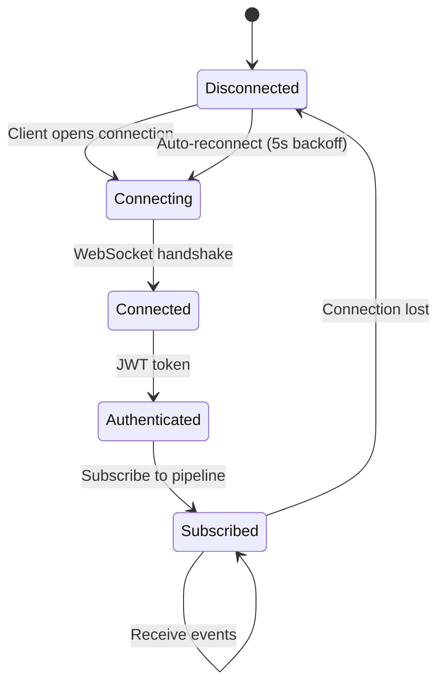
```mermaid
stateDiagram-v2
    [*] --> Disconnected
    Disconnected --> Connecting: Client opens connection
    Connecting --> Connected: WebSocket handshake
    Connected --> Authenticated: JWT token
    Authenticated --> Subscribed: Subscribe to pipeline
    Subscribed --> Subscribed: Receive events
    Subscribed --> Disconnected: Connection lost
    Disconnected --> Connecting: Auto-reconnect (5s backoff)
```

**Features:** Exponential backoff (5s, 10s, 20s, 40s) | Heartbeat ping every 30s | Per-pipeline subscription | Event batching every 100ms

---

## 7. Pipeline Versioning

Git-like version control for pipelines with auditable change history and rollback.

### Version Control Flow

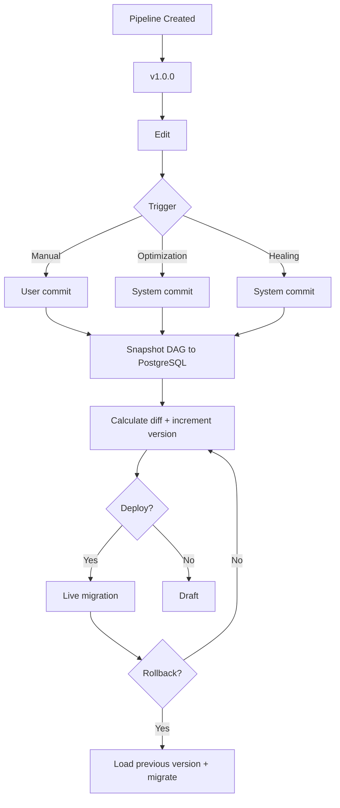
```mermaid
flowchart TD
    A[Pipeline Created] --> B[v1.0.0]
    B --> C[Edit]
    C --> D{Trigger}
    D -->|Manual| E[User commit]
    D -->|Optimization| F[System commit]
    D -->|Healing| G[System commit]
    E & F & G --> H[Snapshot DAG to PostgreSQL]
    H --> I[Calculate diff + increment version]
    I --> J{Deploy?}
    J -->|Yes| K[Live migration]
    J -->|No| L[Draft]
    K --> M{Rollback?}
    M -->|Yes| N[Load previous version + migrate]
    M -->|No| I
```

### Rollback Process

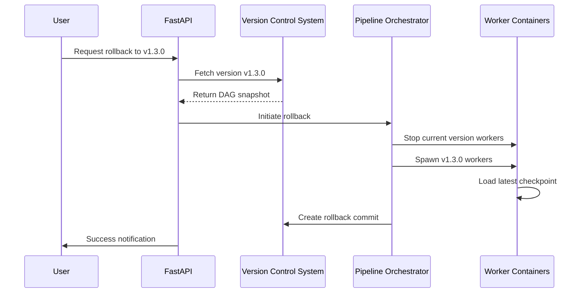
```mermaid
sequenceDiagram
    participant User as User
    participant API as FastAPI
    participant VCS as Version Control System
    participant Pipeline as Pipeline Orchestrator
    participant Workers as Worker Containers
    User->>API: Request rollback to v1.3.0
    API->>VCS: Fetch version v1.3.0
    VCS-->>API: Return DAG snapshot
    API->>Pipeline: Initiate rollback
    Pipeline->>Workers: Stop current version workers
    Pipeline->>Workers: Spawn v1.3.0 workers
    Workers->>Workers: Load latest checkpoint
    Pipeline->>VCS: Create rollback commit
    API->>User: Success notification
```

**Auto-Commit Triggers:** Manual save | Optimization applied | Healing action | Scheduled (24h) | Pre-deployment. **Versioning:** Major (breaking) | Minor (optimizations) | Patch (fixes, healing).

---

## 8. Worker Lifecycle

### Worker State Machine

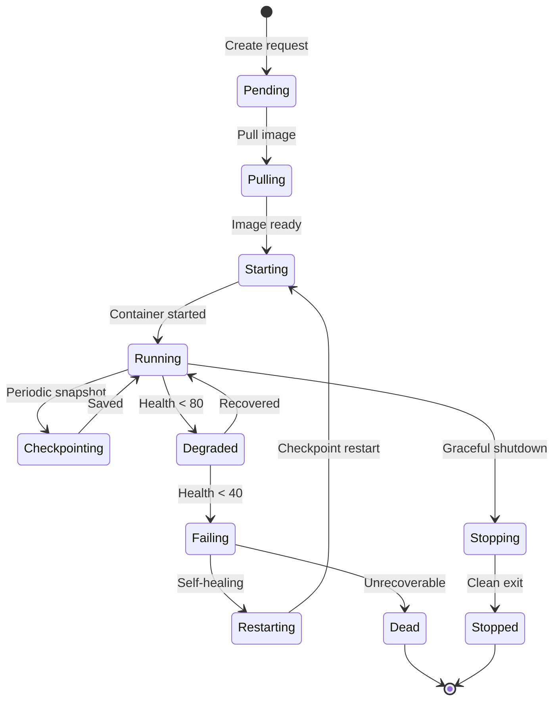
```mermaid
stateDiagram-v2
    [*] --> Pending: Create request
    Pending --> Pulling: Pull image
    Pulling --> Starting: Image ready
    Starting --> Running: Container started
    Running --> Checkpointing: Periodic snapshot
    Checkpointing --> Running: Saved
    Running --> Degraded: Health < 80
    Degraded --> Running: Recovered
    Degraded --> Failing: Health < 40
    Failing --> Restarting: Self-healing
    Restarting --> Starting: Checkpoint restart
    Running --> Stopping: Graceful shutdown
    Stopping --> Stopped: Clean exit
    Failing --> Dead: Unrecoverable
    Dead --> [*]
    Stopped --> [*]
```

### Worker Spawn Flow

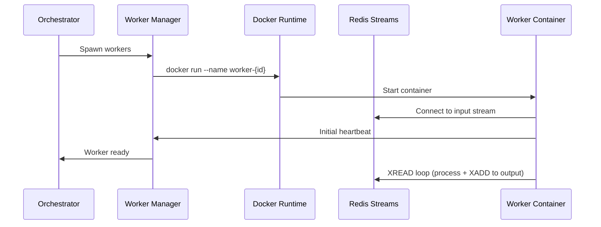
```mermaid
sequenceDiagram
    participant Orch as Orchestrator
    participant Mgr as Worker Manager
    participant Docker as Docker Runtime
    participant Redis as Redis Streams
    participant W as Worker Container
    Orch->>Mgr: Spawn workers
    Mgr->>Docker: docker run --name worker-{id}
    Docker->>W: Start container
    W->>Redis: Connect to input stream
    W->>Mgr: Initial heartbeat
    Mgr->>Orch: Worker ready
    W->>Redis: XREAD loop (process + XADD to output)
```

### Heartbeat Mechanism

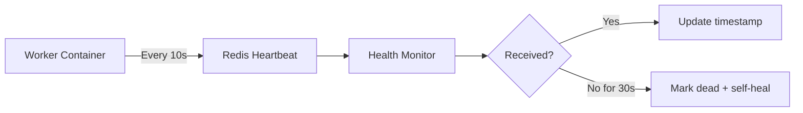
```mermaid
flowchart LR
    A[Worker Container] -->|Every 10s| B[Redis Heartbeat]
    B --> C[Health Monitor]
    C --> D{Received?}
    D -->|Yes| E[Update timestamp]
    D -->|No for 30s| F[Mark dead + self-heal]
```

### Checkpoint Lifecycle

```mermaid
sequenceDiagram
    participant Worker as Worker Container
    participant MinIO as MinIO Storage
    participant Manager as Worker Manager
    loop Every 60 seconds
        Worker->>Worker: Serialize + gzip state
        Worker->>MinIO: Upload checkpoint
        MinIO-->>Worker: Checkpoint ID
        Worker->>Manager: Report success
    end
```

**Resource Limits:** CPU 1.0 core (min 0.5) | Memory 1Gi (min 512Mi). Worker death triggers self-healing (see Section 3 Checkpoint Replay Flow).

---

## 9. Component Interaction Matrix

### Communication Diagram

```mermaid
graph TD
    subgraph Backend
        C[FastAPI]
        D[WebSocket Server]
        E[Pipeline Orchestrator]
        F[Worker Manager]
    end
    subgraph Intelligence
        G[Health Monitor]
        H[Self-Healer]
        I[DAG Rewriter]
    end
    subgraph Data
        J[Redis]
        K[PostgreSQL]
        L[MinIO]
    end
    subgraph Runtime
        M[Worker Containers]
    end
    C <-->|CRUD| K
    D <-->|Pub/Sub| J
    E <-->|Metadata| K
    E -->|Spawn/kill| F
    F -->|Docker API| M
    M <-->|Events| J
    M -->|Heartbeat| G
    G -->|Anomalies| H
    H -->|Heal| F
    I -->|Optimized DAG| E
    M <-->|Checkpoints| L
    G <-->|Metrics| J
```

### Communication Protocols

| Source | Target | Protocol | Purpose |
|--------|--------|----------|---------|
| FastAPI | PostgreSQL | PG wire protocol | Pipeline metadata |
| WebSocket Server | Redis Pub/Sub | Redis protocol | Event subscription |
| Pipeline Orchestrator | Worker Manager | Internal API | Spawn/stop workers |
| Worker Manager | Docker Runtime | Docker API | Container lifecycle |
| Worker Containers | Redis Streams | Redis protocol | Event read/write |
| Worker Containers | Health Monitor | Redis protocol | Heartbeats + metrics |
| Health Monitor | Self-Healer | Internal queue | Anomaly reports |
| Self-Healer | Worker Manager | Internal API | Healing actions |
| DAG Rewriter | Orchestrator | Internal API | Deploy optimized DAG |
| Workers | MinIO | S3 API | Checkpoint save/load |
| Chaos Controller | Workers | Docker API | Failure injection |

---

## 10. Technology Decisions

| Decision | Rationale | Trade-off |
|----------|-----------|-----------|
| Redis Streams over Kafka | Sub-ms latency, consumer groups, unified stack (pub/sub + metrics + caching), no ZooKeeper | ~1M vs 10M+ events/sec ceiling |
| FastAPI over Flask/Django | Native async/await (ASGI), Pydantic validation, auto OpenAPI docs, first-class WebSocket | -- |
| Docker for Worker Isolation | Fault isolation, CPU/memory limits, portable images, independent deps, easy scaling | Higher overhead than process isolation |
| PostgreSQL for Metadata | ACID for versioning, native JSONB for DAG storage, complex queries for diffs | -- |
| MinIO for Checkpoints | S3-compatible, handles large files, built-in versioning, self-hosted with cloud path | -- |
| Python for Workers | Rich data science ecosystem, rapid development, extensible to Go/Rust | GIL limits CPU-bound tasks |
| MAPE-K for Self-Healing | Proven autonomic computing framework, clear separation of concerns, extensible | -- |

---

## Conclusion

The FlowStorm backend is designed for **resilience**, **performance**, and **autonomous operation**. The 4-layer separation enables independent evolution. Self-healing (MAPE-K) ensures availability without manual intervention. Auto-optimization continuously improves performance via live DAG rewriting. Chaos engineering validates resilience. Git-like versioning enables safe experimentation and rollback. WebSocket streaming provides real-time observability.

---

**Document Version:** 1.0 | **Sections:** 10 | **Mermaid Diagrams:** 22 | **Status:** Backend Reference
