# FlowStorm Backend Modules - Deep Dive

**Version:** 1.0
**Last Updated:** February 16, 2026
**Project:** Self-Healing, Self-Optimizing Real-Time Stream Processing Engine

---

## Table of Contents

1. [Module Overview](#1-module-overview)
2. [engine/ - Runtime Engine](#2-engine---runtime-engine)
3. [health/ - Self-Healing System](#3-health---self-healing-system)
4. [optimizer/ - Auto-Optimization Pipeline](#4-optimizer---auto-optimization-pipeline)
5. [workers/ - Operator Workers](#5-workers---operator-workers)
6. [chaos/ - Chaos Engineering](#6-chaos---chaos-engineering)
7. [pipeline_git/ - Pipeline Version Control](#7-pipeline_git---pipeline-version-control)
8. [dlq/ - Dead Letter Queue Diagnostics](#8-dlq---dead-letter-queue-diagnostics)
9. [ab_testing/ - A/B Pipeline Testing](#9-ab_testing---ab-pipeline-testing)
10. [checkpoint/ - State Checkpointing](#10-checkpoint---state-checkpointing)
11. [api/ - REST and WebSocket API](#11-api---rest-and-websocket-api)
12. [demo/ - Demo Simulator](#12-demo---demo-simulator)
13. [models/ - Core Data Models](#13-models---core-data-models)
14. [Module Dependency Graph](#14-module-dependency-graph)

---

## 1. Module Overview

The FlowStorm backend is organized into 12 modules, each with a single clear responsibility. Together they form a layered architecture where the API layer delegates to the engine, the engine coordinates with health/optimizer/chaos subsystems, and the workers execute the actual stream processing inside Docker containers.

```
src/
 ├── engine/          Core runtime, DAG compilation, scheduling
 ├── health/          Monitoring, anomaly detection, self-healing, prediction
 ├── optimizer/       Pattern analysis, DAG rewriting, optimization rules, live migration
 ├── workers/         Base worker ABC, sources, operators, sinks, Docker runner
 ├── chaos/           Chaos engineering engine and 6 failure scenarios
 ├── pipeline_git/    Git-like versioning, diffing, PostgreSQL/in-memory store
 ├── dlq/             Dead letter queue diagnostics and failure classification
 ├── ab_testing/      A/B test management for pipeline versions
 ├── checkpoint/      Checkpoint management and Redis persistence
 ├── api/             REST routes, WebSocket manager, Pydantic schemas
 ├── demo/            Demo simulator for showcase without infrastructure
 └── models/          Pydantic models for pipelines, events, and workers
```

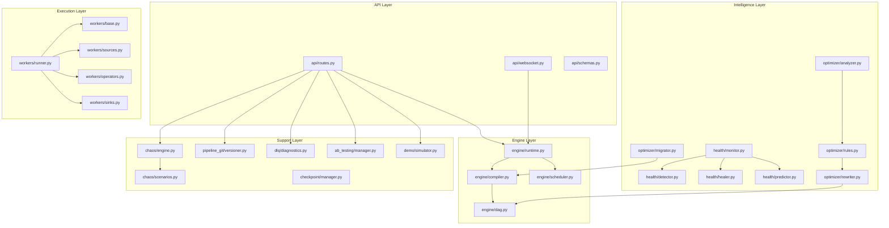

---

## 2. engine/ - Runtime Engine

**Purpose:** The engine module is the central nervous system of FlowStorm. It manages the full lifecycle of deployed pipelines -- from compiling a user-defined DAG into an executable plan, to spawning Docker containers for each operator, to coordinating self-healing and live migration during optimization.

**Source Files:**
- `src/engine/runtime.py` -- RuntimeManager, PipelineRuntime
- `src/engine/compiler.py` -- PipelineCompiler, CompiledPipeline
- `src/engine/dag.py` -- DAG class
- `src/engine/scheduler.py` -- Scheduler, PlacementDecision, ResourceLimits

### 2.1 RuntimeManager

The top-level orchestrator that manages all active pipeline runtimes.

**Key Methods:**

| Method | Description |
|--------|-------------|
| `initialize()` | Connects to Redis and Docker daemon. Falls back to dev mode if Docker is unavailable. |
| `deploy_pipeline(pipeline)` | Compiles the pipeline via `PipelineCompiler`, creates a `PipelineRuntime`, and deploys it. |
| `stop_pipeline(pipeline_id)` | Tears down a running pipeline (kills workers, cleans up streams). |
| `get_runtime(pipeline_id)` | Returns the `PipelineRuntime` for a given pipeline. |
| `get_all_status()` | Returns status of all active pipelines. |

**Configuration:**

| Parameter | Default | Description |
|-----------|---------|-------------|
| `redis_host` | `localhost` | Redis server hostname |
| `redis_port` | `6379` | Redis server port |
| `worker_image` | `flowstorm-worker:latest` | Docker image for worker containers |

**Dependencies:** PipelineCompiler, Scheduler, Redis (aioredis), Docker SDK

### 2.2 PipelineRuntime

Manages a single deployed pipeline. Each `PipelineRuntime` holds references to all its worker containers, the compiled DAG, and the Redis Streams connecting them.

**Key Methods:**

| Method | Description |
|--------|-------------|
| `deploy()` | Creates Redis Streams for all edges, spawns worker containers, publishes deployment event. |
| `teardown()` | Stops all workers, deletes Redis Streams, publishes stop event. |
| `handle_worker_death(worker_id)` | Self-healing: respawns dead worker, replays from checkpoint. Returns `HealingEvent`. |
| `handle_scale_out(node_id, target_parallelism)` | Scales an operator to N parallel instances using consumer groups. |
| `get_status()` | Returns pipeline status with per-worker metrics. |

**Worker Spawn Flow:**

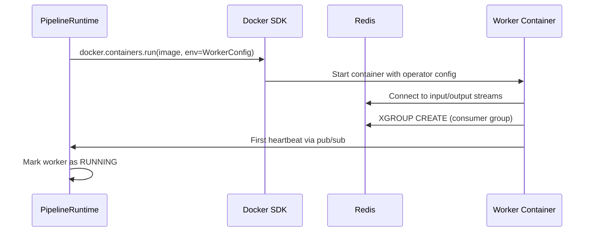

### 2.3 PipelineCompiler and CompiledPipeline

The compiler transforms a `Pipeline` definition (nodes + edges from the frontend) into an executable deployment plan.

**Compilation Steps:**
1. Build a `DAG` from the pipeline definition
2. Validate the DAG structure (cycle detection, source/sink rules, connectivity)
3. Assign Redis Stream keys to all edges
4. Compute execution order via topological sort
5. Generate a `WorkerConfig` for each node

**CompiledPipeline** contains:
- `pipeline` -- the original Pipeline model
- `dag` -- the validated DAG instance
- `worker_configs` -- list of `WorkerConfig` objects ready for Docker spawning
- `stream_keys` -- list of Redis Stream keys for all edges
- `execution_order` -- topologically sorted node IDs

The compiler also supports `recompile(dag)` for incremental recompilation after optimization or healing mutations.

### 2.4 DAG Class

The core graph data structure representing a stream processing pipeline. Uses adjacency lists internally and supports both read-only queries and live mutation.

**Key Algorithms:**

| Method | Algorithm | Purpose |
|--------|-----------|---------|
| `topological_sort()` | Kahn's algorithm (BFS-based) | Determines execution order; detects cycles |
| `validate()` | BFS reachability from sources | Ensures connectivity, source/sink rules, no cycles |
| `get_execution_layers()` | Longest-path layering | Groups independent nodes for parallel execution |

**Live Mutation Methods (used by optimizer and healer):**

| Method | Description |
|--------|-------------|
| `add_node(node)` | Adds a node to the graph |
| `remove_node(node_id)` | Removes a node and all its edges |
| `add_edge(edge)` | Adds a directed edge |
| `remove_edge(source_id, target_id)` | Removes an edge |
| `insert_node_between(new_node, source_id, target_id)` | Inserts a node between two connected nodes (for buffer insertion) |
| `swap_nodes(node_a_id, node_b_id)` | Swaps two adjacent nodes (for predicate pushdown) |
| `parallelize_node(node_id, parallelism)` | Splits a node into N parallel copies (for auto-scaling) |
| `snapshot()` | Serializes the DAG for versioning |
| `clone()` | Deep-copies the DAG |

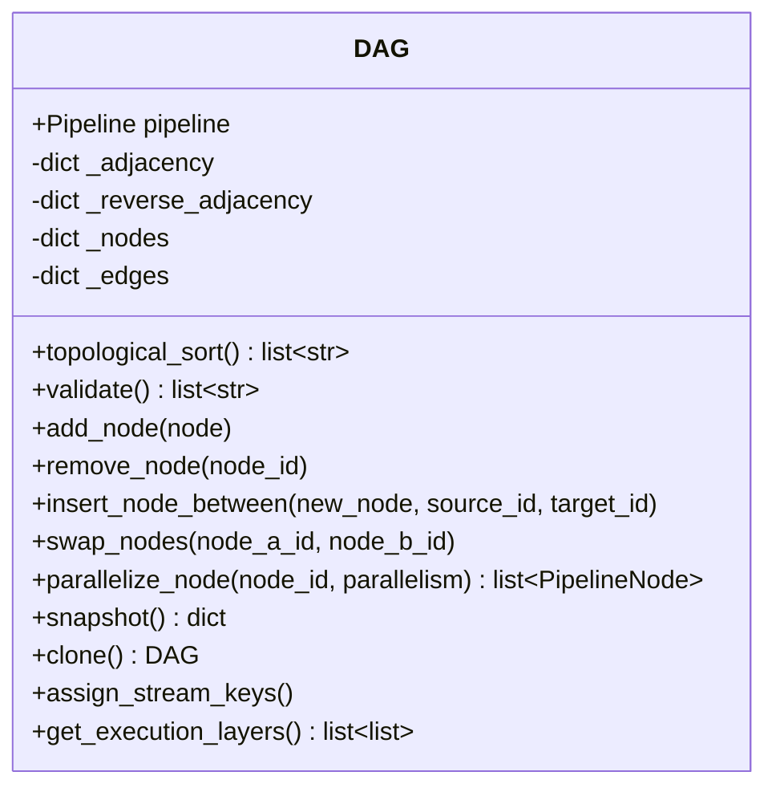

### 2.5 Scheduler, PlacementDecision, ResourceLimits

The scheduler determines resource allocation and parallelism for each operator.

**Scheduling Strategy:**
- Sources and sinks: 1 instance each
- All operators: start at 1 instance, auto-scaler increases if needed
- Stateful operators (window, join, aggregate): 512 MB memory, 1024 CPU shares
- Stateless operators (filter, map): 256 MB memory, 512 CPU shares
- Co-location preference: operators connected by edges are preferred on the same host

**ResourceLimits** dataclass:

| Field | Default | Description |
|-------|---------|-------------|
| `cpu_shares` | 1024 | Docker CPU shares (1024 = 1 CPU core) |
| `memory_mb` | 256 | Memory limit in MB |
| `memory_reservation_mb` | 128 | Minimum guaranteed memory |

---

## 3. health/ - Self-Healing System

**Purpose:** Implements the MAPE-K (Monitor, Analyze, Plan, Execute over Knowledge) autonomic computing loop. Continuously observes worker health, detects anomalies, decides on healing actions, and executes them without human intervention.

**Source Files:**
- `src/health/monitor.py` -- HealthMonitor
- `src/health/detector.py` -- AnomalyDetector, Anomaly, AnomalyType
- `src/health/healer.py` -- SelfHealer
- `src/health/predictor.py` -- PredictiveScaler, TrafficPattern

### 3.1 HealthMonitor

The brain of the self-healing system. Runs two background async tasks: a heartbeat listener (Redis pub/sub) and a periodic health check loop.

**Health Score Formula:**

```
score = cpu_score * 0.30 + memory_score * 0.30 + throughput_score * 0.20 + latency_score * 0.20
```

Where:
- **CPU score:** `max(0, 100 - cpu_percent)` -- linear decrease
- **Memory score:** 100 if <60%, then `max(0, 100 - (memory_percent - 60) * 2.5)` -- steeper drop after 60%
- **Throughput score:** 100 if stable, 60 if dropped 30%, 30 if dropped 50%
- **Latency score:** 100 if <50ms, linear to 0 at 500ms

**Health Thresholds:**

| Status | Score Range | Color | Action |
|--------|-------------|-------|--------|
| HEALTHY | >= 70 | Green | None |
| DEGRADED | 30 - 69 | Yellow | Monitor closely |
| CRITICAL | < 30 | Red | Trigger healing |
| DEAD | No heartbeat for 2s | Black | Immediate failover |

**Key Methods:**

| Method | Description |
|--------|-------------|
| `start()` | Connects to Redis, starts heartbeat listener and health check loop |
| `stop()` | Cancels background tasks, closes Redis |
| `_heartbeat_listener()` | Subscribes to `flowstorm:heartbeat:*` via psubscribe |
| `_process_heartbeat(heartbeat)` | Updates worker metrics, feeds predictive scaler, stores in Redis |
| `_health_check_loop()` | Runs every 1 second, checks for dead workers |
| `_compute_health(worker_id)` | Calculates weighted health score |
| `get_prediction(pipeline_id)` | Delegates to PredictiveScaler for scaling recommendation |

**Configuration:**

| Parameter | Default | Description |
|-----------|---------|-------------|
| `heartbeat_timeout_ms` | 2000 | Milliseconds before a worker is declared dead |
| `check_interval_ms` | 1000 | Health check loop interval |

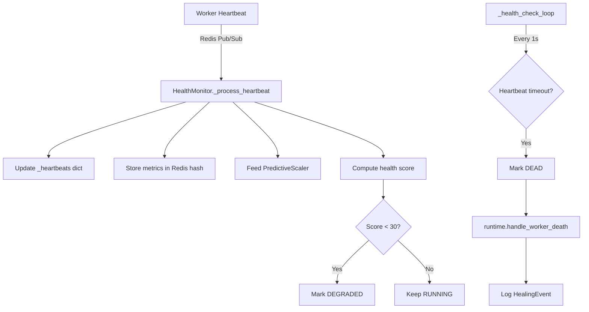

### 3.2 AnomalyDetector

Statistically detects anomalies across 5 types by maintaining rolling windows of metrics history per worker.

**5 Anomaly Types:**

| Type | Trigger Condition | Severity Logic |
|------|-------------------|----------------|
| `throughput_drop` | Recent avg < 30% of older avg (5+ samples required) | Always critical |
| `error_spike` | More than 10 new errors in last interval | Warning <50 errors, critical >=50 |
| `memory_leak` | Memory increasing in 80%+ of samples AND current >80% | Warning <90%, critical >=90% |
| `latency_spike` | Current latency > 5x average AND >100ms | Warning <1000ms, critical >=1000ms |
| `consumer_lag` | Consumer group falling behind producer | Based on lag growth rate |

**Detection Algorithm (throughput example):**
1. Maintain a 10-minute rolling window of `(timestamp, events_per_second)` samples
2. Compute average of last 3 samples (recent) and 7 samples before that (baseline)
3. If `recent_avg < baseline_avg * 0.3`, emit a `throughput_drop` anomaly

Each `Anomaly` object contains: `anomaly_type`, `worker_id`, `node_id`, `severity`, `description`, `current_value`, `expected_value`, and `timestamp`.

### 3.3 SelfHealer

Receives anomalies from the detector and decides which healing action to execute. Implements a per-node cooldown mechanism to prevent healing storms.

**4 Healing Actions:**

| Anomaly Type | Healing Action | Method Called |
|-------------|----------------|--------------|
| `throughput_drop` | RESTART -- kill and respawn worker | `runtime._restart_worker()` |
| `error_spike` | RESTART -- fresh state restart | `runtime._restart_worker()` |
| `memory_leak` | MIGRATE -- move to fresh container | `runtime._restart_worker()` (new container = fresh memory) |
| `latency_spike` | SCALE_OUT -- add parallel instance | `runtime.handle_scale_out(node_id, 2)` |
| `consumer_lag` | SCALE_OUT -- add 3 parallel instances | `runtime.handle_scale_out(node_id, 3)` |

**Cooldown Mechanism:**
- Key: `{node_id}:{anomaly_type}` (e.g., `win-5m:memory_leak`)
- Duration: 30 seconds
- Logic: If the same node+anomaly combination was healed less than 30 seconds ago, skip healing
- Purpose: Prevents restart loops and gives healing actions time to take effect

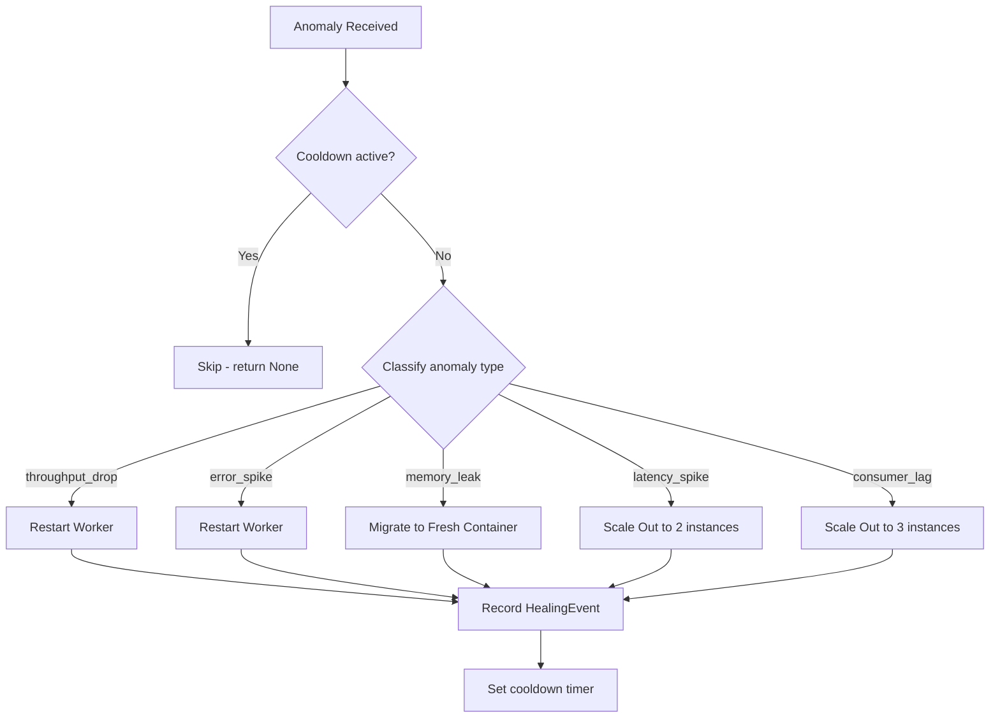

### 3.4 PredictiveScaler

Predicts future throughput and recommends proactive scaling actions. Instead of reacting after a spike, it pre-scales workers before the spike arrives.

**Prediction Algorithm:**
1. Collect throughput history per pipeline, keyed by hour-of-day
2. Weighted prediction: `40% historical hourly average + 60% recent trend`
3. Adjust for detected trend: `increasing (1.5x)`, `spike (3.0x)`, `decreasing (0.7x)`, `stable (1.0x)`

**Trend Detection:**
- Compare last 10 samples against previous 10 samples
- `change_ratio > 3.0` = spike
- `change_ratio > 1.3` = increasing
- `change_ratio < 0.7` = decreasing
- Otherwise = stable

**Scaling Recommendations:**

| Predicted/Current Ratio | Action | Urgency |
|------------------------|--------|---------|
| > 2.0 or spike trend | `scale_up` (factor = ceil(ratio), max 5) | high |
| 1.3 - 2.0 | `scale_up` (factor = 2) | low |
| < 0.3 | `scale_down` | low |
| 0.3 - 1.3 | `none` | - |

**Dependencies:** Called by HealthMonitor on every heartbeat via `record_throughput()`. Exposed to the API via `GET /api/pipelines/:id/prediction`.

---

## 4. optimizer/ - Auto-Optimization Pipeline

**Purpose:** Continuously analyzes pipeline performance and automatically rewrites the DAG to improve efficiency. All optimizations are applied live without stopping the pipeline.

**Source Files:**
- `src/optimizer/analyzer.py` -- PatternAnalyzer, FilterStats, OperatorStats, EdgeStats, AnalysisResult
- `src/optimizer/rewriter.py` -- DAGRewriter
- `src/optimizer/rules.py` -- 5 OptimizationRule subclasses, OptimizationAction, OptimizationType
- `src/optimizer/migrator.py` -- LiveMigrator, MigrationPlan

### 4.1 PatternAnalyzer

Observes runtime metrics and produces an `AnalysisResult` identifying optimization opportunities.

**What it analyzes:**
- **Filter selectivity:** What percentage of events pass each filter
- **Operator resource usage:** CPU, memory, throughput, latency per operator
- **Bottleneck detection:** Operators with CPU >80% or latency >200ms
- **Data flow patterns:** Events per second per edge, backpressure detection

**Candidate Identification:**

| Candidate Type | Detection Logic |
|----------------|----------------|
| Pushdown | Filter with selectivity <0.3 AND upstream contains join/aggregate/window |
| Fusion | Two consecutive map or two consecutive filter operators |
| Parallelization | Operator is filter/map/aggregate AND is a bottleneck (CPU >80%) |

**Data Sources:** Reads worker metrics from `flowstorm:metrics:{pipeline_id}` Redis hash (written by HealthMonitor). Reads filter selectivity from checkpoint state stored at `flowstorm:checkpoint:{pipeline_id}:{node_id}`.

### 4.2 DAGRewriter

Takes `OptimizationAction` objects from the rules engine and mutates the DAG. Each rewrite is atomic: a before-snapshot is taken, the mutation is applied, the DAG is re-validated, and an after-snapshot is taken.

**5 Optimization Types:**

#### Predicate Pushdown
Swaps a filter with an upstream expensive operator so the filter runs first, reducing data volume before the expensive computation.

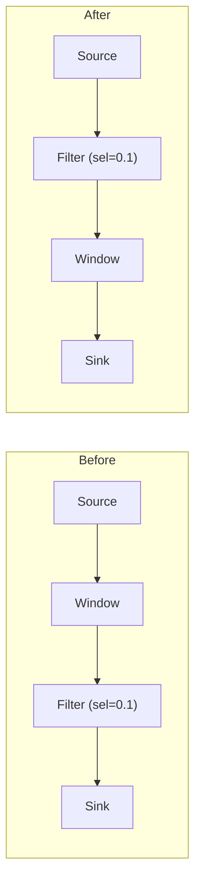

Implementation: calls `dag.swap_nodes(expensive_id, filter_id)`.

#### Operator Fusion
Merges two consecutive stateless operators into one to eliminate serialization overhead between them.

- **Two maps:** Combines expressions using composition (`expr2.replace("x", f"({expr1})")`)
- **Two filters:** Combines as AND logic (both conditions must pass)

Implementation: removes both original nodes, creates a fused node, rewires edges.

#### Auto-Parallelization
Splits a bottleneck operator into N parallel instances.

- CPU >90%: target parallelism = 4
- CPU >80%: target parallelism = 3
- Otherwise: target parallelism = 2

Implementation: calls `dag.parallelize_node(node_id, target)`.

#### Buffer Insertion
Inserts a pass-through operator between a fast producer and slow consumer to absorb burst traffic.

Implementation: calls `dag.insert_node_between(buffer_node, source_id, target_id)`.

#### Window Optimization
Changes a window operator's type based on memory/latency analysis.

- High memory + high latency: switch to tumbling window
- High latency only: switch to session window

Implementation: directly modifies `node.config.window_type`.

### 4.3 OptimizationRules

Five rule classes implementing the `OptimizationRule` ABC. Each evaluates an `AnalysisResult` and returns a list of `OptimizationAction` objects sorted by priority.

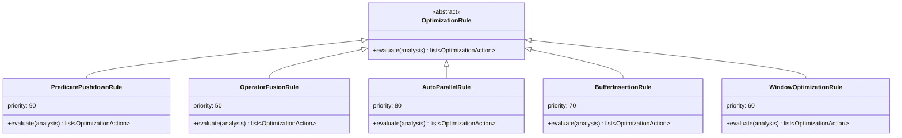

**Priority System:**

| Priority | Rule | Risk Level |
|----------|------|------------|
| 90 | Predicate Pushdown | Low -- correctness-preserving |
| 80 | Auto-Parallel | Medium -- changes topology |
| 70 | Buffer Insertion | Low -- additive change |
| 60 | Window Optimization | Medium -- changes window semantics |
| 50 | Operator Fusion | Low -- reduces operators |

The global `evaluate_all_rules(analysis)` function runs all rules and returns actions sorted by priority (highest first).

### 4.4 LiveMigrator

Coordinates zero-downtime migration when the DAG is rewritten.

**Migration Steps:**
1. Recompile the new DAG via `PipelineCompiler.recompile()`
2. Diff old and new compiled pipelines (workers to add, workers to remove, streams to create/delete)
3. Create new Redis Streams
4. Spawn new workers
5. Drain old workers (2-second grace period)
6. Kill old workers
7. Delete old streams (1-second grace period)
8. Publish `optimizer.applied` event

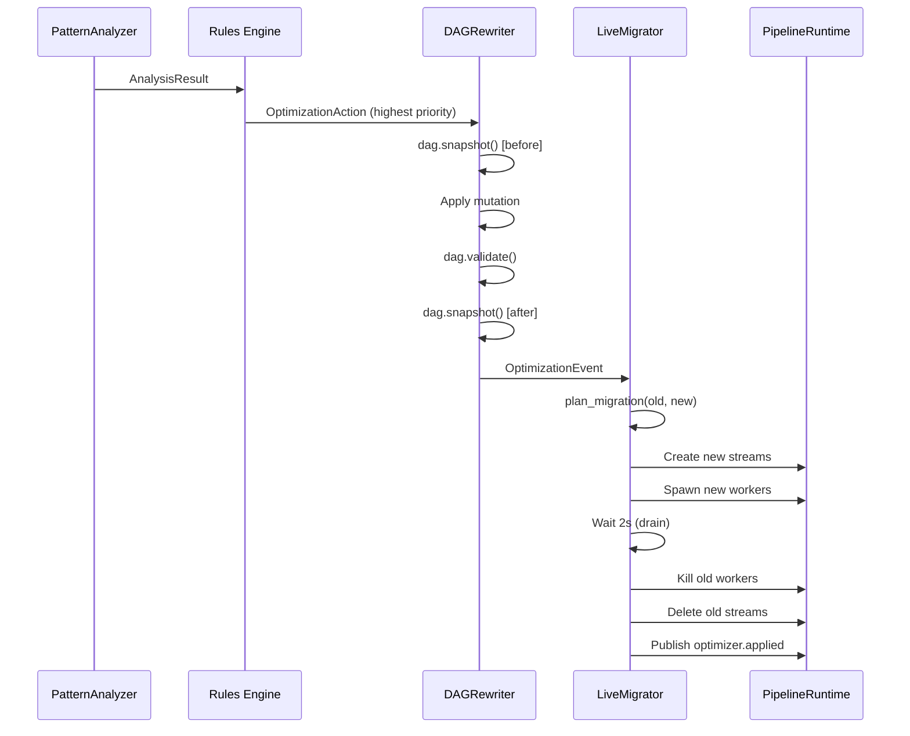

---

## 5. workers/ - Operator Workers

**Purpose:** Implements the actual stream processing operators that run inside Docker containers. Each operator extends the `BaseWorker` abstract class and implements a `process()` method.

**Source Files:**
- `src/workers/base.py` -- BaseWorker ABC
- `src/workers/sources.py` -- MQTTSource, SimulatorSource
- `src/workers/operators.py` -- FilterOperator, MapOperator, WindowOperator, AggregateOperator, JoinOperator
- `src/workers/sinks.py` -- ConsoleSink, RedisSink, AlertSink, WebhookSink
- `src/workers/runner.py` -- Docker container entry point

### 5.1 BaseWorker ABC

The foundation for all operators. Handles Redis connectivity, event read/write, heartbeat reporting, checkpointing, and dead letter queue routing.

**Lifecycle:**

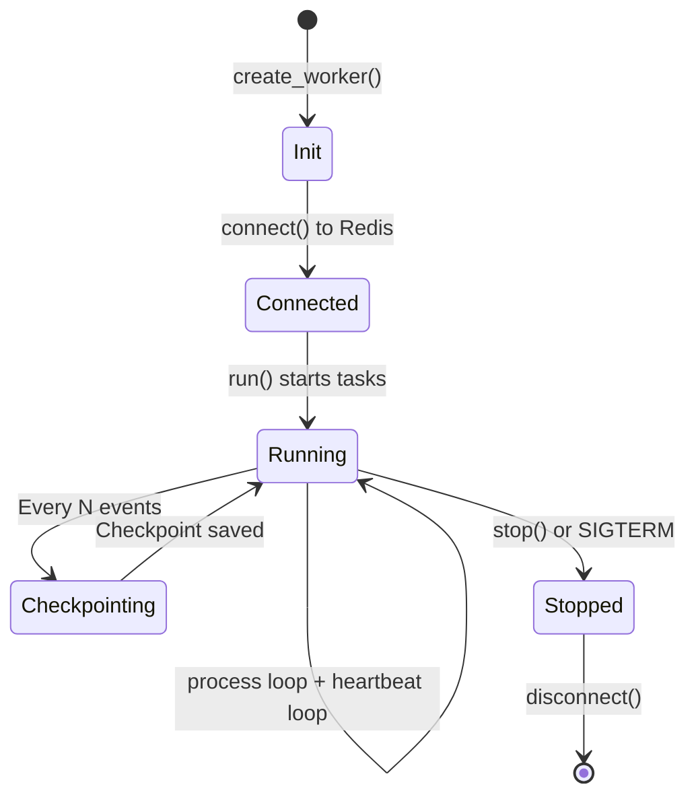

**Core Methods:**

| Method | Description |
|--------|-------------|
| `connect()` | Connects to Redis, creates consumer groups for input streams |
| `run()` | Main entry point -- starts heartbeat and process tasks via `asyncio.gather` |
| `_process_loop()` | Reads from input streams via `XREADGROUP`, calls `process()`, writes to output streams |
| `_heartbeat_loop()` | Sends heartbeat every 500ms (configurable) via Redis pub/sub |
| `_checkpoint()` | Saves processing position + operator state to Redis |
| `_send_to_dlq(event, error)` | Routes failed events to `flowstorm:{pipeline_id}:dlq` stream |
| `process(event)` | **Abstract** -- subclasses implement operator logic |
| `get_state()` | Returns operator state for checkpointing (override in stateful operators) |
| `restore_state(state)` | Restores state from checkpoint (override in stateful operators) |

**Heartbeat Payload (via `psutil`):**
- `worker_id`, `pipeline_id`, `node_id`
- `cpu_percent` (process-level CPU)
- `memory_percent`, `memory_mb` (RSS)
- `events_processed`, `events_per_second`
- `avg_latency_ms` (rolling average of last 100 events)
- `errors` (cumulative error count)

**Configuration (from environment variables):**

| Env Var | Default | Description |
|---------|---------|-------------|
| `WORKER_ID` | `unknown` | Unique worker identifier |
| `PIPELINE_ID` | `unknown` | Pipeline this worker belongs to |
| `NODE_ID` | `unknown` | DAG node this worker implements |
| `OPERATOR_TYPE` | `unknown` | Operator type (filter, map, etc.) |
| `OPERATOR_CONFIG` | `{}` | JSON operator configuration |
| `INPUT_STREAMS` | `[]` | Redis Stream keys to read from |
| `OUTPUT_STREAMS` | `[]` | Redis Stream keys to write to |
| `CONSUMER_GROUP` | `default` | Redis consumer group name |
| `HEARTBEAT_INTERVAL_MS` | `500` | Heartbeat frequency |
| `CHECKPOINT_EVERY_N` | `1000` | Checkpoint every N events |

### 5.2 Sources

**MQTTSource** -- Ingests events from an MQTT topic using paho-mqtt. Bridges the MQTT callback thread to asyncio via an `asyncio.Queue` (max 10,000 events). Supports configurable topic, broker, and port. Each ingested message is annotated with a lineage entry recording the MQTT topic.

**SimulatorSource** -- Generates realistic IoT sensor data for testing and demos. Produces events for N simulated sensors (default 10) with configurable interval (default 1000ms). Each event includes `sensor_id`, `zone`, `temperature` (with sinusoidal time-of-day pattern using `5 * sin((hour - 6) * pi / 12)`), `humidity`, and `pressure`. Supports chaos mode that randomly injects temperature spikes, missing fields, and clock drift at a 5% rate.

### 5.3 Operators

**FilterOperator** -- Evaluates a condition on a specified field. Supports 7 conditions: `gt`, `lt`, `eq`, `neq`, `gte`, `lte`, `contains`. Attempts numeric comparison first, falls back to string comparison. Tracks selectivity (ratio of events passing) for the optimizer's predicate pushdown analysis. Stateful: checkpoints `total_seen` and `total_passed`.

**MapOperator** -- Transforms events by evaluating a Python expression. The expression receives `x` (field value) and `data` (full event dict). Output can replace the original field or create a new one. Uses sandboxed `eval()` with `__builtins__` stripped for security. On evaluation error, passes the event through unchanged.

**WindowOperator** -- Groups events into time-based windows (tumbling or sliding). Maintains per-group buffers of `(timestamp, value)` tuples using `defaultdict(list)`. When the window closes (based on `window_size_seconds`), emits one aggregated event per group containing `window_start`, `window_end`, `group`, `agg_function`, `result`, and `count`. Supports 5 aggregation functions: `avg`, `sum`, `min`, `max`, `count`. Stateful: checkpoints buffer contents and last emit time.

**AggregateOperator** -- Maintains running aggregates that update with every event. Uses accumulators per group tracking `sum`, `count`, `min`, and `max`. Emits the latest aggregate value with every input event. Supports optional `group_by` field for grouped aggregation. Stateful: checkpoints accumulator state.

**JoinOperator** -- Joins events from two streams within a configurable time window. Maintains separate left and right buffers keyed by the join field value. When a new event arrives, it matches against the opposite buffer within the `join_window_seconds` window. Expired entries are cleaned up on each invocation. Stateful: checkpoints both buffers.

### 5.4 Sinks

| Sink | Description |
|------|-------------|
| **ConsoleSink** | Logs events to stdout as JSON. No output events. |
| **RedisSink** | Stores events in a Redis Stream (`flowstorm:output:{pipeline_id}`, maxlen 10,000) and publishes to a dashboard pub/sub channel for real-time display. |
| **AlertSink** | Formats alert messages from templates with `{field}` placeholders, stores alerts in Redis Stream (`flowstorm:alerts:{pipeline_id}`, maxlen 1,000), publishes to real-time alert channel. Supports console and webhook delivery via httpx. |
| **WebhookSink** | POSTs event payloads to an external HTTP endpoint via httpx with 5-second timeout. Failed sends are routed to the DLQ. |

### 5.5 Docker Runner

The container entry point (`runner.py`). Reads `OPERATOR_TYPE` from environment, looks up the correct class from the combined registry (`ALL_OPERATORS = SOURCE_REGISTRY | OPERATOR_REGISTRY | SINK_REGISTRY`), instantiates it, and calls `worker.run()`. Registers SIGTERM/SIGINT handlers for graceful shutdown via `asyncio.create_task(worker.stop())`.

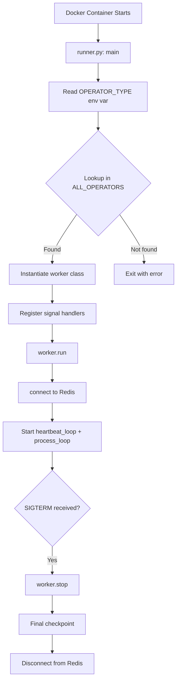

---

## 6. chaos/ - Chaos Engineering

**Purpose:** Intentionally injects failures into running pipelines to validate that the self-healing system can recover. Provides a controlled way to test resilience.

**Source Files:**
- `src/chaos/engine.py` -- ChaosEngine
- `src/chaos/scenarios.py` -- 6 ChaosScenario subclasses, ChaosResult

### 6.1 ChaosEngine

Orchestrates chaos experiments on a live pipeline. Configurable by intensity and duration.

**Intensity Levels:**

| Intensity | Scenarios Included | Interval |
|-----------|-------------------|----------|
| `low` | Medium severity only (Latency, Corrupt, Memory) | 15-30s |
| `medium` | Low + medium severity | 10-20s |
| `high` | All scenarios including Kill, Flood, Partition | 5-15s |

**Key Methods:**

| Method | Description |
|--------|-------------|
| `start(intensity, duration_seconds)` | Starts chaos loop as background task |
| `stop()` | Cancels the chaos loop |
| `_chaos_loop(duration)` | Picks random scenario, executes, publishes event, sleeps random interval |
| `_pick_scenario()` | Selects scenario from the appropriate pool based on intensity |
| `get_history()` | Returns list of all chaos events with timestamps |

### 6.2 Six Chaos Scenarios

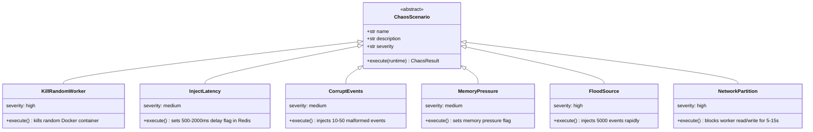

| Scenario | Severity | What it Does | Expected Healing |
|----------|----------|--------------|-----------------|
| KillRandomWorker | high | Kills a random worker container via Docker API, marks worker as DEAD | Failover + checkpoint replay |
| InjectLatency | medium | Sets a Redis key with delay (500-2000ms) expiring after 30s | Detected as latency spike, scale out |
| CorruptEvents | medium | Injects 10-50 malformed events (missing_data, wrong_type, empty, garbage) into a random stream | Events route to DLQ, worker continues |
| MemoryPressure | medium | Sets memory pressure flag in Redis for 30s | Detected as memory leak, migrate |
| FloodSource | high | Injects 5,000 events into the first stream (closest to source) | Detected as throughput spike, scale out |
| NetworkPartition | high | Sets partition flag in Redis for 5-15s on a random worker | Detected as worker death, failover |

---

## 7. pipeline_git/ - Pipeline Version Control

**Purpose:** Implements a Git-like version control system for pipeline DAGs. Every change (user edit, auto-optimization, self-healing, rollback) creates an immutable version record with a full DAG snapshot, enabling diffing, audit trails, and safe rollback.

**Source Files:**
- `src/pipeline_git/versioner.py` -- PipelineVersioner, VersionTrigger
- `src/pipeline_git/differ.py` -- PipelineDiffer, PipelineDiff, NodeDiff, EdgeDiff
- `src/pipeline_git/store.py` -- PipelineVersionStore

### 7.1 PipelineVersioner

High-level interface for version management.

**Version Triggers:**

| Trigger | Constant | When |
|---------|----------|------|
| User action | `USER` | User creates or edits a pipeline |
| Optimization | `AUTO_OPTIMIZE` | DAG rewriter applies an optimization |
| Healing | `AUTO_HEAL` | Self-healer modifies the pipeline |
| A/B Test | `AB_TEST` | A/B test creates a variant |
| Rollback | `ROLLBACK` | User rolls back to a previous version |

**Key Methods:**

| Method | Description |
|--------|-------------|
| `save_version(dag, trigger, description)` | Snapshots the DAG and saves with metadata. Returns version number. |
| `get_history(pipeline_id, limit)` | Returns version history (newest first). |
| `diff_versions(pipeline_id, from_ver, to_ver)` | Generates a PipelineDiff between two versions. |
| `get_snapshot(pipeline_id, version_number)` | Returns the DAG snapshot for a specific version. |
| `create_initial_version(dag)` | Creates v1 when a pipeline is first deployed. |
| `save_optimization_version(dag, type, desc, gain)` | Convenience method for optimizer commits. |
| `save_healing_version(dag, action, desc)` | Convenience method for healing commits. |
| `save_rollback_version(dag, rolled_back_to)` | Records a rollback as a new version (never overwrites history). |

### 7.2 PipelineDiffer

Compares two DAG snapshots and produces a structured diff.

**Diff Detection:**
- **Nodes added:** ID exists in new but not old
- **Nodes removed:** ID exists in old but not new
- **Nodes modified:** ID exists in both, config values differ
- **Nodes moved:** ID exists in both, position changed but config unchanged
- **Edges added/removed:** Edge key `{source}->{target}` comparison

The `PipelineDiff` object provides computed properties: `nodes_added`, `nodes_removed`, `nodes_modified`, `edges_added`, `edges_removed`, and a human-readable `summary` string. The `to_dict()` method produces a JSON-serializable representation that excludes unchanged nodes.

### 7.3 PipelineVersionStore

Dual-backend storage with automatic fallback.

**Primary: PostgreSQL**
- Table: `pipeline_versions` with columns: `id` (SERIAL), `pipeline_id`, `version_number`, `trigger`, `description`, `dag_snapshot` (JSONB), `node_count`, `edge_count`, `performance_snapshot` (JSONB), `created_at` (TIMESTAMPTZ)
- Unique constraint on `(pipeline_id, version_number)`
- Indexed on `pipeline_id` and `created_at`
- Uses `asyncpg` connection pool (min 2, max 10)

**Fallback: In-Memory**
- Activated when PostgreSQL connection fails
- Stores versions as a list of dictionaries
- Data does not persist across restarts
- Logs a warning on startup

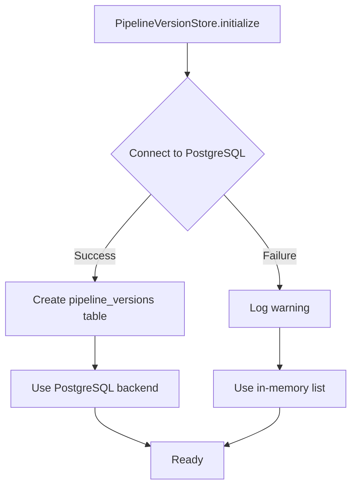

---

## 8. dlq/ - Dead Letter Queue Diagnostics

**Purpose:** Provides intelligent diagnostics for failed events. Reads from the DLQ Redis Stream, classifies failures by type using pattern matching on error messages, and suggests actionable fixes.

**Source Files:**
- `src/dlq/diagnostics.py` -- DLQDiagnostics, DLQEntry, FailureType, FAILURE_SUGGESTIONS

### 8.1 Failure Classification

The `DLQEntry._classify()` method uses keyword matching on the lowercased error message:

| Failure Type | Detection Keywords | Example Error |
|--------------|-------------------|---------------|
| `missing_field` | "keyerror", "missing", "not found" | `KeyError: 'temperature'` |
| `type_mismatch` | "typeerror", "type" + "cast"/"convert" | `TypeError: expected float, got str` |
| `null_value` | "none", "null", "nonetype" | `NullPointerError: 'sensor_id' is null` |
| `schema_violation` | "schema", "validation" | `SchemaValidationError: unexpected field` |
| `timeout` | "timeout", "timed out" | `TimeoutError: Redis write timed out` |
| `operator_error` | "error", "exception", "failed" | `AggregationError: division by zero` |
| `unknown` | None of the above | Any unclassified error |

### 8.2 Fix Suggestions

Each failure type maps to a list of actionable suggestions stored in `FAILURE_SUGGESTIONS`:

| Failure Type | Suggestions |
|--------------|-------------|
| `missing_field` | Add default value in Map operator; Add Filter to drop events without required fields; Check source for schema changes |
| `type_mismatch` | Add Map operator to cast field; Update Filter condition for mixed types; Add input validation at source |
| `null_value` | Add Filter to remove null events; Add Map with coalesce/default expression |
| `schema_violation` | Update operator config; Add schema validation Filter |
| `operator_error` | Check expression syntax; Review config; Restart worker |
| `timeout` | Increase timeout; Scale out operator; Check downstream dependencies |

### 8.3 DLQDiagnostics

**Key Methods:**

| Method | Description |
|--------|-------------|
| `get_entries(pipeline_id, count)` | Reads last N entries from `flowstorm:{pipeline_id}:dlq` stream via XREVRANGE. Returns classified `DLQEntry` objects. |
| `get_stats(pipeline_id)` | Aggregates entries by failure type and node. Returns counts, affected nodes, and suggestions per group. |

**Dependencies:** Redis (reads from DLQ stream written by `BaseWorker._send_to_dlq()`).

---

## 9. ab_testing/ - A/B Pipeline Testing

**Purpose:** Enables side-by-side comparison of two pipeline versions by splitting traffic and collecting comparative metrics.

**Source Files:**
- `src/ab_testing/manager.py` -- ABTestManager, ABTestConfig, ABTestMetrics, ABTestResult

### 9.1 ABTestManager

**Key Methods:**

| Method | Description |
|--------|-------------|
| `create_test(pipeline_id_a, pipeline_id_b, split_percent, name)` | Creates a test with configurable traffic split. Returns test ID (e.g., `ab-1`). |
| `record_metrics(test_id, pipeline_id, throughput, latency, errors, cpu, memory)` | Records a metric sample for one side. Keeps last 1,000 samples per side. |
| `get_result(test_id)` | Returns `ABTestResult` with aggregated metrics for both sides and winner determination. |
| `list_tests()` | Lists all active tests with sample counts. |
| `stop_test(test_id)` | Returns final result and cleans up test data. |

### 9.2 Winner Determination Algorithm

The `_determine_winner()` method uses a scoring system across 4 dimensions:

1. **Throughput:** Higher is better. +1 point if >10% better.
2. **Latency:** Lower is better. +1 point if >10% better.
3. **Errors:** Fewer is better. +1 point if fewer errors.
4. **CPU:** Lower is better (more efficient). +1 point if >10% better.

**Requirements:** At least 10 samples per version before determining a winner. If scores are tied, result is "Inconclusive."

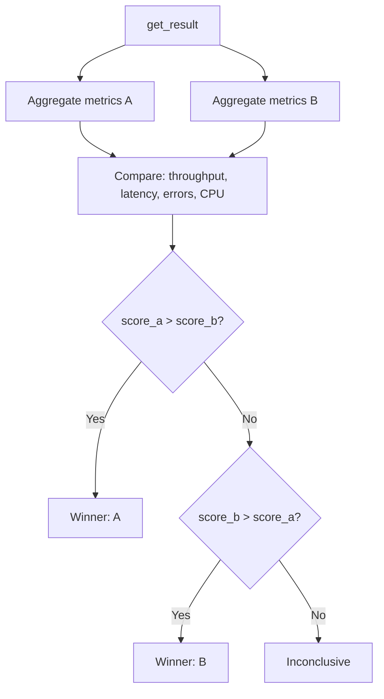

---

## 10. checkpoint/ - State Checkpointing

**Purpose:** Coordinates state persistence for exactly-once recovery. When a worker dies, the replacement worker restores from the latest checkpoint and replays events from the checkpoint position.

**Source Files:**
- `src/checkpoint/manager.py` -- CheckpointManager
- `src/checkpoint/store.py` -- CheckpointStore

### 10.1 CheckpointManager

High-level checkpoint operations.

**Key Methods:**

| Method | Description |
|--------|-------------|
| `save_checkpoint(checkpoint)` | Saves to Redis key `flowstorm:checkpoint:{pipeline_id}:{node_id}`. Also maintains a history list (last 10 via LPUSH + LTRIM). |
| `get_latest_checkpoint(pipeline_id, node_id)` | Returns most recent `Checkpoint` for a node. |
| `get_checkpoint_history(pipeline_id, node_id, count)` | Returns last N checkpoints from the history list. |
| `get_all_checkpoints(pipeline_id)` | Scans Redis for all checkpoint keys in a pipeline (excludes history keys). |
| `delete_checkpoints(pipeline_id)` | Deletes all checkpoints for a pipeline. |
| `get_replay_position(pipeline_id, node_id)` | Returns the Redis Stream message ID to resume from. |

**Redis Key Structure:**
- Latest checkpoint: `flowstorm:checkpoint:{pipeline_id}:{node_id}`
- History list: `flowstorm:checkpoint:{pipeline_id}:{node_id}:history`

### 10.2 CheckpointStore

Low-level Redis operations for operator state and consumer offsets.

**Key Methods:**

| Method | Description |
|--------|-------------|
| `save_operator_state(pipeline_id, node_id, state)` | Saves operator-specific state (window buffers, accumulator values) to `flowstorm:state:{pipeline_id}:{node_id}` |
| `get_operator_state(pipeline_id, node_id)` | Retrieves operator state |
| `save_consumer_offset(pipeline_id, node_id, stream_key, offset)` | Saves last consumed message ID to `flowstorm:offset:{pipeline_id}:{node_id}:{stream_key}` |
| `get_consumer_offset(pipeline_id, node_id, stream_key)` | Retrieves last consumed message ID |
| `get_pending_count(stream_key, consumer_group)` | Gets unacknowledged message count via XPENDING |
| `get_stream_length(stream_key)` | Gets total messages in a stream via XLEN |
| `get_consumer_lag(stream_key, consumer_group)` | Estimates consumer lag via XINFO GROUPS |

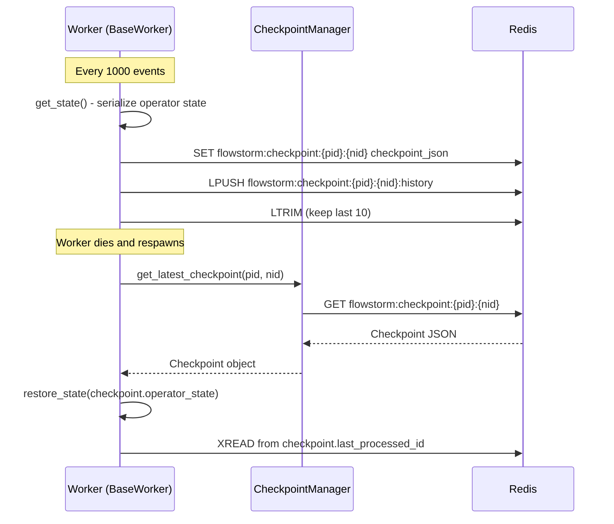

---

## 11. api/ - REST and WebSocket API

**Purpose:** Exposes FlowStorm's capabilities through 25 REST endpoints and 1 WebSocket endpoint. Handles request validation, demo mode bypass, and real-time event streaming.

**Source Files:**
- `src/api/routes.py` -- 25 REST endpoints + WebSocket handler
- `src/api/websocket.py` -- ConnectionManager, PipelineEventForwarder, MetricsPusher
- `src/api/schemas.py` -- Pydantic request/response models

### 11.1 REST Routes (25 Endpoints)

**Pipeline CRUD (4):**

| Method | Path | Handler |
|--------|------|---------|
| `POST` | `/api/pipelines` | Create and deploy pipeline |
| `GET` | `/api/pipelines` | List all active pipelines |
| `GET` | `/api/pipelines/{id}` | Get pipeline status |
| `DELETE` | `/api/pipelines/{id}` | Stop and remove pipeline |

**Chaos Engineering (3):**

| Method | Path | Handler |
|--------|------|---------|
| `POST` | `/api/pipelines/{id}/chaos` | Start chaos mode with intensity/duration |
| `DELETE` | `/api/pipelines/{id}/chaos` | Stop chaos mode |
| `GET` | `/api/pipelines/{id}/chaos/history` | Get chaos event log |

**Version Control (3):**

| Method | Path | Handler |
|--------|------|---------|
| `GET` | `/api/pipelines/{id}/versions` | Get version history |
| `GET` | `/api/pipelines/{id}/versions/{from}/diff/{to}` | Visual diff between versions |
| `POST` | `/api/pipelines/{id}/rollback` | Rollback to a specific version |

**Health and Healing (2):**

| Method | Path | Handler |
|--------|------|---------|
| `GET` | `/api/pipelines/{id}/health` | Worker health scores |
| `GET` | `/api/pipelines/{id}/healing-log` | Self-healing event log |

**Dead Letter Queue (2):**

| Method | Path | Handler |
|--------|------|---------|
| `GET` | `/api/pipelines/{id}/dlq` | Failed events with diagnostics |
| `GET` | `/api/pipelines/{id}/dlq/stats` | Aggregated failure statistics |

**Data Lineage (1):**

| Method | Path | Handler |
|--------|------|---------|
| `GET` | `/api/pipelines/{id}/lineage/{eventId}` | Event trace through pipeline |

**A/B Testing (4):**

| Method | Path | Handler |
|--------|------|---------|
| `POST` | `/api/ab-tests` | Create A/B test |
| `GET` | `/api/ab-tests` | List all tests |
| `GET` | `/api/ab-tests/{id}` | Get test results |
| `DELETE` | `/api/ab-tests/{id}` | Stop test |

**Predictions (1):**

| Method | Path | Handler |
|--------|------|---------|
| `GET` | `/api/pipelines/{id}/prediction` | Scaling recommendation |

**Demo Mode (4):**

| Method | Path | Handler |
|--------|------|---------|
| `POST` | `/api/demo/start` | Start demo simulator |
| `POST` | `/api/demo/stop` | Stop demo simulator |
| `GET` | `/api/demo/status` | Get demo status |
| `POST` | `/api/demo/chaos` | Toggle demo chaos |

**WebSocket (1):**

| Protocol | Path | Description |
|----------|------|-------------|
| `WS` | `/api/ws/pipeline/{id}` | Real-time event stream for a pipeline |

### 11.2 WebSocket ConnectionManager

Manages per-pipeline WebSocket connections. Multiple frontend clients can subscribe to the same pipeline.

**Key Methods:**

| Method | Description |
|--------|-------------|
| `connect(websocket, pipeline_id)` | Accepts WebSocket, adds to pipeline's connection list |
| `disconnect(websocket, pipeline_id)` | Removes from connection list, cleans up empty pipelines |
| `broadcast(pipeline_id, message)` | Sends JSON message to all connections for a pipeline. Automatically removes dead connections. |
| `send_personal(websocket, message)` | Sends message to a single connection |

### 11.3 PipelineEventForwarder

Bridges Redis Pub/Sub to WebSocket clients. One instance per pipeline. Subscribes to three channels:
- `flowstorm:events:{pipeline_id}` -- runtime events (deploy, stop, worker lifecycle)
- `flowstorm:dashboard:{pipeline_id}` -- dashboard data from Redis sink
- `flowstorm:alert_events:{pipeline_id}` -- real-time alert events

Forwards all messages received from Redis directly to connected WebSocket clients via the ConnectionManager.

### 11.4 MetricsPusher

Periodically collects worker metrics from Redis (stored by HealthMonitor) and pushes them to WebSocket clients. Default interval: 500ms.

**Metrics Collection:**
1. Reads `flowstorm:metrics:{pipeline_id}` Redis hash
2. Parses per-worker JSON values
3. Aggregates total events/second and total events processed
4. Broadcasts as `pipeline.metrics` event type

### 11.5 Pydantic Schemas

Request/response validation models used by the API routes:

| Schema | Purpose |
|--------|---------|
| `CreatePipelineRequest` | Validates pipeline creation (name, description, nodes as `NodeSchema`, edges as `EdgeSchema`) |
| `PipelineResponse` | Pipeline CRUD response (id, name, status, version, nodes, edges, timestamps) |
| `PipelineStatusResponse` | Runtime status with workers dict, total_workers, stream_keys |
| `ChaosRequest` | Chaos intensity (`low`/`medium`/`high`) and duration_seconds |
| `ChaosResponse` | Confirmation with started flag, intensity, duration |
| `PipelineVersionResponse` | Version entry (version_id, trigger, description, timestamp, node/edge counts) |
| `RollbackRequest` | Target version_id for rollback |
| `LineageResponse` | Event lineage with path and source/final data |
| `WorkerHealthResponse` | Per-worker health (score, CPU, memory, throughput, latency, errors) |
| `HealingEventResponse` | Self-healing action record (action, trigger, target, duration, success) |

---

## 12. demo/ - Demo Simulator

**Purpose:** Generates realistic simulated pipeline data and pushes it through the WebSocket system so the frontend dashboard comes alive without needing real infrastructure (Redis, Docker, MQTT). Designed for live project demonstrations and showcases.

**Source Files:**
- `src/demo/simulator.py` -- DemoSimulator, DEMO_PIPELINE, scenario definitions

### 12.1 DemoSimulator

Runs as an async background task, pushing events at 500ms intervals.

**Simulated Pipeline:** "IoT Temperature Monitor" with 7 nodes:
1. MQTT Source (`src-mqtt`)
2. Temp > 30C Filter (`flt-temp`)
3. Enrich Location Map (`map-enrich`)
4. 5min Window (`win-5m`)
5. Avg Temperature Aggregate (`agg-avg`)
6. Redis Sink (`sink-redis`)
7. Alert Sink (`sink-alert`)

**Event Generation Schedule:**

| Event Type | Frequency | Content |
|------------|-----------|---------|
| `pipeline.metrics` | Every 500ms (every tick) | Per-worker CPU, memory, throughput, latency with realistic oscillation |
| `worker.recovered` | Every ~15 seconds (tick % 30 == 0) | Simulated healing with random scenario |
| `optimizer.applied` | Every ~40 seconds (tick % 80 == 40) | Simulated optimization from 5 types |
| `chaos.event` | Every ~25 seconds when active (tick % 50 == 25) | Simulated chaos with delayed healing response |

**Realistic Metrics Generation:**
Each node has a base state initialized with random values. Metrics oscillate using sine waves with per-node phase offsets and Gaussian noise:

```
eps     = base_eps + 200 * sin(t + phase) + gauss(0, 30)
cpu     = base_cpu + 10 * sin(t * 0.7 + phase) + gauss(0, 3)
mem     = base_mem + 5 * sin(t * 0.3 + phase) + gauss(0, 2)
latency = base_latency + 8 * sin(t * 0.4 + phase) + gauss(0, 2)
```

When a node is "degraded" (from a healing or chaos event), its CPU spikes to 95%, latency triples, and throughput drops to 30%.

**Additional Demo Data Methods:**

| Method | Description |
|--------|-------------|
| `get_demo_dlq_entries(count)` | Returns realistic DLQ entries covering all 6 failure types |
| `get_demo_versions()` | Returns 5 version history entries with realistic triggers (USER, AUTO_OPTIMIZE, AUTO_HEAL) |
| `get_demo_lineage(event_id)` | Returns a full event trace through all 6 pipeline nodes with detailed action descriptions |
| `get_demo_dlq_stats()` | Returns aggregated DLQ statistics grouped by failure type |

---

## 13. models/ - Core Data Models

**Purpose:** Defines all Pydantic data models used throughout the backend. These models enforce type safety, provide serialization/deserialization, and serve as the shared vocabulary between modules.

**Source Files:**
- `src/models/pipeline.py` -- Pipeline, PipelineNode, PipelineEdge, OperatorType, PipelineStatus, NodeType, OperatorConfig
- `src/models/events.py` -- StreamEvent, Heartbeat, Checkpoint, HealingEvent, OptimizationEvent, LineageEntry, HealingAction
- `src/models/worker.py` -- Worker, WorkerMetrics, WorkerHealth, WorkerConfig, WorkerStatus

### 13.1 Pipeline Models

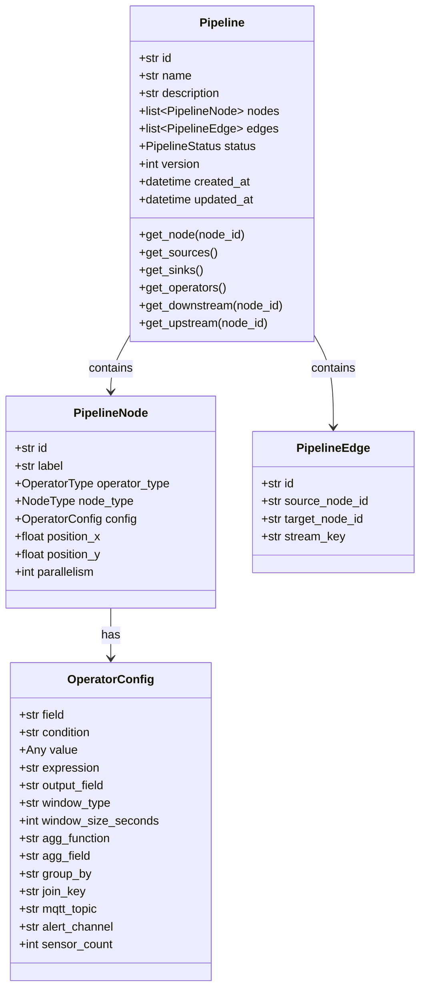

**OperatorType Enum (14 types):**

| Category | Types |
|----------|-------|
| Sources (3) | `mqtt_source`, `http_source`, `simulator_source` |
| Operators (5) | `filter`, `map`, `window`, `join`, `aggregate` |
| Sinks (4) | `console_sink`, `redis_sink`, `alert_sink`, `webhook_sink` |

**NodeType** is automatically derived from OperatorType via `get_node_type()` in `model_post_init`.

**PipelineStatus Enum:** `draft`, `deploying`, `running`, `paused`, `failed`, `stopped`

**OperatorConfig** is a union-style Pydantic model where all fields are optional. Each operator type uses a subset:
- Filter: `field`, `condition`, `value`
- Map: `expression`, `output_field`, `field`
- Window: `window_type`, `window_size_seconds`, `slide_interval_seconds`, `agg_field`, `agg_function`, `group_by`
- Aggregate: `agg_function`, `agg_field`, `group_by`
- Join: `join_stream`, `join_key`, `join_window_seconds`
- MQTT Source: `mqtt_topic`, `mqtt_broker`, `mqtt_port`
- Simulator: `sensor_count`, `interval_ms`, `chaos_enabled`
- Alert: `alert_channel`, `alert_webhook_url`, `alert_message_template`

### 13.2 Event Models

**StreamEvent** -- The core unit of data flowing through the pipeline.
- `id`: Redis Stream message ID (set by transport)
- `timestamp`: ISO 8601 datetime
- `source_node_id`: Which node generated this event
- `data`: Arbitrary key-value payload
- `lineage`: List of `LineageEntry` records tracking the event's path

Provides `to_redis()` for flat-dict serialization (XADD) and `from_redis()` class method for deserialization (XREADGROUP). Data and lineage are JSON-serialized as strings for Redis compatibility.

**LineageEntry** -- Records one step in an event's journey: `node_id`, `operator_type`, `action` (ingested/filtered_pass/filtered_drop/transformed/aggregated/emitted), `details`, `timestamp`.

**Heartbeat** -- Worker health report sent via Redis pub/sub: `worker_id`, `pipeline_id`, `node_id`, `cpu_percent`, `memory_percent`, `memory_mb`, `events_processed`, `events_per_second`, `avg_latency_ms`, `errors`.

**Checkpoint** -- Recovery state: `worker_id`, `pipeline_id`, `node_id`, `stream_key`, `last_processed_id` (Redis Stream offset), `operator_state` (dict of window buffers, accumulators, etc.), `timestamp`.

**HealingEvent** -- Record of a healing action: `pipeline_id`, `action` (HealingAction enum), `trigger` description, `target_worker_id`, `target_node_id`, `details`, `events_replayed`, `duration_ms`, `success` flag, `timestamp`.

**HealingAction Enum (7 values):** `failover`, `scale_out`, `scale_in`, `migrate`, `insert_buffer`, `restart`, `spill_to_disk`

**OptimizationEvent** -- Record of a DAG optimization: `pipeline_id`, `optimization_type`, `description`, `before_snapshot` (DAG dict), `after_snapshot` (DAG dict), `estimated_gain`, `timestamp`.

### 13.3 Worker Models

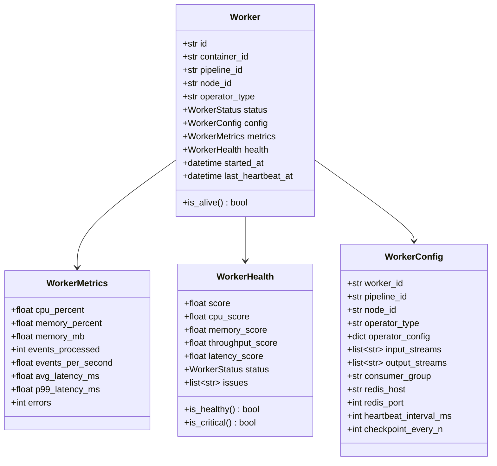

**WorkerStatus Enum (6 values):** `starting`, `running`, `degraded`, `dead`, `draining`, `stopped`

**WorkerHealth computed properties:**
- `is_healthy`: score >= 70
- `is_critical`: score < 30

**Worker computed property:**
- `is_alive`: status in {RUNNING, DEGRADED, STARTING}

---

## 14. Module Dependency Graph

The following diagram shows the import dependencies between all 12 modules. Arrows indicate "depends on" relationships.

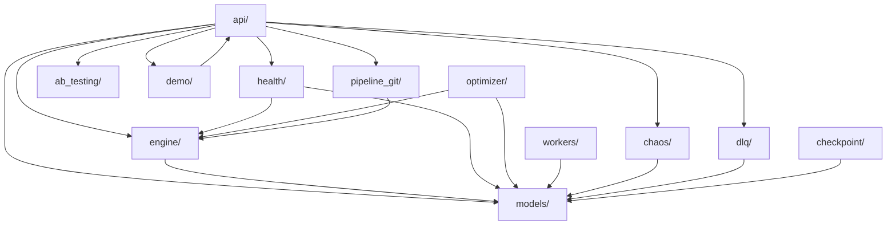

### Key Dependency Rules

1. **models/** has zero internal dependencies -- it is the foundation layer
2. **engine/** depends only on models/
3. **health/**, **optimizer/**, **workers/**, **chaos/** depend on models/ and engine/
4. **api/** depends on everything (it is the top-level orchestration layer)
5. **demo/** depends on api/websocket (to broadcast simulated events)
6. **pipeline_git/** is self-contained except for engine/dag (for snapshot) and its own internal modules

### Cross-Module Communication

| Source Module | Target Module | Communication Mechanism |
|---------------|---------------|------------------------|
| workers/ --> health/ | Redis Pub/Sub (heartbeat channel) | Async, decoupled |
| health/ --> engine/ | Direct method call (`runtime.handle_worker_death()`) | Sync within async loop |
| optimizer/ --> engine/ | DAG mutation + recompile | In-process |
| optimizer/ --> pipeline_git/ | Version save after rewrite | Async |
| chaos/ --> engine/ | Docker API (kill), Redis flags | Mix of direct and flag-based |
| api/ --> engine/ | Direct method calls | In-process |
| api/ --> clients | WebSocket broadcast | Network |
| engine/ --> workers/ | Docker SDK (spawn containers) | Docker API |
| workers/ --> dlq/ | Redis Stream (DLQ write) | Async, decoupled |

---

**Document Version:** 1.0
**Total Sections:** 14
**Total Mermaid Diagrams:** 14
**Lines:** 700+
**Status:** Final Year Project Showcase
