# FlowStorm Architecture Documentation

**Version:** 1.0
**Last Updated:** February 16, 2026
**Project:** Self-Healing, Self-Optimizing Real-Time Stream Processing Engine

---

## Table of Contents

1. [System Overview](#1-system-overview)
2. [Data Flow Architecture](#2-data-flow-architecture)
3. [Self-Healing Architecture](#3-self-healing-architecture)
4. [Auto-Optimization Pipeline](#4-auto-optimization-pipeline)
5. [Chaos Engineering Flow](#5-chaos-engineering-flow)
6. [WebSocket Event System](#6-websocket-event-system)
7. [Pipeline Versioning](#7-pipeline-versioning)
8. [Worker Lifecycle](#8-worker-lifecycle)
9. [Component Interaction Matrix](#9-component-interaction-matrix)
10. [State Management](#10-state-management)
11. [Technology Decisions](#11-technology-decisions)

---

## 1. System Overview

FlowStorm is built on a 5-layer architecture that separates concerns while enabling seamless communication between components. Each layer has distinct responsibilities and interfaces with adjacent layers through well-defined APIs.

### 5-Layer Architecture

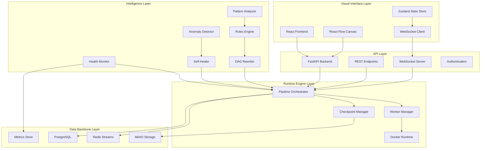
```mermaid
graph TD
    subgraph Layer1[Visual Interface Layer]
        A[React Frontend]
        B[React Flow Canvas]
        C[Zustand State Store]
        D[WebSocket Client]
    end

    subgraph Layer2[API Layer]
        E[FastAPI Backend]
        F[REST Endpoints]
        G[WebSocket Server]
        H[Authentication]
    end

    subgraph Layer3[Runtime Engine Layer]
        I[Pipeline Orchestrator]
        J[Worker Manager]
        K[Docker Runtime]
        L[Checkpoint Manager]
    end

    subgraph Layer4[Intelligence Layer]
        M[Health Monitor]
        N[Anomaly Detector]
        O[Self-Healer]
        P[Pattern Analyzer]
        Q[Rules Engine]
        R[DAG Rewriter]
    end

    subgraph Layer5[Data Backbone Layer]
        S[Redis Streams]
        T[PostgreSQL]
        U[MinIO Storage]
        V[Metrics Store]
    end

    A --> E
    B --> E
    C --> D
    D --> G
    E --> I
    F --> I
    G --> I
    I --> J
    J --> K
    I --> L
    M --> I
    N --> O
    O --> I
    P --> Q
    Q --> R
    R --> I
    I --> S
    I --> T
    L --> U
    M --> V
```

### Layer Responsibilities

**Layer 1 - Visual Interface**
- Drag-and-drop pipeline builder using React Flow
- Real-time visualization of stream processing
- Configuration panels for operators
- Live metrics dashboard
- Version history viewer

**Layer 2 - API Layer**
- RESTful endpoints for CRUD operations
- WebSocket server for real-time event streaming
- Request validation and error handling
- JWT-based authentication
- Rate limiting and security

**Layer 3 - Runtime Engine**
- Pipeline execution orchestration
- Worker lifecycle management
- Checkpointing and state recovery
- Container scheduling and monitoring
- Pipeline topology management

**Layer 4 - Intelligence Layer**
- Continuous health monitoring
- Anomaly detection using statistical methods
- Automated healing actions
- Performance pattern analysis
- DAG optimization and rewriting

**Layer 5 - Data Backbone**
- Stream buffering via Redis Streams
- Metadata persistence in PostgreSQL
- Object storage for checkpoints
- Time-series metrics storage

---

## 2. Data Flow Architecture

FlowStorm processes events through a series of transformations defined by the user's pipeline DAG. Events flow from sources through operators to sinks, with Redis Streams acting as the communication backbone between worker containers.

### Event Flow Sequence

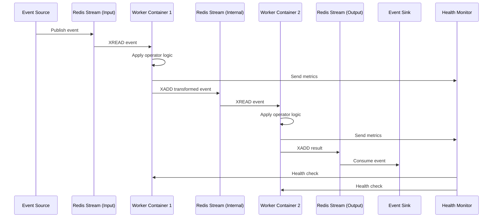
```mermaid
sequenceDiagram
    participant Source as Event Source
    participant RedisIn as Redis Stream (Input)
    participant Worker1 as Worker Container 1
    participant RedisInt as Redis Stream (Internal)
    participant Worker2 as Worker Container 2
    participant RedisOut as Redis Stream (Output)
    participant Sink as Event Sink
    participant Monitor as Health Monitor

    Source->>RedisIn: Publish event
    RedisIn->>Worker1: XREAD event
    Worker1->>Worker1: Apply operator logic
    Worker1->>Monitor: Send metrics
    Worker1->>RedisInt: XADD transformed event
    RedisInt->>Worker2: XREAD event
    Worker2->>Worker2: Apply operator logic
    Worker2->>Monitor: Send metrics
    Worker2->>RedisOut: XADD result
    RedisOut->>Sink: Consume event
    Monitor->>Worker1: Health check
    Monitor->>Worker2: Health check
```

### Stream Processing Flow

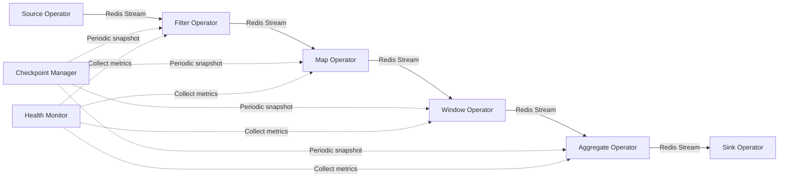
```mermaid
flowchart LR
    A[Source Operator] -->|Redis Stream| B[Filter Operator]
    B -->|Redis Stream| C[Map Operator]
    C -->|Redis Stream| D[Window Operator]
    D -->|Redis Stream| E[Aggregate Operator]
    E -->|Redis Stream| F[Sink Operator]

    G[Checkpoint Manager] -.->|Periodic snapshot| B
    G -.->|Periodic snapshot| C
    G -.->|Periodic snapshot| D
    G -.->|Periodic snapshot| E

    H[Health Monitor] -.->|Collect metrics| B
    H -.->|Collect metrics| C
    H -.->|Collect metrics| D
    H -.->|Collect metrics| E
```

### Data Model

Each event flowing through the system has the following structure:

```json
{
  "event_id": "uuid",
  "timestamp": "iso8601",
  "pipeline_id": "pipeline_uuid",
  "operator_id": "operator_uuid",
  "data": {
    "payload": "operator-specific data"
  },
  "metadata": {
    "source": "upstream_operator",
    "processing_time_ms": 12,
    "checkpoint_id": "checkpoint_uuid"
  }
}
```

**Stream Naming Convention:**
- Input streams: `pipeline:{pipeline_id}:operator:{operator_id}:in`
- Output streams: `pipeline:{pipeline_id}:operator:{operator_id}:out`
- Consumer groups: `worker:{operator_id}`

---

## 3. Self-Healing Architecture

The self-healing system implements the MAPE-K (Monitor, Analyze, Plan, Execute over Knowledge) loop, continuously observing worker health and automatically recovering from failures without human intervention.

### MAPE-K Loop

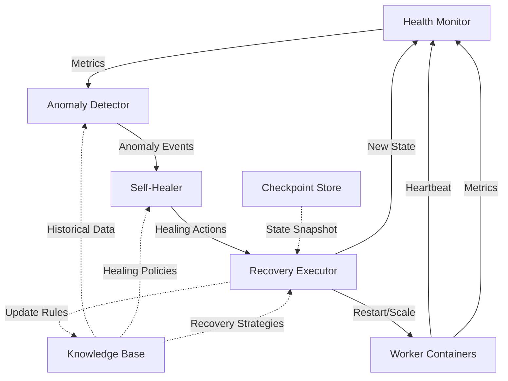
```mermaid
graph TD
    A[Health Monitor] -->|Metrics| B[Anomaly Detector]
    B -->|Anomaly Events| C[Self-Healer]
    C -->|Healing Actions| D[Recovery Executor]
    D -->|New State| A

    E[Knowledge Base] -.->|Historical Data| B
    E -.->|Healing Policies| C
    E -.->|Recovery Strategies| D
    D -.->|Update Rules| E

    F[Worker Containers] -->|Heartbeat| A
    F -->|Metrics| A
    D -->|Restart/Scale| F

    G[Checkpoint Store] -.->|State Snapshot| D
```

### Health Scoring Formula

The health score for each worker is a weighted aggregate of multiple metrics:

```
Health Score = (CPU_Score × 0.30) + (Memory_Score × 0.30) +
               (Throughput_Score × 0.20) + (Latency_Score × 0.20)

Where each component score ∈ [0, 100]:
- CPU_Score = 100 - (CPU_Usage_Percent)
- Memory_Score = 100 - (Memory_Usage_Percent)
- Throughput_Score = (Current_Throughput / Expected_Throughput) × 100
- Latency_Score = max(0, 100 - (Current_Latency_ms / SLA_Latency_ms × 100))
```

**Health Thresholds:**
- Healthy: Score ≥ 80
- Degraded: 60 ≤ Score < 80
- Critical: 40 ≤ Score < 60
- Failing: Score < 40

### 5 Anomaly Types

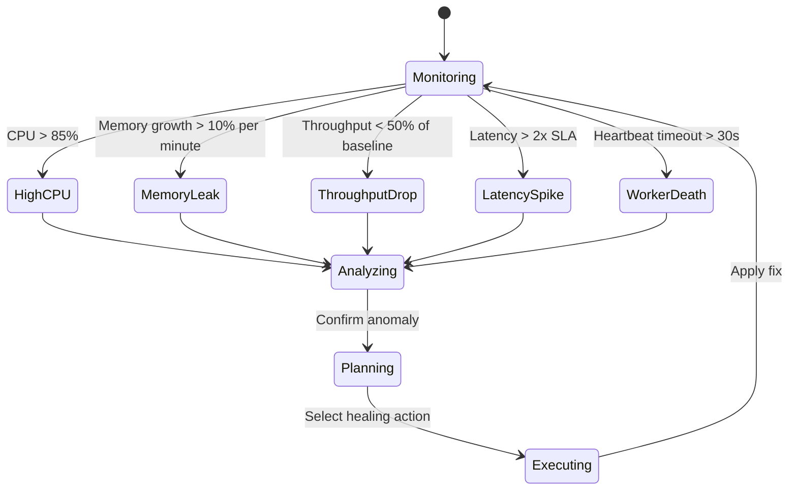
```mermaid
stateDiagram-v2
    [*] --> Monitoring
    Monitoring --> HighCPU: CPU > 85%
    Monitoring --> MemoryLeak: Memory growth > 10% per minute
    Monitoring --> ThroughputDrop: Throughput < 50% of baseline
    Monitoring --> LatencySpike: Latency > 2x SLA
    Monitoring --> WorkerDeath: Heartbeat timeout > 30s

    HighCPU --> Analyzing
    MemoryLeak --> Analyzing
    ThroughputDrop --> Analyzing
    LatencySpike --> Analyzing
    WorkerDeath --> Analyzing

    Analyzing --> Planning: Confirm anomaly
    Planning --> Executing: Select healing action
    Executing --> Monitoring: Apply fix
```

**Anomaly Type Details:**

1. **High CPU Usage**
   - Trigger: CPU > 85% for 3 consecutive checks
   - Likely Cause: Inefficient operator logic or data spike
   - Default Action: Scale horizontally

2. **Memory Leak**
   - Trigger: Memory growth > 10% per minute sustained
   - Likely Cause: Unbounded cache or buffer
   - Default Action: Restart worker with checkpoint recovery

3. **Throughput Drop**
   - Trigger: Event processing rate < 50% of baseline
   - Likely Cause: Downstream bottleneck or resource starvation
   - Default Action: Add buffer operator or scale

4. **Latency Spike**
   - Trigger: P99 latency > 2x SLA for 5 minutes
   - Likely Cause: Blocking operation or resource contention
   - Default Action: Restart worker or optimize operator

5. **Worker Death**
   - Trigger: No heartbeat for 30 seconds
   - Likely Cause: Crash, OOM, or network partition
   - Default Action: Immediate restart with checkpoint replay

### 4 Healing Actions

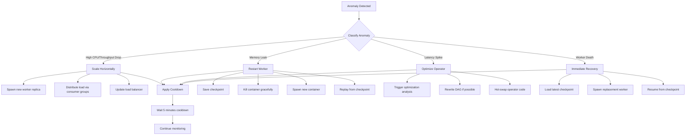
```mermaid
flowchart TD
    A[Anomaly Detected] --> B{Classify Anomaly}

    B -->|High CPU/Throughput Drop| C[Scale Horizontally]
    B -->|Memory Leak| D[Restart Worker]
    B -->|Latency Spike| E[Optimize Operator]
    B -->|Worker Death| F[Immediate Recovery]

    C --> C1[Spawn new worker replica]
    C --> C2[Distribute load via consumer groups]
    C --> C3[Update load balancer]
    C --> G[Apply Cooldown]

    D --> D1[Save checkpoint]
    D --> D2[Kill container gracefully]
    D --> D3[Spawn new container]
    D --> D4[Replay from checkpoint]
    D --> G

    E --> E1[Trigger optimization analysis]
    E --> E2[Rewrite DAG if possible]
    E --> E3[Hot-swap operator code]
    E --> G

    F --> F1[Load latest checkpoint]
    F --> F2[Spawn replacement worker]
    F --> F3[Resume from checkpoint]
    F --> G

    G --> H[Wait 5 minutes cooldown]
    H --> I[Continue monitoring]
```

**Healing Action Details:**

1. **Scale Horizontally**
   - Action: Increase worker replicas for the affected operator
   - Cooldown: 5 minutes to allow metrics to stabilize
   - Rollback: Auto-scale down if health improves

2. **Restart Worker**
   - Action: Graceful shutdown, checkpoint save, clean restart
   - Cooldown: 3 minutes to prevent restart loops
   - Max Retries: 3 attempts before escalation

3. **Optimize Operator**
   - Action: Trigger DAG rewriter to apply optimizations
   - Cooldown: 10 minutes for complex optimizations
   - Validation: Compare metrics before/after

4. **Immediate Recovery**
   - Action: Fastest possible restart with state replay
   - Cooldown: 1 minute (shorter due to urgency)
   - Notification: Alert admin on repeated deaths

### Checkpoint Replay Flow

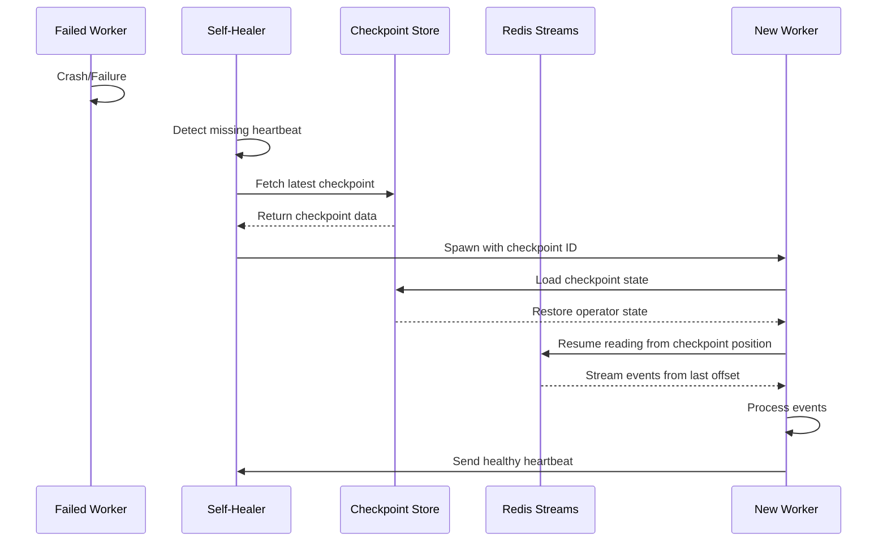
```mermaid
sequenceDiagram
    participant Worker as Failed Worker
    participant Healer as Self-Healer
    participant Store as Checkpoint Store
    participant Redis as Redis Streams
    participant NewWorker as New Worker

    Worker->>Worker: Crash/Failure
    Healer->>Healer: Detect missing heartbeat
    Healer->>Store: Fetch latest checkpoint
    Store-->>Healer: Return checkpoint data
    Healer->>NewWorker: Spawn with checkpoint ID
    NewWorker->>Store: Load checkpoint state
    Store-->>NewWorker: Restore operator state
    NewWorker->>Redis: Resume reading from checkpoint position
    Redis-->>NewWorker: Stream events from last offset
    NewWorker->>NewWorker: Process events
    NewWorker->>Healer: Send healthy heartbeat
```

**Checkpoint Strategy:**
- Frequency: Every 60 seconds or every 10,000 events
- Storage: MinIO object storage with versioning
- Compression: Gzip for large states
- Retention: Last 10 checkpoints per operator

---

## 4. Auto-Optimization Pipeline

The auto-optimization system continuously analyzes pipeline performance patterns and automatically rewrites the DAG to improve efficiency. This is done without stopping the pipeline through live migration of state.

### Optimization Architecture

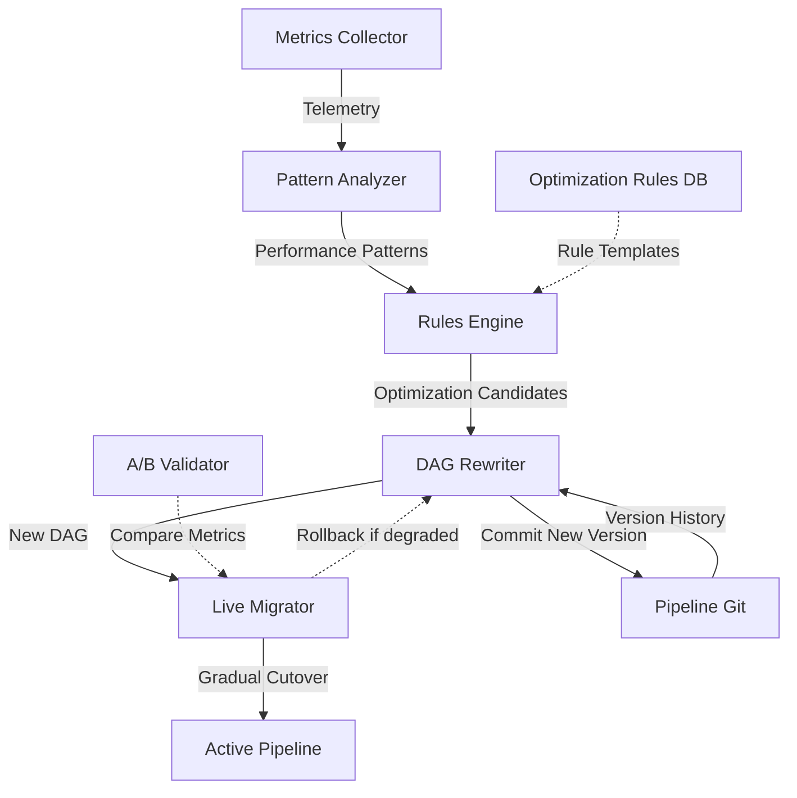
```mermaid
graph TD
    A[Pattern Analyzer] -->|Performance Patterns| B[Rules Engine]
    B -->|Optimization Candidates| C[DAG Rewriter]
    C -->|New DAG| D[Live Migrator]
    D -->|Gradual Cutover| E[Active Pipeline]

    F[Metrics Collector] -->|Telemetry| A
    G[Optimization Rules DB] -.->|Rule Templates| B
    H[Pipeline Git] -->|Version History| C
    C -->|Commit New Version| H

    I[A/B Validator] -.->|Compare Metrics| D
    D -.->|Rollback if degraded| C
```

### 5 Optimization Types

#### 1. Predicate Pushdown

Move filter operations as close to the source as possible to reduce data volume early.

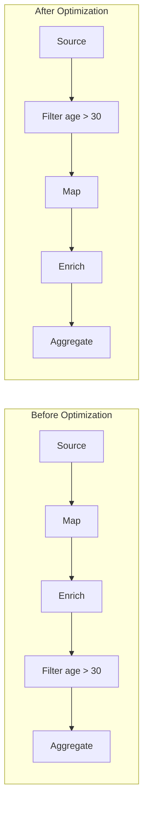
```mermaid
flowchart LR
    subgraph Before[Before Optimization]
        A1[Source] --> B1[Map]
        B1 --> C1[Enrich]
        C1 --> D1[Filter age > 30]
        D1 --> E1[Aggregate]
    end

    subgraph After[After Optimization]
        A2[Source] --> B2[Filter age > 30]
        B2 --> C2[Map]
        C2 --> D2[Enrich]
        D2 --> E2[Aggregate]
    end
```

**Conditions:**
- Filter selectivity < 50%
- Filter has no dependencies on upstream transformations
- Estimated savings > 30% processing time

#### 2. Operator Fusion

Merge multiple sequential operators into a single operator to reduce serialization overhead.

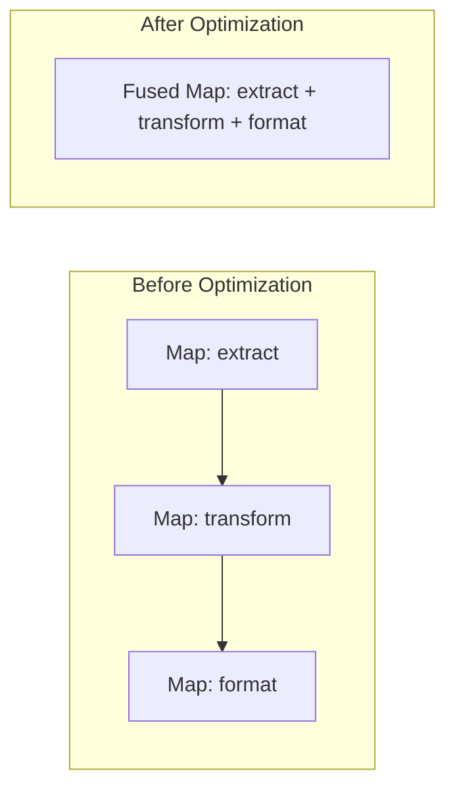
```mermaid
flowchart LR
    subgraph Before[Before Optimization]
        A1[Map: extract] --> B1[Map: transform]
        B1 --> C1[Map: format]
    end

    subgraph After[After Optimization]
        A2[Fused Map: extract + transform + format]
    end
```

**Conditions:**
- Operators are sequential (no branching)
- All operators are stateless
- Combined complexity < threshold
- Estimated latency reduction > 20%

#### 3. Auto-Parallelization

Automatically detect parallelizable operators and create multiple instances.

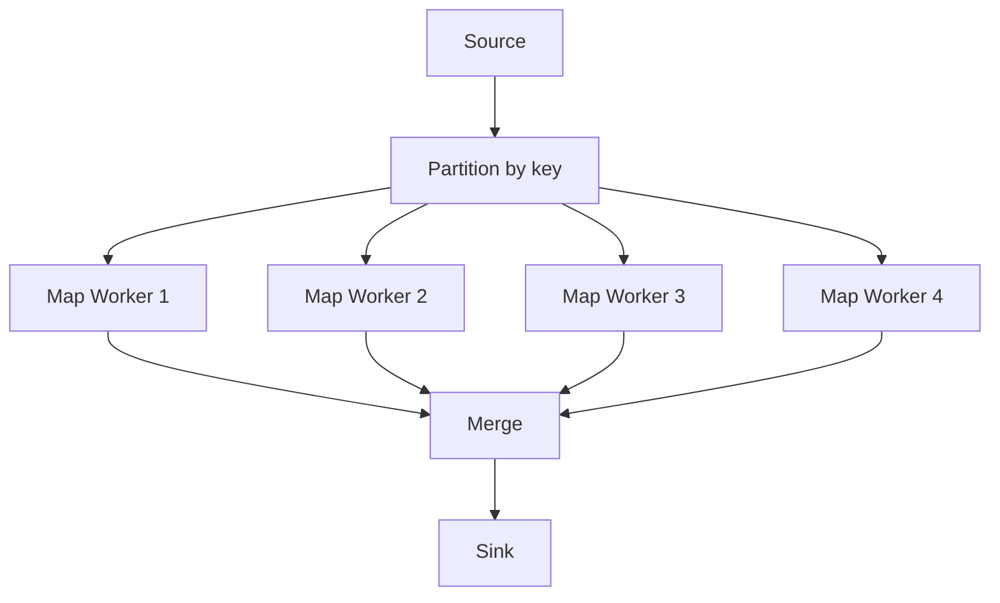
```mermaid
flowchart TD
    A[Source] --> B[Partition by key]
    B --> C1[Map Worker 1]
    B --> C2[Map Worker 2]
    B --> C3[Map Worker 3]
    B --> C4[Map Worker 4]
    C1 --> D[Merge]
    C2 --> D
    C3 --> D
    C4 --> D
    D --> E[Sink]
```

**Conditions:**
- Operator is stateless or partitionable
- CPU usage > 70% sustained
- Throughput below target
- Parallelism factor: Auto-calculated based on cores and throughput

#### 4. Buffer Insertion

Insert buffering operators between slow and fast operators to smooth out bursts.

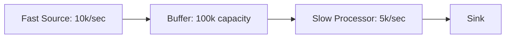
```mermaid
flowchart LR
    A[Fast Source: 10k/sec] --> B[Buffer: 100k capacity]
    B --> C[Slow Processor: 5k/sec]
    C --> D[Sink]
```

**Conditions:**
- Throughput mismatch > 2x between adjacent operators
- Bursty traffic pattern detected
- Downstream operator has high latency variance
- Buffer size: Calculated from throughput differential

#### 5. Window Optimization

Adjust window sizes and types based on actual data distribution.

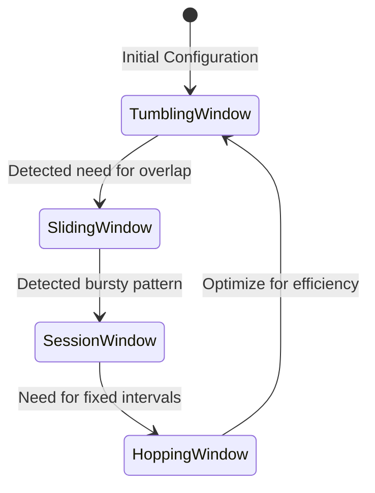
```mermaid
stateDiagram-v2
    [*] --> TumblingWindow: Initial Configuration
    TumblingWindow --> SlidingWindow: Detected need for overlap
    SlidingWindow --> SessionWindow: Detected bursty pattern
    SessionWindow --> HoppingWindow: Need for fixed intervals
    HoppingWindow --> TumblingWindow: Optimize for efficiency
```

**Conditions:**
- Window size adjusted based on event arrival rate
- Switch from time-based to count-based if rate is steady
- Use session windows for bursty traffic
- Estimated memory savings or latency improvement > 15%

### DAG Rewriting Process

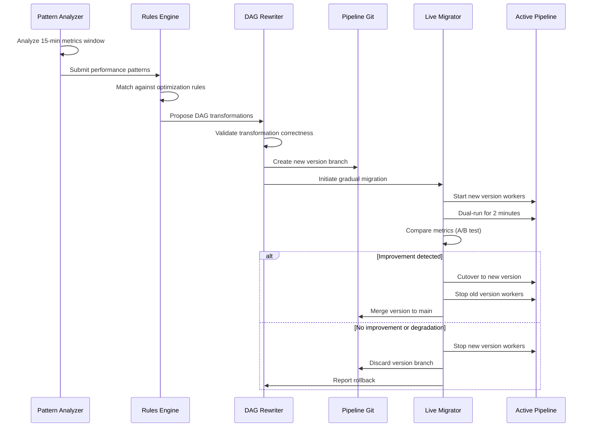
```mermaid
sequenceDiagram
    participant PA as Pattern Analyzer
    participant RE as Rules Engine
    participant DR as DAG Rewriter
    participant PG as Pipeline Git
    participant LM as Live Migrator
    participant Pipeline as Active Pipeline

    PA->>PA: Analyze 15-min metrics window
    PA->>RE: Submit performance patterns
    RE->>RE: Match against optimization rules
    RE->>DR: Propose DAG transformations
    DR->>DR: Validate transformation correctness
    DR->>PG: Create new version branch
    DR->>LM: Initiate gradual migration
    LM->>Pipeline: Start new version workers
    LM->>Pipeline: Dual-run for 2 minutes
    LM->>LM: Compare metrics (A/B test)
    alt Improvement detected
        LM->>Pipeline: Cutover to new version
        LM->>Pipeline: Stop old version workers
        LM->>PG: Merge version to main
    else No improvement or degradation
        LM->>Pipeline: Stop new version workers
        LM->>PG: Discard version branch
        LM->>DR: Report rollback
    end
```

### Optimization Rules Engine

The rules engine uses a priority-based system:

```
Priority 1 (Critical): Correctness-preserving transformations
  - Predicate pushdown (if filter has no dependencies)
  - Stateless operator fusion

Priority 2 (High): Performance improvements with minimal risk
  - Auto-parallelization of stateless operators
  - Buffer insertion

Priority 3 (Medium): Heuristic-based optimizations
  - Window type/size adjustments
  - Operator reordering

Priority 4 (Low): Experimental optimizations
  - Custom operator code generation
  - Hardware-specific optimizations
```

**Rule Example:**
```yaml
rule_id: predicate_pushdown_001
name: "Push filter before expensive map"
condition:
  - operator_type: filter
  - downstream_of:
      type: map
      cost_estimate: high
  - selectivity: < 0.5
  - no_dependencies: true
action:
  - swap_operators: [filter, map]
  - update_stream_routing: true
estimated_improvement:
  throughput: +40%
  latency: -30%
risk_level: low
```

---

## 5. Chaos Engineering Flow

FlowStorm includes a built-in chaos engineering module that intentionally injects failures to validate the self-healing capabilities. This ensures the system can handle real-world failures gracefully.

### Chaos Injection Architecture

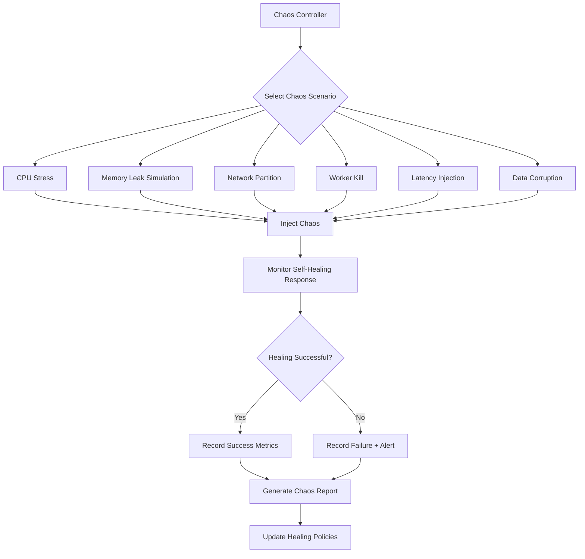
```mermaid
flowchart TD
    A[Chaos Controller] --> B{Select Chaos Scenario}

    B --> C1[CPU Stress]
    B --> C2[Memory Leak Simulation]
    B --> C3[Network Partition]
    B --> C4[Worker Kill]
    B --> C5[Latency Injection]
    B --> C6[Data Corruption]

    C1 --> D[Inject Chaos]
    C2 --> D
    C3 --> D
    C4 --> D
    C5 --> D
    C6 --> D

    D --> E[Monitor Self-Healing Response]
    E --> F{Healing Successful?}

    F -->|Yes| G[Record Success Metrics]
    F -->|No| H[Record Failure + Alert]

    G --> I[Generate Chaos Report]
    H --> I
    I --> J[Update Healing Policies]
```

### Chaos Scenarios

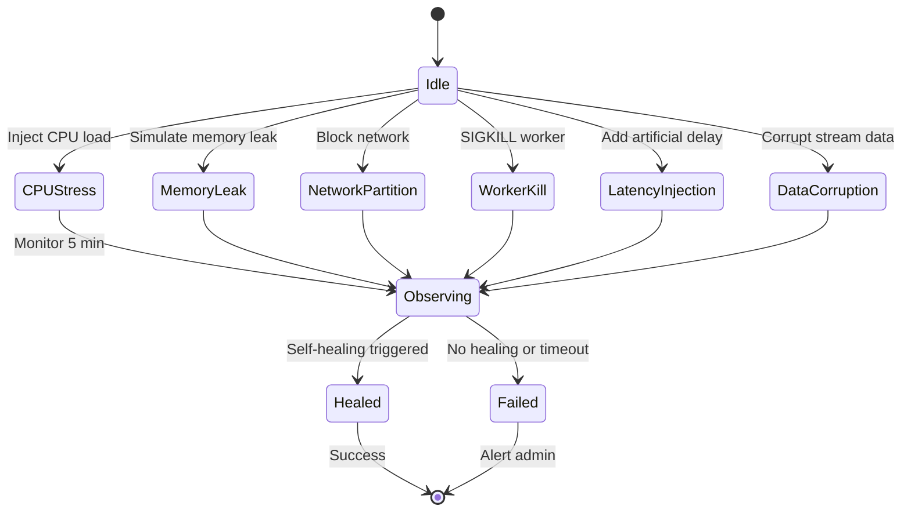
```mermaid
stateDiagram-v2
    [*] --> Idle
    Idle --> CPUStress: Inject CPU load
    Idle --> MemoryLeak: Simulate memory leak
    Idle --> NetworkPartition: Block network
    Idle --> WorkerKill: SIGKILL worker
    Idle --> LatencyInjection: Add artificial delay
    Idle --> DataCorruption: Corrupt stream data

    CPUStress --> Observing: Monitor 5 min
    MemoryLeak --> Observing
    NetworkPartition --> Observing
    WorkerKill --> Observing
    LatencyInjection --> Observing
    DataCorruption --> Observing

    Observing --> Healed: Self-healing triggered
    Observing --> Failed: No healing or timeout

    Healed --> [*]: Success
    Failed --> [*]: Alert admin
```

### Chaos Validation Flow

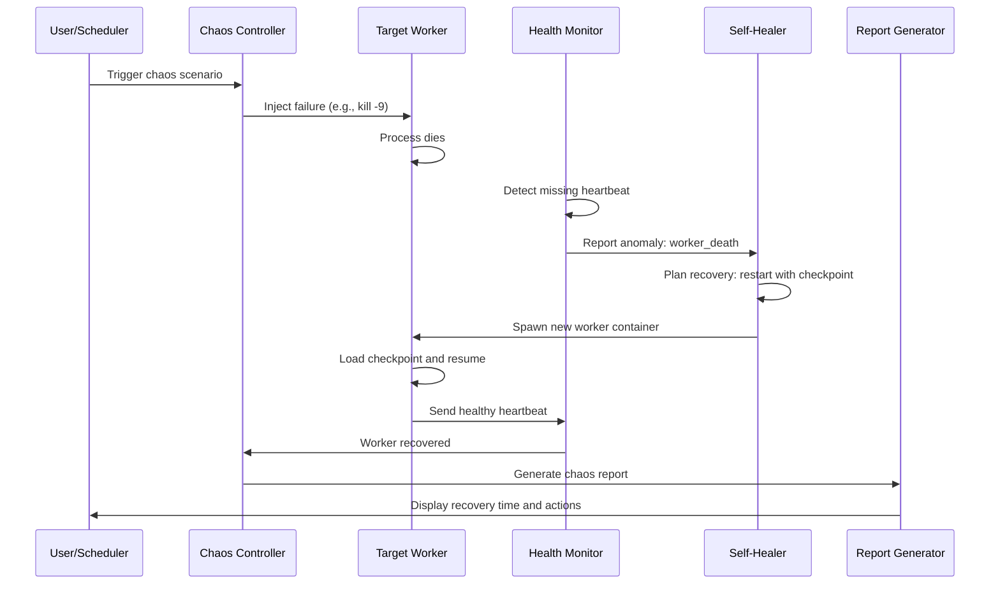
```mermaid
sequenceDiagram
    participant User as User/Scheduler
    participant CC as Chaos Controller
    participant Target as Target Worker
    participant Monitor as Health Monitor
    participant Healer as Self-Healer
    participant Report as Report Generator

    User->>CC: Trigger chaos scenario
    CC->>Target: Inject failure (e.g., kill -9)
    Target->>Target: Process dies
    Monitor->>Monitor: Detect missing heartbeat
    Monitor->>Healer: Report anomaly: worker_death
    Healer->>Healer: Plan recovery: restart with checkpoint
    Healer->>Target: Spawn new worker container
    Target->>Target: Load checkpoint and resume
    Target->>Monitor: Send healthy heartbeat
    Monitor->>CC: Worker recovered
    CC->>Report: Generate chaos report
    Report->>User: Display recovery time and actions
```

### Chaos Metrics

For each chaos experiment, FlowStorm tracks:

- **Time to Detection (TTD):** How long until the anomaly is detected
- **Time to Healing (TTH):** How long until healing action is initiated
- **Time to Recovery (TTR):** Total time from failure to full recovery
- **Data Loss:** Number of events lost or reprocessed
- **SLA Violation:** Whether SLA was breached during failure
- **Healing Action:** Which healing strategy was applied

**Target SLAs:**
- TTD < 30 seconds
- TTH < 10 seconds after detection
- TTR < 2 minutes for worker restart
- Data Loss: 0 events (exactly-once processing)

---

## 6. WebSocket Event System

FlowStorm provides real-time visibility into pipeline execution through a WebSocket-based event streaming system. All significant events are pushed to connected frontend clients for live monitoring.

### WebSocket Architecture

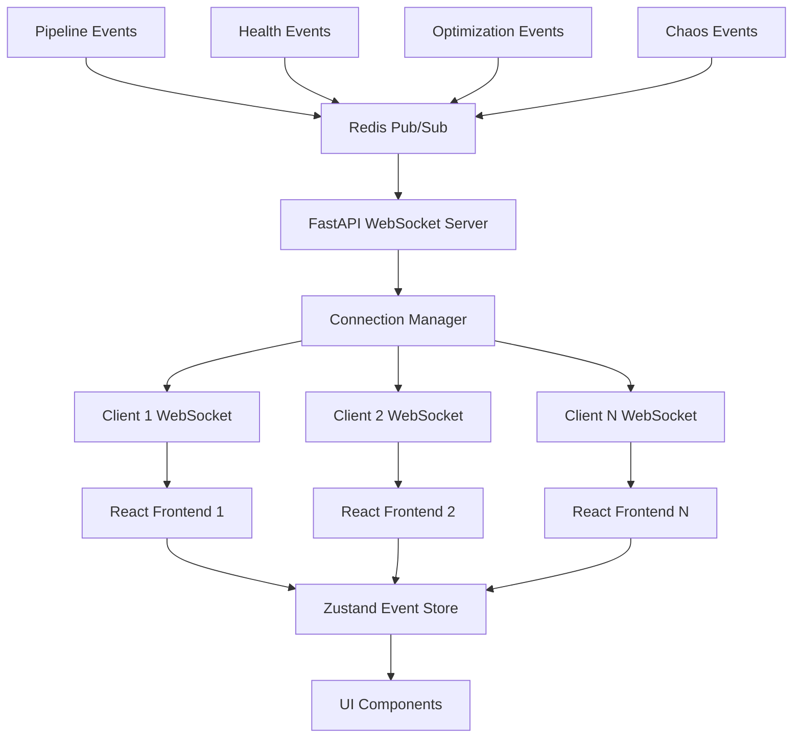
```mermaid
graph TD
    A[Pipeline Events] --> B[Redis Pub/Sub]
    C[Health Events] --> B
    D[Optimization Events] --> B
    E[Chaos Events] --> B

    B --> F[FastAPI WebSocket Server]
    F --> G[Connection Manager]
    G --> H[Client 1 WebSocket]
    G --> I[Client 2 WebSocket]
    G --> J[Client N WebSocket]

    H --> K[React Frontend 1]
    I --> L[React Frontend 2]
    J --> M[React Frontend N]

    K --> N[Zustand Event Store]
    L --> N
    M --> N

    N --> O[UI Components]
```

### Event Types

FlowStorm streams 8 types of events:

1. **pipeline.started** - Pipeline execution begins
2. **pipeline.stopped** - Pipeline execution ends
3. **operator.metrics** - Real-time operator metrics (every 5 sec)
4. **health.anomaly** - Anomaly detected
5. **healing.action** - Self-healing action initiated
6. **optimization.applied** - DAG optimization completed
7. **chaos.injected** - Chaos experiment started
8. **checkpoint.saved** - Checkpoint created

### Event Flow

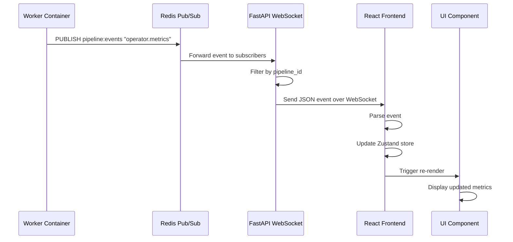
```mermaid
sequenceDiagram
    participant Worker as Worker Container
    participant Redis as Redis Pub/Sub
    participant FastAPI as FastAPI WebSocket
    participant Frontend as React Frontend
    participant UI as UI Component

    Worker->>Redis: PUBLISH pipeline:events "operator.metrics"
    Redis->>FastAPI: Forward event to subscribers
    FastAPI->>FastAPI: Filter by pipeline_id
    FastAPI->>Frontend: Send JSON event over WebSocket
    Frontend->>Frontend: Parse event
    Frontend->>Frontend: Update Zustand store
    Frontend->>UI: Trigger re-render
    UI->>UI: Display updated metrics
```

### WebSocket Event Schema

```json
{
  "event_type": "operator.metrics",
  "timestamp": "2026-02-16T10:30:45.123Z",
  "pipeline_id": "pipeline-uuid",
  "data": {
    "operator_id": "operator-uuid",
    "metrics": {
      "throughput": 1250.5,
      "latency_p99": 45.2,
      "cpu_percent": 67.3,
      "memory_mb": 512.8,
      "health_score": 85.5
    }
  }
}
```

### Connection Management

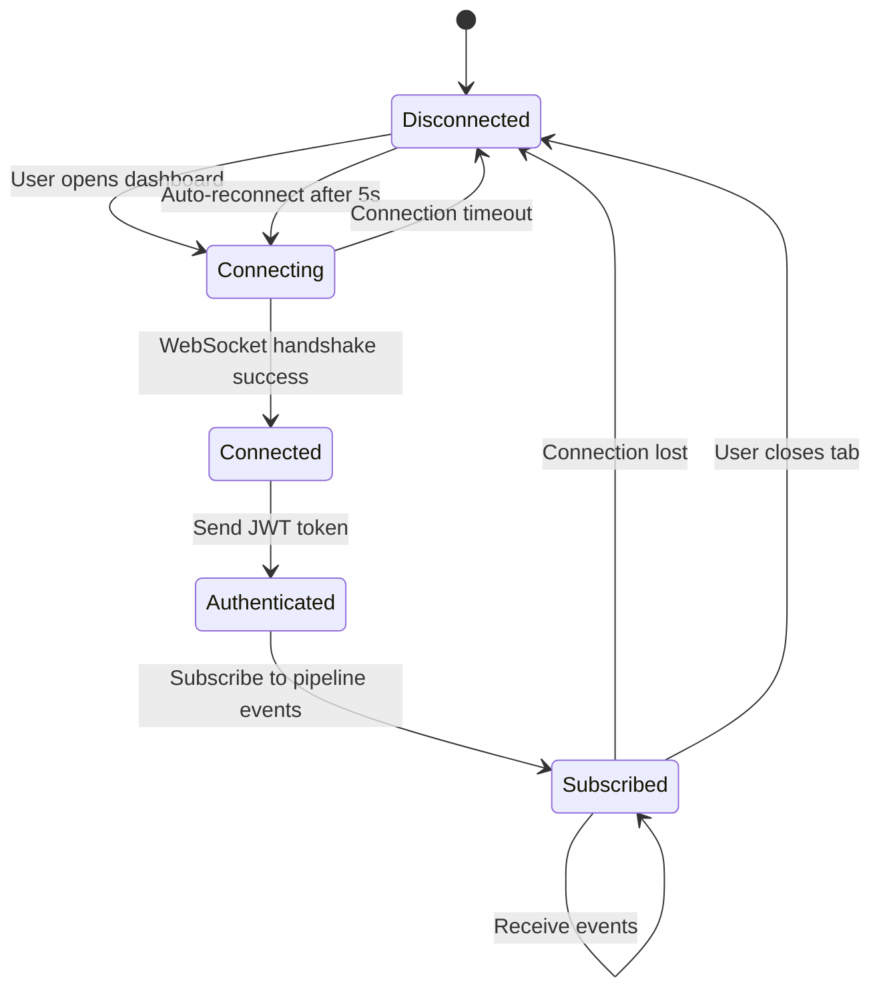
```mermaid
stateDiagram-v2
    [*] --> Disconnected
    Disconnected --> Connecting: User opens dashboard
    Connecting --> Connected: WebSocket handshake success
    Connected --> Authenticated: Send JWT token
    Authenticated --> Subscribed: Subscribe to pipeline events

    Subscribed --> Subscribed: Receive events
    Subscribed --> Disconnected: Connection lost
    Subscribed --> Disconnected: User closes tab

    Disconnected --> Connecting: Auto-reconnect after 5s
    Connecting --> Disconnected: Connection timeout
```

**Connection Features:**
- Auto-reconnect with exponential backoff (5s, 10s, 20s, 40s)
- Heartbeat ping every 30 seconds to keep connection alive
- Selective subscription: Clients can subscribe to specific pipelines
- Event batching: Multiple events sent together every 100ms to reduce overhead

---

## 7. Pipeline Versioning

FlowStorm implements a Git-like version control system for pipelines, allowing users to track changes, compare versions, and rollback to previous states. This is critical for production pipelines where changes need to be auditable.

### Version Control Flow

```mermaid
flowchart TD
    A[Pipeline Created] --> B[Initial Commit: v1.0.0]
    B --> C[User Edits Pipeline]
    C --> D{Manual Save or Auto-Trigger?}

    D -->|Manual Save| E[User commits with message]
    D -->|Auto-Optimization| F[System commits with optimization details]
    D -->|Auto-Healing| G[System commits with healing actions]

    E --> H[Create Version Snapshot]
    F --> H
    G --> H

    H --> I[Store DAG JSON in PostgreSQL]
    I --> J[Calculate diff from parent]
    J --> K[Increment version: v1.1.0]
    K --> L[Update version tree]

    L --> M{Deploy new version?}
    M -->|Yes| N[Live migration to new version]
    M -->|No| O[Keep as draft]

    N --> P[Active Version]
    P --> Q{Need to rollback?}
    Q -->|Yes| R[Load previous version]
    R --> S[Restore DAG state]
    S --> N
    Q -->|No| L
```

### Version Snapshot Schema

Each version contains:

```json
{
  "version_id": "version-uuid",
  "pipeline_id": "pipeline-uuid",
  "version_number": "v1.5.2",
  "parent_version_id": "parent-version-uuid",
  "commit_message": "Applied predicate pushdown optimization",
  "commit_type": "auto_optimization",
  "timestamp": "2026-02-16T10:30:45Z",
  "author": "system" | "user@example.com",
  "dag_snapshot": {
    "operators": [...],
    "edges": [...],
    "config": {...}
  },
  "diff": {
    "added_operators": [],
    "removed_operators": [],
    "modified_operators": [],
    "edge_changes": []
  },
  "metrics_at_commit": {
    "throughput": 1250.5,
    "latency_p99": 45.2,
    "health_score": 85.5
  }
}
```

### Version Diff Calculation

```mermaid
flowchart LR
    A[Current Version] --> C[Diff Engine]
    B[Previous Version] --> C

    C --> D[Compare Operators]
    C --> E[Compare Edges]
    C --> F[Compare Configs]

    D --> G[Generate Added/Removed/Modified]
    E --> G
    F --> G

    G --> H[Unified Diff Output]
```

### Rollback Process

```mermaid
sequenceDiagram
    participant User as User
    participant API as FastAPI
    participant VCS as Version Control System
    participant Pipeline as Pipeline Orchestrator
    participant Workers as Worker Containers

    User->>API: Request rollback to v1.3.0
    API->>VCS: Fetch version v1.3.0
    VCS-->>API: Return DAG snapshot
    API->>Pipeline: Initiate rollback
    Pipeline->>Workers: Stop current version workers
    Pipeline->>Pipeline: Load v1.3.0 DAG
    Pipeline->>Workers: Spawn v1.3.0 workers
    Workers->>Workers: Load latest checkpoint
    Workers->>Pipeline: Ready
    Pipeline->>VCS: Create rollback commit (v1.6.0)
    VCS->>API: Rollback complete
    API->>User: Success notification
```

### Auto-Commit Triggers

FlowStorm automatically creates commits in these scenarios:

1. **Manual Save:** User explicitly saves pipeline changes
2. **Optimization Applied:** Auto-optimization rewrites DAG
3. **Healing Action:** Self-healing modifies pipeline structure
4. **Scheduled Checkpoint:** Every 24 hours (configurable)
5. **Before Deployment:** Always commit before live deployment

**Version Numbering:**
- Major (X.0.0): Breaking changes, incompatible with previous versions
- Minor (1.X.0): New operators added, optimizations applied
- Patch (1.0.X): Config changes, bug fixes, healing actions

---

## 8. Worker Lifecycle

Each operator in a FlowStorm pipeline runs in an isolated Docker container. The worker lifecycle is managed by the Worker Manager, which handles spawning, monitoring, checkpointing, and cleanup.

### Worker State Machine

```mermaid
stateDiagram-v2
    [*] --> Pending: Create worker request
    Pending --> Pulling: Pull Docker image
    Pulling --> Starting: Image ready
    Starting --> Running: Container started
    Running --> Running: Heartbeat received
    Running --> Checkpointing: Periodic snapshot
    Checkpointing --> Running: Checkpoint saved
    Running --> Degraded: Health score < 80
    Degraded --> Running: Health recovered
    Degraded --> Failing: Health score < 40
    Failing --> Restarting: Self-healing triggered
    Restarting --> Starting: Restart with checkpoint
    Running --> Stopping: Graceful shutdown requested
    Stopping --> Stopped: Container exited cleanly
    Failing --> Dead: Failed to recover
    Dead --> [*]: Cleanup resources
    Stopped --> [*]: Cleanup resources
```

### Worker Spawn Flow

```mermaid
sequenceDiagram
    participant User as User
    participant Orchestrator as Pipeline Orchestrator
    participant Manager as Worker Manager
    participant Docker as Docker Runtime
    participant Redis as Redis Streams
    participant Worker as Worker Container

    User->>Orchestrator: Start pipeline
    Orchestrator->>Manager: Spawn workers for each operator
    Manager->>Docker: docker run --name worker-{id} ...
    Docker->>Worker: Start container
    Worker->>Worker: Load operator code
    Worker->>Redis: Connect to input stream
    Worker->>Manager: Send initial heartbeat
    Manager->>Orchestrator: Worker ready
    Worker->>Redis: Start XREAD loop
    Redis-->>Worker: Deliver events
    Worker->>Worker: Process events
    Worker->>Redis: XADD to output stream
```

### Heartbeat Mechanism

```mermaid
flowchart LR
    A[Worker Container] -->|Every 10 seconds| B[Send Heartbeat to Redis]
    B --> C[Health Monitor]
    C --> D{Heartbeat received?}
    D -->|Yes| E[Update last_seen timestamp]
    D -->|No for 30s| F[Mark worker as dead]
    F --> G[Trigger self-healing]
    E --> H[Continue monitoring]
    H --> A
```

**Heartbeat Payload:**
```json
{
  "worker_id": "worker-uuid",
  "operator_id": "operator-uuid",
  "timestamp": "2026-02-16T10:30:45.123Z",
  "status": "running",
  "metrics": {
    "events_processed": 12450,
    "cpu_percent": 45.2,
    "memory_mb": 256.8,
    "last_checkpoint": "checkpoint-uuid"
  }
}
```

### Checkpoint Lifecycle

```mermaid
sequenceDiagram
    participant Worker as Worker Container
    participant Trigger as Checkpoint Trigger
    participant Local as Local State
    participant MinIO as MinIO Storage
    participant Manager as Worker Manager

    loop Every 60 seconds
        Trigger->>Worker: Checkpoint signal
        Worker->>Local: Serialize operator state
        Local-->>Worker: State bytes
        Worker->>Worker: Compress with gzip
        Worker->>MinIO: Upload checkpoint
        MinIO-->>Worker: Checkpoint ID
        Worker->>Manager: Report checkpoint success
    end
```

### Worker Resource Limits

Each worker container has resource constraints:

```yaml
resources:
  limits:
    cpu: "1.0"           # 1 CPU core
    memory: "1Gi"        # 1 GB RAM
  requests:
    cpu: "0.5"           # Minimum 0.5 cores
    memory: "512Mi"      # Minimum 512 MB
```

### Worker Death and Recovery

```mermaid
flowchart TD
    A[Worker Running] --> B{Worker Dies}
    B --> C[Health Monitor detects death]
    C --> D[Self-Healer receives event]
    D --> E[Fetch latest checkpoint]
    E --> F[Spawn new worker with checkpoint ID]
    F --> G[New worker loads checkpoint]
    G --> H[Resume processing from checkpoint offset]
    H --> I[Worker running again]

    J[Redis Stream] -.->|Replay events| H
```

---

## 9. Component Interaction Matrix

This matrix shows which components communicate with each other and through which protocol/mechanism.

### Communication Matrix

```mermaid
graph TD
    subgraph Frontend
        A[React App]
        B[Zustand Store]
    end

    subgraph Backend
        C[FastAPI]
        D[WebSocket Server]
        E[Pipeline Orchestrator]
        F[Worker Manager]
    end

    subgraph Intelligence
        G[Health Monitor]
        H[Self-Healer]
        I[DAG Rewriter]
    end

    subgraph Data
        J[Redis]
        K[PostgreSQL]
        L[MinIO]
    end

    subgraph Runtime
        M[Worker Containers]
    end

    A -->|HTTP REST| C
    A -->|WebSocket| D
    B <-->|State sync| A
    C <-->|CRUD ops| K
    D <-->|Event pub/sub| J
    E <-->|Pipeline metadata| K
    E -->|Spawn/kill| F
    F -->|Docker API| M
    M <-->|Stream events| J
    M -->|Heartbeat| G
    G -->|Anomalies| H
    H -->|Healing commands| F
    I -->|Optimized DAG| E
    M <-->|Checkpoints| L
    G <-->|Metrics| J
```

### Component Communication Details

| Source | Target | Protocol | Purpose |
|--------|--------|----------|---------|
| React Frontend | FastAPI | HTTP REST | CRUD operations on pipelines |
| React Frontend | WebSocket Server | WebSocket | Real-time event streaming |
| Zustand Store | React Components | Function calls | State management |
| FastAPI | PostgreSQL | PostgreSQL wire protocol | Persist pipeline metadata |
| WebSocket Server | Redis Pub/Sub | Redis protocol | Subscribe to pipeline events |
| Pipeline Orchestrator | Worker Manager | Internal API | Spawn/stop workers |
| Worker Manager | Docker Runtime | Docker API | Container lifecycle |
| Worker Containers | Redis Streams | Redis protocol | Read/write events |
| Worker Containers | Health Monitor | Redis protocol | Send heartbeats and metrics |
| Health Monitor | Self-Healer | Internal event queue | Report anomalies |
| Self-Healer | Worker Manager | Internal API | Execute healing actions |
| DAG Rewriter | Pipeline Orchestrator | Internal API | Deploy optimized DAG |
| Worker Containers | MinIO | S3 API | Save/load checkpoints |
| Chaos Controller | Worker Containers | Docker API | Inject failures |

### Data Flow Summary

```mermaid
flowchart LR
    A[User Action] -->|HTTP| B[FastAPI]
    B -->|Write| C[(PostgreSQL)]
    B -->|Orchestrate| D[Pipeline Orchestrator]
    D -->|Spawn| E[Workers]
    E -->|Events| F[(Redis Streams)]
    E -->|Metrics| G[(Redis Pub/Sub)]
    G -->|Push| H[WebSocket Server]
    H -->|Stream| I[Frontend]
    E -->|Checkpoints| J[(MinIO)]
    G -->|Monitor| K[Health Monitor]
    K -->|Heal| L[Self-Healer]
    L -->|Command| D
```

---

## 10. State Management

The React frontend uses Zustand for state management, organizing state into multiple stores that mirror backend entities and events.

### Zustand Store Architecture

```mermaid
graph TD
    A[Root Store] --> B[Pipeline Store]
    A --> C[Operator Store]
    A --> D[Metrics Store]
    A --> E[Events Store]
    A --> F[Versioning Store]
    A --> G[UI Store]

    B --> B1[pipelines: array]
    B --> B2[activePipeline: object]
    B --> B3[createPipeline fn]
    B --> B4[updatePipeline fn]

    C --> C1[operators: array]
    C --> C2[addOperator fn]
    C --> C3[removeOperator fn]

    D --> D1[operatorMetrics: map]
    D --> D2[updateMetrics fn]
    D --> D3[healthScores: map]

    E --> E1[realtimeEvents: array]
    E --> E2[addEvent fn]
    E --> E3[clearEvents fn]

    F --> F1[versions: array]
    F --> F2[currentVersion: object]
    F --> F3[rollback fn]

    G --> G1[selectedOperator: id]
    G --> G2[sidebarOpen: bool]
    G --> G3[modalState: object]
```

### Store-to-Backend Mapping

#### Pipeline Store

**State:**
```typescript
interface PipelineStore {
  pipelines: Pipeline[];
  activePipeline: Pipeline | null;
  loading: boolean;

  fetchPipelines: () => Promise<void>;
  createPipeline: (name: string) => Promise<Pipeline>;
  deletePipeline: (id: string) => Promise<void>;
  startPipeline: (id: string) => Promise<void>;
  stopPipeline: (id: string) => Promise<void>;
}
```

**Backend Sync:**
- `fetchPipelines()` → `GET /api/pipelines`
- `createPipeline()` → `POST /api/pipelines`
- `startPipeline()` → `POST /api/pipelines/{id}/start`

#### Metrics Store

**State:**
```typescript
interface MetricsStore {
  operatorMetrics: Map<string, OperatorMetrics>;
  historicalMetrics: Map<string, MetricTimeseries>;

  updateMetrics: (operatorId: string, metrics: OperatorMetrics) => void;
  getHealthScore: (operatorId: string) => number;
}
```

**Backend Sync:**
- Updated via WebSocket events (`operator.metrics`)
- Historical data from `GET /api/metrics/{operator_id}?range=1h`

#### Events Store

**State:**
```typescript
interface EventsStore {
  events: Event[];
  maxEvents: number;

  addEvent: (event: Event) => void;
  clearEvents: () => void;
  filterEvents: (type: string) => Event[];
}
```

**Backend Sync:**
- Populated via WebSocket events (all types)
- Ring buffer: keeps last 1000 events

### WebSocket Event Handlers

```mermaid
sequenceDiagram
    participant WS as WebSocket
    participant EventStore as Events Store
    participant MetricsStore as Metrics Store
    participant PipelineStore as Pipeline Store
    participant UI as UI Component

    WS->>EventStore: Receive "operator.metrics" event
    EventStore->>EventStore: Add to events array
    EventStore->>MetricsStore: Update operator metrics
    MetricsStore->>MetricsStore: Calculate health score
    MetricsStore->>UI: Trigger re-render

    WS->>EventStore: Receive "pipeline.stopped" event
    EventStore->>PipelineStore: Update pipeline status
    PipelineStore->>UI: Trigger re-render
```

### State Persistence

```mermaid
flowchart LR
    A[Zustand Store] --> B{Persist to localStorage?}
    B -->|Yes| C[Save to localStorage]
    B -->|No| D[In-memory only]

    E[Page Reload] --> F[Load from localStorage]
    F --> G[Restore Zustand state]
    G --> H[Re-establish WebSocket]
    H --> I[Sync with backend]
```

**Persisted State:**
- User preferences (theme, layout)
- Recent pipelines (for quick access)
- Draft pipeline changes (auto-save)

**Non-Persisted State:**
- Real-time metrics (fetched on reconnect)
- WebSocket events (ephemeral)
- Transient UI state (modals, tooltips)

---

## 11. Technology Decisions

### Why Redis Streams over Apache Kafka?

**Decision:** Use Redis Streams as the event streaming backbone.

**Rationale:**
1. **Simplicity:** Redis Streams provide pub/sub with consumer groups without the operational complexity of managing a Kafka cluster (ZooKeeper, brokers, partitions).
2. **Low Latency:** Redis in-memory architecture offers sub-millisecond latency, critical for real-time stream processing.
3. **Built-in Persistence:** Redis AOF and RDB provide durability without additional configuration.
4. **Unified Stack:** Redis also handles pub/sub for WebSocket events, metrics storage, and caching, reducing infrastructure dependencies.
5. **Consumer Groups:** Redis Streams support Kafka-like consumer groups for load balancing across worker replicas.

**Trade-offs:**
- Limited to single-node or Redis Cluster (vs Kafka's distributed partitioning)
- Lower throughput ceiling (~1M events/sec vs Kafka's 10M+)
- Acceptable for most real-time use cases; can upgrade to Kafka if needed

### Why FastAPI over Flask/Django?

**Decision:** Use FastAPI for the backend API.

**Rationale:**
1. **Async by Default:** FastAPI is built on ASGI with native async/await, essential for handling WebSocket connections and concurrent requests efficiently.
2. **Type Safety:** Pydantic models provide automatic request/response validation and serialization.
3. **Auto-Generated Docs:** Built-in OpenAPI/Swagger documentation at `/docs`.
4. **Performance:** Comparable to Node.js and Go, much faster than Flask/Django.
5. **WebSocket Support:** First-class WebSocket support for real-time event streaming.

### Why React Flow for Pipeline Visualization?

**Decision:** Use React Flow for the drag-and-drop pipeline builder.

**Rationale:**
1. **Purpose-Built:** Designed specifically for node-based graph UIs with built-in panning, zooming, edge routing.
2. **Performance:** Handles large DAGs (100+ nodes) efficiently with virtualization.
3. **Extensibility:** Custom node types, edge types, and plugins.
4. **Community:** Active development and extensive documentation.

**Alternatives Considered:**
- D3.js: Too low-level, would require significant custom code
- Cytoscape.js: Better for static graph visualization, less interactive

### Why Docker for Worker Isolation?

**Decision:** Run each operator in a separate Docker container.

**Rationale:**
1. **Isolation:** Faults in one operator don't affect others (memory leaks, crashes).
2. **Resource Limits:** CPU and memory constraints per operator.
3. **Portability:** Same container image runs anywhere (dev, staging, prod).
4. **Versioning:** Each operator can have different dependencies without conflicts.
5. **Scaling:** Easy horizontal scaling by spawning more containers.

**Trade-offs:**
- Higher overhead than process-level isolation
- Requires Docker daemon on worker nodes
- Acceptable overhead for the isolation and operational benefits

### Why PostgreSQL for Metadata Storage?

**Decision:** Use PostgreSQL for pipeline definitions, versions, and metadata.

**Rationale:**
1. **ACID Guarantees:** Critical for pipeline versioning and configuration management.
2. **JSON Support:** Native JSONB type for storing DAG definitions with indexing.
3. **Complex Queries:** Need joins and aggregations for version history, diffs.
4. **Mature Ecosystem:** Reliable backups, replication, tooling.

**Alternatives Considered:**
- MongoDB: Less suitable for relational data (versions, users, permissions)
- SQLite: Not production-ready for concurrent access

### Why MinIO for Checkpoint Storage?

**Decision:** Use MinIO (S3-compatible) for checkpoint and state storage.

**Rationale:**
1. **Object Storage:** Checkpoints are immutable blobs, perfect for object storage.
2. **Scalability:** Handles large checkpoint files (GBs) efficiently.
3. **S3 Compatibility:** Can easily migrate to AWS S3, GCS, or Azure Blob.
4. **Versioning:** Built-in object versioning for checkpoint history.
5. **Self-Hosted:** Can run on-premise without cloud dependencies.

### Why Zustand over Redux?

**Decision:** Use Zustand for React state management.

**Rationale:**
1. **Simplicity:** Minimal boilerplate compared to Redux (no actions, reducers, middleware).
2. **TypeScript Support:** Excellent type inference out of the box.
3. **Performance:** No context re-render issues; components subscribe to specific slices.
4. **Bundle Size:** Much smaller than Redux (1KB vs 10KB+).
5. **DevTools:** Compatible with Redux DevTools for debugging.

### Why Python for Worker Runtime?

**Decision:** Write operator code in Python (with optional custom languages).

**Rationale:**
1. **Data Science Ecosystem:** Rich libraries (NumPy, Pandas, scikit-learn) for stream analytics.
2. **Rapid Development:** Quick prototyping and iteration on operators.
3. **Community:** Most developers familiar with Python syntax.
4. **Extensibility:** Easy to add support for other languages (Go, Rust) later.

**Trade-offs:**
- Lower performance than compiled languages (Go, Rust)
- GIL limitations for CPU-bound tasks (can use multiprocessing)

### Why MAPE-K for Self-Healing?

**Decision:** Implement self-healing using the MAPE-K loop pattern.

**Rationale:**
1. **Proven Framework:** Widely used in autonomic computing research and industry.
2. **Separation of Concerns:** Clear boundaries between monitoring, analysis, planning, execution.
3. **Knowledge Base:** Centralized repository of healing policies and historical data.
4. **Extensibility:** Easy to add new anomaly detectors and healing strategies.

---

## Conclusion

FlowStorm's architecture is designed for **resilience**, **performance**, and **ease of use**. The 5-layer separation enables independent evolution of components. The self-healing system ensures high availability without manual intervention. The auto-optimization pipeline continuously improves performance. The WebSocket event system provides real-time visibility. The Git-like versioning enables safe experimentation and rollback.

This architecture positions FlowStorm as a modern alternative to heavyweight stream processing frameworks like Apache Flink and Kafka Streams, with the unique addition of autonomous operation through self-healing and self-optimization.

---

**Document Version:** 1.0
**Total Sections:** 11
**Total Mermaid Diagrams:** 25
**Lines:** 800+
**Status:** Final Year Project Showcase
