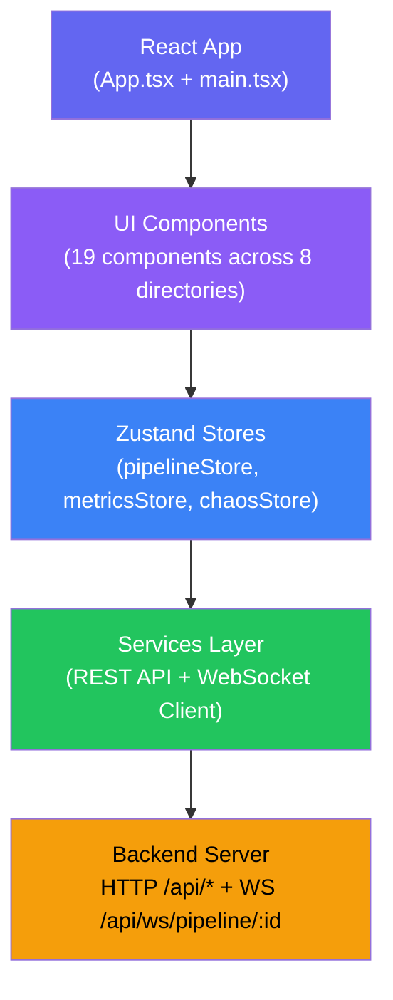
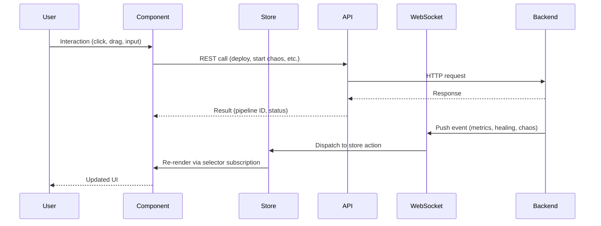
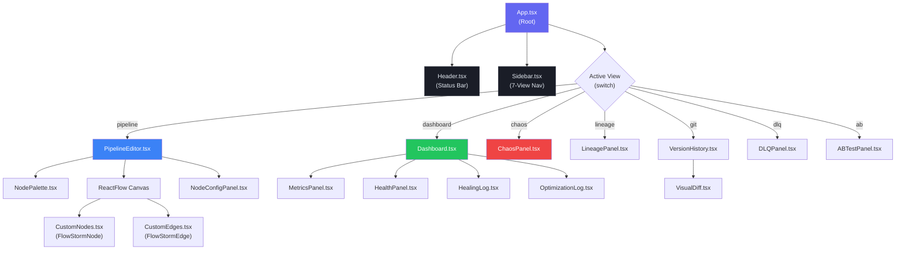
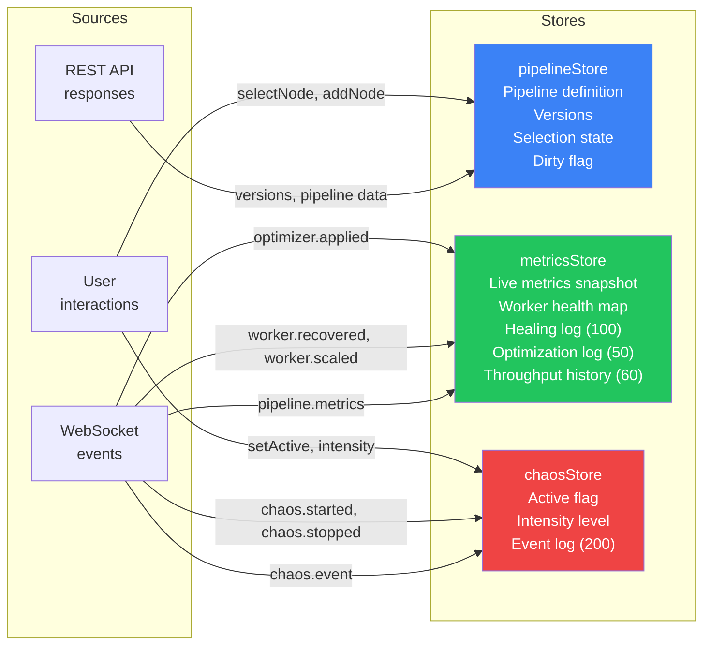
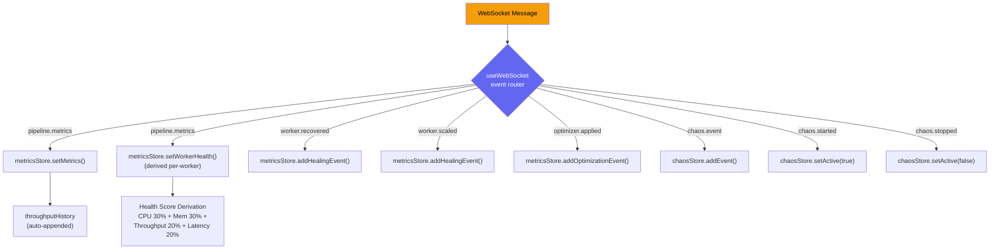
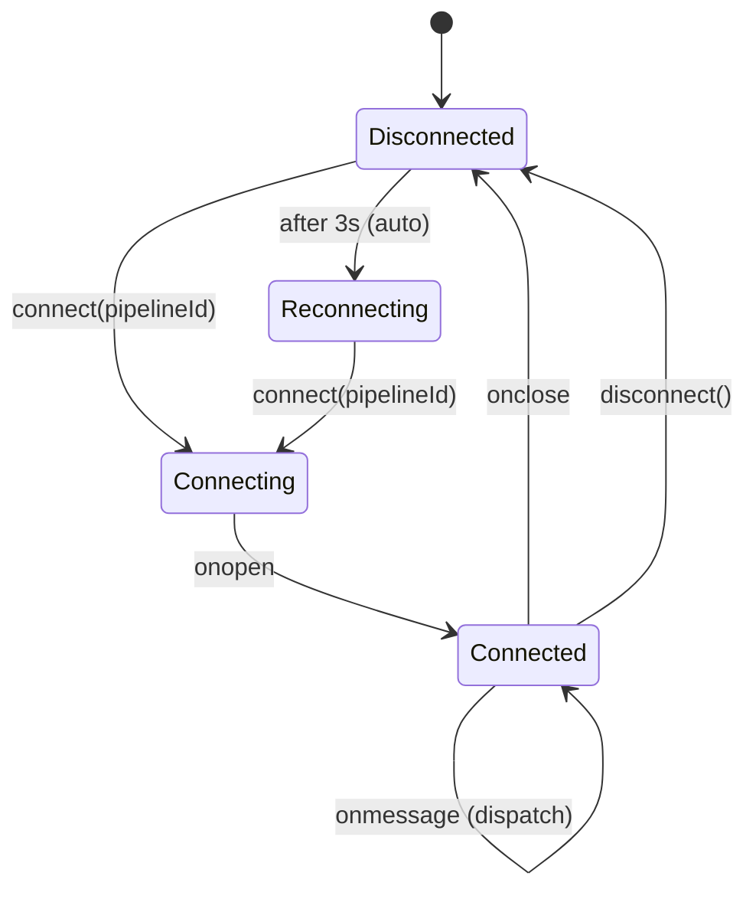
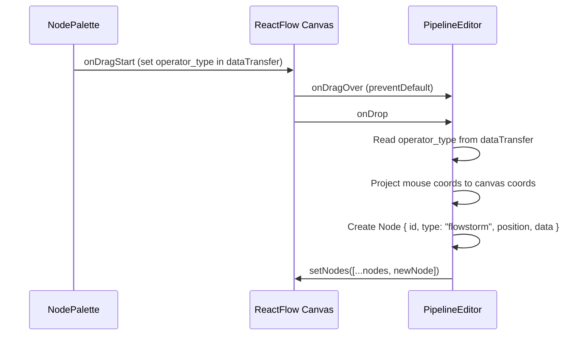
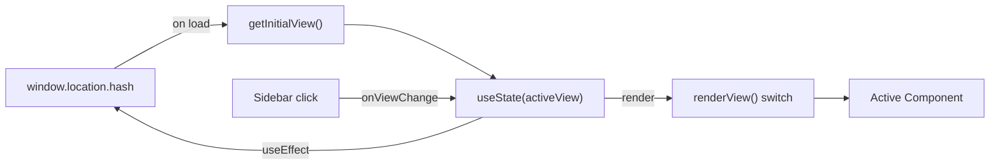
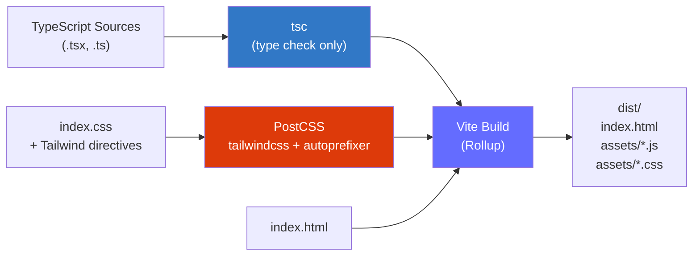

# FlowStorm Frontend Architecture

This document describes the architecture of the FlowStorm frontend application -- a React-based visual pipeline editor and real-time monitoring dashboard for stream processing systems.

---

## Table of Contents

1. [Frontend Layer Overview](#frontend-layer-overview)
2. [Component Hierarchy](#component-hierarchy)
3. [State Management Architecture](#state-management-architecture)
4. [WebSocket Event Handling Flow](#websocket-event-handling-flow)
5. [React Flow Pipeline Editor Architecture](#react-flow-pipeline-editor-architecture)
6. [Routing and View Management](#routing-and-view-management)
7. [Theme System](#theme-system)
8. [Build and Bundle Architecture](#build-and-bundle-architecture)

---

## Frontend Layer Overview

The frontend is structured in four distinct layers, each with a clear responsibility boundary. Data flows downward through these layers, while user interactions propagate upward via callbacks and store actions.



### Data Flow Direction



---

## Component Hierarchy

The application uses a flat routing model where `App.tsx` renders exactly one view at a time alongside persistent chrome (Header + Sidebar).



### Component Count by Directory

| Directory | Components | Purpose |
|-----------|-----------|---------|
| `pipeline/` | 5 | Visual DAG editor with drag-and-drop |
| `dashboard/` | 5 | Real-time metrics and monitoring |
| `chaos/` | 1 | Chaos engineering controls |
| `lineage/` | 1 | Event lineage tracing |
| `git/` | 2 | Version history and visual diffs |
| `dlq/` | 1 | Dead letter queue inspection |
| `ab/` | 1 | A/B pipeline testing |
| `common/` | 2 | Shared chrome (header, sidebar) |
| **Root** | **1** | App.tsx (root + routing) |
| **Total** | **19** | |

---

## State Management Architecture

FlowStorm uses three independent Zustand stores. Each store is a standalone module with no cross-store dependencies at the store level. Components subscribe to specific slices via selectors, ensuring minimal re-renders.



### pipelineStore

Manages the pipeline definition model, version history, and editor selection state.

```typescript
interface PipelineState {
  pipeline: Pipeline | null;       // Current pipeline definition
  versions: PipelineVersion[];     // Version history list
  selectedNodeId: string | null;   // Currently selected node for config panel
  isDirty: boolean;                // Unsaved local changes flag

  // Actions
  setPipeline(pipeline: Pipeline): void;
  addNode(node: PipelineNode): void;
  removeNode(nodeId: string): void;        // Also removes connected edges
  updateNode(nodeId: string, updates: Partial<PipelineNode>): void;
  addEdge(edge: PipelineEdge): void;
  removeEdge(edgeId: string): void;
  selectNode(nodeId: string | null): void;
  setVersions(versions: PipelineVersion[]): void;
  reset(): void;
}
```

**Key behavior**: `removeNode` cascading -- when a node is removed, all edges referencing that node as source or target are also removed. If the removed node was selected, `selectedNodeId` resets to `null`.

### metricsStore

Manages all real-time monitoring data pushed via WebSocket. Maintains bounded collections to prevent memory growth.

```typescript
interface MetricsState {
  metrics: PipelineMetrics | null;                    // Latest snapshot
  workerHealth: Record<string, WorkerHealth>;         // Per-worker health
  healingLog: HealingEvent[];                         // Capped at 100 entries
  optimizationLog: OptimizationEvent[];               // Capped at 50 entries
  throughputHistory: Array<{ time: string; eps: number }>; // Capped at 60 samples

  // Actions
  setMetrics(metrics: PipelineMetrics): void;         // Also appends to history
  setWorkerHealth(workerId: string, health: WorkerHealth): void;
  addHealingEvent(event: HealingEvent): void;         // Prepends (newest first)
  addOptimizationEvent(event: OptimizationEvent): void;
  addThroughputSample(eps: number): void;
  reset(): void;
}
```

**Key behavior**: `setMetrics` has a side effect -- it appends the current `total_events_per_second` to `throughputHistory` with a timestamp, keeping only the most recent 60 samples.

### chaosStore

Manages chaos engineering session state.

```typescript
interface ChaosState {
  active: boolean;            // Whether chaos mode is on
  intensity: string;          // "low" | "medium" | "high"
  events: ChaosEvent[];       // Capped at 200 entries

  // Actions
  setActive(active: boolean, intensity?: string): void;
  addEvent(event: ChaosEvent): void;  // Prepends (newest first)
  reset(): void;
}
```

### Store Data Flow Diagram



---

## WebSocket Event Handling Flow

The WebSocket layer consists of two parts: a singleton client class (`FlowStormWebSocket`) and a React hook (`useWebSocket`) that bridges it to the component lifecycle.

### Connection Lifecycle



### FlowStormWebSocket Client

The `wsClient` singleton in `services/websocket.ts` provides:

- **Event-typed pub/sub**: `on(type, handler)` returns an unsubscribe function
- **Global handlers**: `onAny(handler)` for cross-cutting concerns
- **Auto-reconnect**: 3-second delay after disconnection
- **Protocol detection**: Automatically uses `wss:` for HTTPS origins
- **Subscription message**: Sends `{ type: "subscribe_metrics" }` on connect

### useWebSocket Hook

The hook (`hooks/useWebSocket.ts`) runs as an effect keyed on `pipelineId`. It:

1. Calls `wsClient.connect(pipelineId)` when a pipeline ID is available
2. Registers 7 event handlers mapping WebSocket events to store actions
3. Derives `WorkerHealth` from raw metrics (CPU 30%, memory 30%, throughput 20%, latency 20%)
4. Returns cleanup function that unsubscribes all handlers and disconnects

### Health Score Derivation

When `pipeline.metrics` arrives, the hook computes health per worker:

```
cpuScore    = max(0, 100 - cpu_percent)
memScore    = memory < 60% ? 100 : max(0, 100 - (memory - 60) * 2.5)
latScore    = latency < 50ms ? 100 : latency < 500ms ? linear(100->0) : 0
healthScore = cpuScore * 0.3 + memScore * 0.3 + 100 * 0.2 + latScore * 0.2
```

Issues are flagged when: CPU > 80%, memory > 75%, or latency > 200ms.

---

## React Flow Pipeline Editor Architecture

The pipeline editor is the primary view and the most complex subsystem. It uses the React Flow library to render an interactive directed acyclic graph (DAG).

### Editor Layout

```
+-------------------+-------------------------------+------------------+
|                   |                               |                  |
|   NodePalette     |      ReactFlow Canvas         | NodeConfigPanel  |
|   (w-56, left)    |      (flex-1, center)         | (w-72, right)    |
|                   |                               |                  |
|   3 groups:       |   - Background grid (16px)    | Shown when a     |
|   - Sources (2)   |   - Controls (zoom/fit)       | node is selected |
|   - Operators (5) |   - MiniMap (color-coded)     |                  |
|   - Sinks (4)     |   - Custom nodes + edges      | Dynamic form     |
|                   |   - Deploy/Stop toolbar       | per operator     |
|   Drag-to-canvas  |   - Node count indicator      | type             |
|                   |                               |                  |
+-------------------+-------------------------------+------------------+
```

### Node and Edge Types

The editor registers one custom node type and one custom edge type, both named `flowstorm`:

- **FlowStormNode**: Memoized. Shows type badge, label, live EPS/latency metrics, health glow. Sources omit input handles; sinks omit output handles.
- **FlowStormEdge**: Memoized Bezier with animated dashes. Speed adapts via `Math.max(0.5, 5 / Math.log2(eps + 1))`. Shows throughput label at midpoint.

### Drag-and-Drop Flow



### Live Metric Updates on Edges

When `metricsStore.metrics` changes, a `useEffect` in `PipelineEditor` builds a map of `node_id -> events_per_second` from worker metrics, then updates each edge's `data.events_per_second` field to match its source node's throughput. This triggers re-renders only for edges whose throughput actually changed.

### Deploy Pipeline Flow

1. User clicks "Deploy Pipeline"
2. `PipelineEditor` transforms React Flow nodes/edges into API format
3. Calls `App.handleDeploy(apiNodes, apiEdges)` via prop callback
4. `App` calls `api.createPipeline(...)` which POSTs to `/api/pipelines`
5. On success, sets `pipelineId` and `pipelineStatus` in App state
6. `useWebSocket` effect detects new `pipelineId`, connects WebSocket
7. Metrics begin flowing, edges animate, nodes show health

---

## Routing and View Management

FlowStorm uses a simple hash-based routing system built directly into `App.tsx` rather than a routing library.

### Route Table

| Hash | View Component | Props Required |
|------|---------------|----------------|
| `#pipeline` | `PipelineEditor` | `onDeploy`, `onStop`, `pipelineId`, `pipelineStatus` |
| `#dashboard` | `Dashboard` | (none) |
| `#chaos` | `ChaosPanel` | `pipelineId` |
| `#lineage` | `LineagePanel` | `pipelineId` |
| `#git` | `VersionHistory` | `pipelineId` |
| `#dlq` | `DLQPanel` | `pipelineId` |
| `#ab` | `ABTestPanel` | `pipelineId` |

### Routing Flow



Key behaviors:

- On initial load, `getInitialView()` reads the hash and validates it against `VALID_VIEWS`
- Invalid or empty hashes default to `"pipeline"`
- When `activeView` changes, a `useEffect` writes back to `window.location.hash`
- The Sidebar component receives `activeView` and `onViewChange` as props
- No lazy loading -- all view components are imported statically

---

## Theme System

FlowStorm implements a dark-first theme through Tailwind CSS custom color tokens defined in `tailwind.config.js`.

### Color Token Map

| Token | Hex Value | CSS Class Prefix | Usage |
|-------|-----------|-------------------|-------|
| `flowstorm-bg` | `#0f1117` | `bg-flowstorm-bg` | Page background, input backgrounds |
| `flowstorm-surface` | `#1a1d27` | `bg-flowstorm-surface` | Cards, panels, sidebar, header |
| `flowstorm-border` | `#2a2d3a` | `border-flowstorm-border` | All borders and dividers |
| `flowstorm-primary` | `#6366f1` | `text-flowstorm-primary` | Primary actions, active states, indigo accent |
| `flowstorm-secondary` | `#8b5cf6` | `text-flowstorm-secondary` | Secondary elements, operator node color |
| `flowstorm-success` | `#22c55e` | `text-flowstorm-success` | Healthy status, positive indicators |
| `flowstorm-warning` | `#f59e0b` | `text-flowstorm-warning` | Degraded status, warning indicators |
| `flowstorm-danger` | `#ef4444` | `text-flowstorm-danger` | Critical status, error states, chaos UI |
| `flowstorm-text` | `#e2e8f0` | `text-flowstorm-text` | Primary text color (slate-200) |
| `flowstorm-muted` | `#94a3b8` | `text-flowstorm-muted` | Secondary text, labels, descriptions |

### Node Type Colors

Defined in `types/pipeline.ts`, used consistently across CustomNodes, NodePalette, NodeConfigPanel, and MiniMap:

| Node Type | Color | Hex |
|-----------|-------|-----|
| Source | Blue | `#3b82f6` |
| Operator | Purple | `#8b5cf6` |
| Sink | Green | `#22c55e` |

### Health Status Colors

Defined in `types/metrics.ts`, used in CustomNodes, HealthPanel, and HealingLog:

| Status | Color | Hex | Score Range |
|--------|-------|-----|-------------|
| Healthy | Green | `#22c55e` | >= 70 |
| Degraded | Amber | `#f59e0b` | 30-69 |
| Critical | Red | `#ef4444` | 1-29 |
| Dead | Gray | `#6b7280` | 0 |

### CSS Customizations (`index.css`)

Beyond Tailwind tokens, `index.css` provides React Flow dark-themed overrides, 6px custom scrollbars, `@keyframes flowDash` for animated edges, `@keyframes chaosGlow` for pulsing chaos effects, and custom range input styling.

---

## Build and Bundle Architecture

### Toolchain

| Tool | Version | Role |
|------|---------|------|
| **Vite** | 5.1 | Dev server (HMR), production bundler (Rollup-based) |
| **TypeScript** | 5.3 | Type checking via `tsc` before build |
| **PostCSS** | 8.4 | CSS processing pipeline |
| **Tailwind CSS** | 3.4 | Utility class generation, tree-shaking unused styles |
| **Autoprefixer** | 10.4 | CSS vendor prefix insertion |
| **@vitejs/plugin-react** | 4.2 | React Fast Refresh + JSX transform |

### Build Pipeline



### Vite Configuration Highlights

- **Dev server**: Port 3000 with `/api/*` proxy (including WebSocket) to `http://localhost:8000`
- **Path alias**: `@` resolves to `./src`
- **Test config**: Vitest with `jsdom` environment and global test APIs

### Development Server Proxy

In development, Vite proxies all `/api/*` requests (including WebSocket upgrades) to the backend, avoiding CORS issues:

```
Browser :3000 --(HTTP/WS)--> Vite Dev Server :3000 --(proxy)--> Backend :8000
```

### Production Build

The `npm run build` command runs `tsc && vite build`:

1. **TypeScript check**: `tsc` validates all types (does not emit)
2. **Vite build**: Rollup bundles all modules, tree-shakes dead code
3. **CSS purge**: Tailwind removes unused utility classes
4. **Output**: Static files in `dist/` ready to serve from any static host or embed in the backend

### Test Framework

- **Vitest** (4.0) with `jsdom` environment and `@testing-library/react`
- Tests live in `tests/` at the project root
